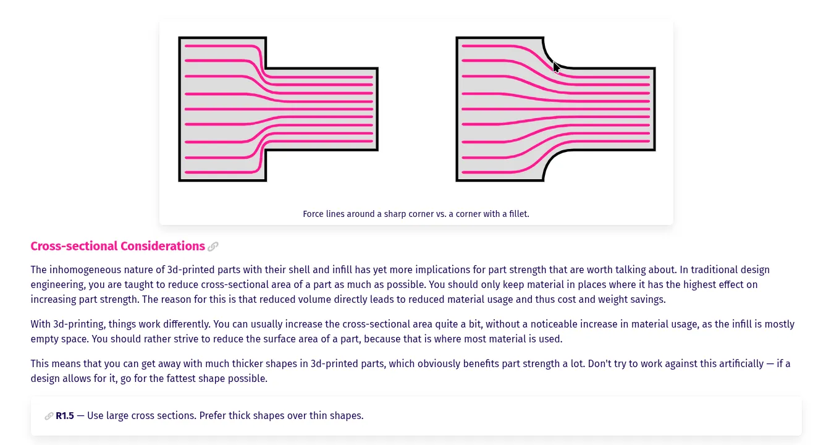
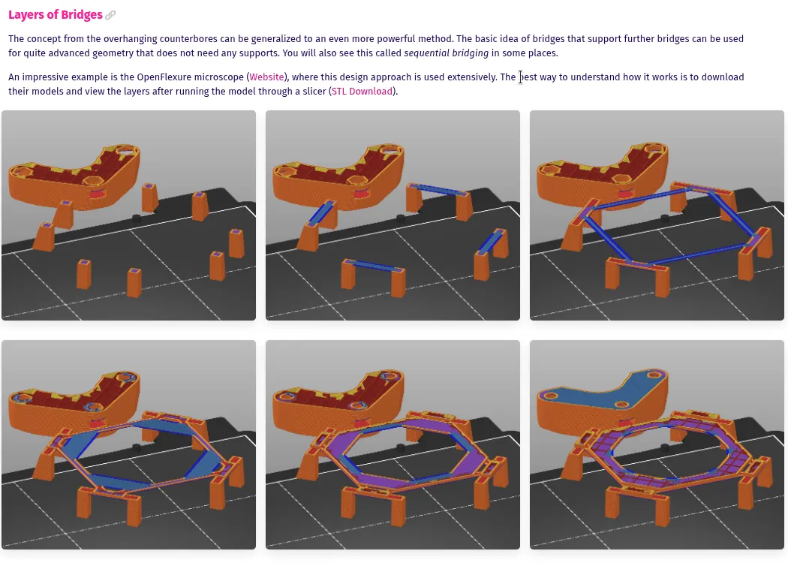

It's wonderful when people take the time to share the expertise they've developed. Even more so when the resulting article is filled with FreeCAD screenshots.

Fabulous FreeCAD user Rahix has put together this [impressive long read (80 mins)](https://blog.rahix.de/design-for-3d-printing/) over on their blog. It's a collection of knowledge relating to various areas of 3D printing including designing for part strength, functional integration challenges and practice, process optimisation and more.

Whilst it definitely doesn't shy away from looking at underlying engineering principles, for example there's a great section on corner geometries and forces, it's written as a great collection of heuristics with clear explanations of the risks and rewards of different approaches. Glancing through every section it gently questions those decisions we probably all make at our 3D printer and nudges us towards better practice. It's brilliantly written and definitely worth reading.

Finally, it's lovely to see that Rahix includes examples of where he has seen excellence in design approaches. For example there's discussion of approaches using sequential bridges to create part geometries that can print successfully without the, sometimes problematic, use of support materials. Rahix gives mention to our friends over at the [OpenFlexure](https://openflexure.org/) project citing them as a great example of this approach.

Thanks for taking the time to write this valuable material up Rahix!
