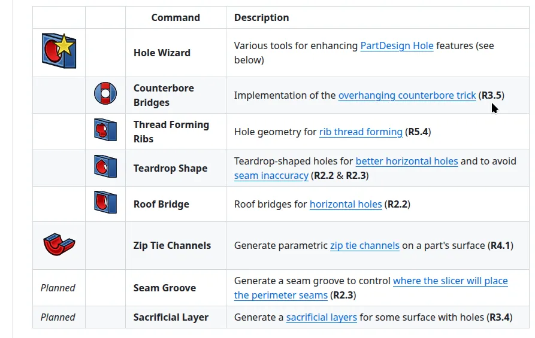

A short while ago we posted here about an [excellent article by Rahix describing some really interesting and useful design approaches for fused filament style 3D printing](https://blog.freecad.org/2025/05/08/design-for-3d-printing-an-excellent-article/). If you haven't checked out that article it's really worth a read.

Brilliantly Rahix has worked on some macros which make it trivial to apply some of the excellent design techniques to your FreeCAD project, furthermore they have compiled this into an addon available via the addon manager.

It stops short of adding a full workbench to your install but rather adds a small collection of tools to your Part Design workbench. Also excellently if you [look at the addon's github repository](https://github.com/Rahix/FusedFilamentDesign) there are links from the tool descriptions back to the original article.

We look forward to all or any updates on this addon, in particular the planned "Seam Groove" tool which controls where a slicer will place a seam which sounds very useful.