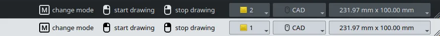

This week in FreeCAD development:

**Sketcher**: refactoring by AjinkyaDahale, fixes by chennes and ElementW.

**PartDesign**: alfrix moved the selector for Hole base profiles to the top of the Task panel.

**TechDraw**:

- PaddleStroke fixed a bug where a hatch would not be claimed by a view, then another bug in the decorate line code, and removed a limitation where the Lock/Unlock commands would only work on a single view.
- benj5378 fixed a bug where the face color for view would not work.

**CAM**:

- LarryWoestman added command line arguments for coolant, machine-specific commands, and end-of-line characters.
- tarman3 added a button to reset the camera view to the new Simulator. He also added a possibility to create PathShape object inside Job with Tool Controller; this allows using some modifiers, array and path simulator.
- jffmichi fixed a couple of bugs.

**BIM**:

- tetektoza fixed the mapping to weight during the IFC Quantities assignment.
- furgo16 fixed a bug and added the Offset input to the Wall creation task panel.

**FEM**:

- NewJoker added several new VTK glyph types for the new Glyph filter: Cone, Cylinder, Line, and Sphere.
- marioalexis84 added support for VTK < 9.1 in the calculator filter.

**GUI**:

- alfix fixed a couple of issues.
- The big new feature coming from kadet1090 are the new interaction hints in the statusbar, similar to what you get in Blender and Dune3D:

Among other changes:

- Various fixes in Draft by Roy_043.
- hlorus fixed a couple of bugs in the Measure tool.
- tritao and kadet1090 fixed a couple in the Materials code.

Additional improvements and fixes were contributed by chennes, sasobadovinac, luzpaz, pieterhijma, Flast, adrianinsaval, jffmichi, 3x380V, xtemp09, mosfet80, trita0, hyarion, and davesrocketshop.

**PR stats**: since the previous report, 52 pull requests have been merged, and 37 new pull requests have been opened.

**Issue stats**: overall, there are 2896 open issues in the tracker, up by 44 from last week.