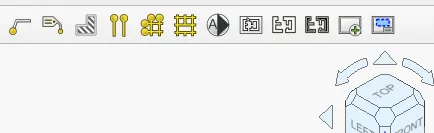
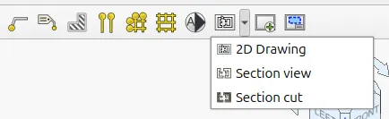

This week in FreeCAD development:

**Draft**: Roy_043 simplified using an actual font file from the OS as the default for ShapeString objects.

**Sketcher**: jacquesbeaurain improved the situation with font size on HiDPI displays across Linux and macOS systems, and hyarion fixed an issue.

**PartDesign**: Beep6581 fixed an issue where finding the closest matching thread size would not take the thread pitch into account.

**Arch / BIM**:

- Roy_043, marcuspollio, tetektoza, furgo16, and Syres916 fixed various issues.
- furgo16 also grouped some items in BIM toolbars to reduce the cognitive load.

Before:

After:

**FEM**:

- Ickby enabled Python implemented post-rocessing filters and exposed the VTK data object of post-processing filters.
- marioalexis84 fixed an issue where Elmer electric charge density would convert very low values to zero.

**CAM**:

- tarman3 and shaise fixed a couple of issues in the new simulator.
- LarryWoestman fixed tool changes not correctly output in G-Code.
- jalapenopuzzle added initial support for all of the Snapmaker machines and their variants and modifications.
- knipknap fixed some postprocessor errors.

**TechDraw**: WandererFan fixed a hidden line regression and a complex section crash.

**Materials**: davesrocketshop improved the handling and assignment of default units in materials**.**

Among other changes: pieterhijma continued improving source code documentation (one of his grant projects).

Additional improvements and fixes were contributed by tetektoza, oursland, 3x380V, hyarion, maxwxyz, PaddleStroke, marcuspollio, and davesrocketshop.

**PR stats**: since the previous report, 52 pull requests have been merged, and 20 new pull requests have been opened.

**Issue stats**: overall, there are 2840 open issues in the tracker, up by 26 from last week.