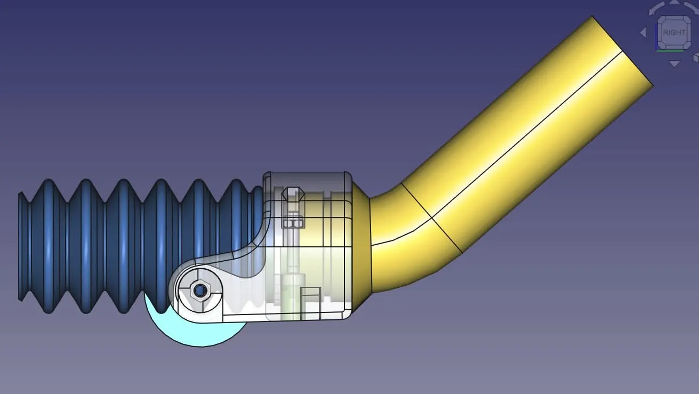
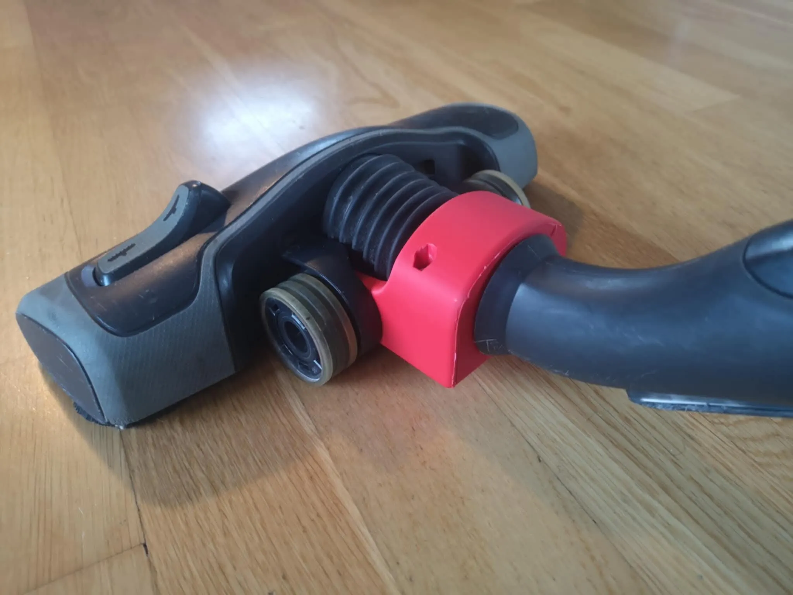

There's all kinds of reasons to learn and use FreeCAD and we probably should never get into saying that one use case is better than any other. That said, it's always awesome to see FreeCAD combined with 3D printing for repair. Spotted over in the FreeCAD Facebook community it's great to see that Bjørn Birkeland managed to get their vacuum back up and running after some very excellent CAD work.

Bjørn hasn't shied away from the complexity of doing the job properly. Not only creating the geometry of the replacement piece but also accurately modelling the parts connecting to the faulty area. It's a very well worked example. As such the resulting 3D printed part is a great fit and almost looks like a stock part. We like how Bjørn has used a contrasting colour of filament for the repair part, it's nice sometimes to show that a part has been repaired and Bjørn should be proud of their work.

