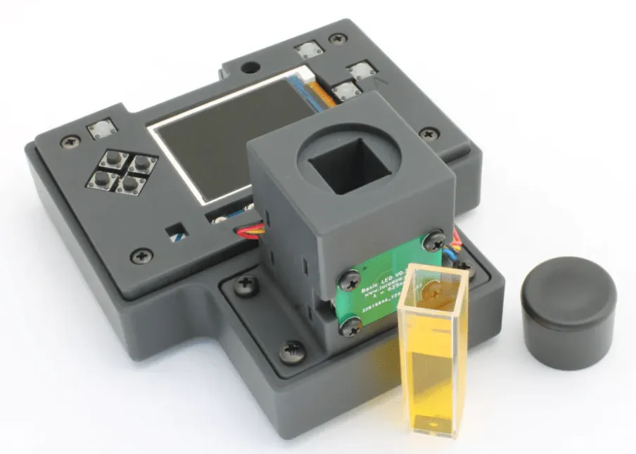
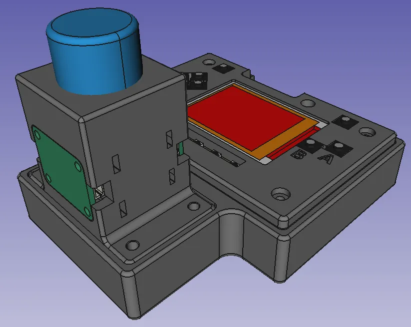

It's always fabulous to see open hardware, even more wonderful when the tool chain to make the hardware is open, and lastly, great when people have used FreeCAD as part of their fascinating projects.

The [Open Colorimeter](https://iorodeo.com/pages/open-colorimeter) from [IO Rodeo](https://iorodeo.com/) is a device allowing for the measurement of the intensity of color in a given sample. It achieves this by measuring the absorbance of light of a known wavelength as it's passed through a sample in a container called a cuvette. These techniques can be used for a wide variety of science and just glancing at some of the tutorials on the IO ROdeo site we can see it has many research applications.

- Measuring ammonia, nitrate or nitrite with API test kits
- Turbidity measurements
- Community-developed lab for measuring active carbon in soil
- Community-developed lab for measuring proteins

It's a really capable and neat design and uses an existing product, the Adafruit PyBadge which is pre programmed with a custom firmware in Circuitpython. Attached to this is an Adafruit Light sensor and you can choose a specific wavelength value of LED module as a light source. It's all neatly wrapped up in a 3D printed enclosure, of course modelled in FreeCAD.

IO Rodeo sell the devices as complete preflashed systems but glancing over the [repo](https://github.com/iorodeo/open_colorimeter)every bit of the source is their for you to build one youself should you need too. As it requires no laptop and is a totally standalone device we imagine it's incredibly useful not only in education but also out in the field. Rounded out with [OSHWA certification](https://certification.oshwa.org/us002138.html) it's a fantastic project and we wish them well.