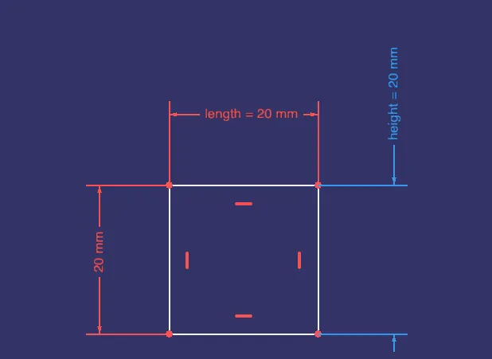

This week in FreeCAD development:

**Draft**: Roy-043 specified units of spinboxes in UI files for arrays and ShapeString and made minor improvements in the OrthoArray task panel.

**Sketcher**:

- theo-vt and tetektoza fixed a couple of issues.
- tetektoza also patched the code to show geometry lines above constraints.
- longrackslabs continued adding contextual input hints to edit tools.
- maxwxyz patched Sketcher to show the dimensional name by default.

**PartDesign**:

- PaddleStroke brought over a feature from RealThunder's fork, that adds faces to closed wires of sketches and thus lets the user select the faces they want to extrude.
- davetanana added 1 3/16 16 threaded drill hole diameter to the Hole tool.

**BIM**: Roy-043, furgo16, Syres916, and tetektoza, and maxwxyz fixed several bugs.

**CAM**: knipknap patched the workbench to show abbreviations on each label to match the input value to the shape image on the UI.

**TechDraw**: ryankembrey added spacing preview, so now each time a value is adjusted, the view is updated on the page instantly.

**I/O: **furgo16 renamed "Group layers into blocks" into "Merge layer and contents into blocks" in the DXF loader options and fixed the handling of non-standard 8859_1 encodings.

Additional improvements and fixes were contributed by wmayer, hyarion, chennes, furgo16, tetektoza, Syres916, Roy-043, benj5378, alfrix, kadet1090, captain0xff, and 3x380V.

**PR stats**: since the previous report, 39 pull requests have been merged, and 42 new pull requests have been opened.

**Issue stats**: overall, there are 2921 open issues in the tracker, down by 7 from last week.

Elsewhere in the community, SargoDevel released a new version of their [Cables](https://github.com/sargo-devel/Cables) workbench.

Some of the interesting changes are:

- WireFlex can now take different shapes based on the same points: polyline or bspline.
- Introduced colored markings of attached vertices in WireFlex.
- Added CompoundPath and CableConduit objects that enable the creation of complex bundles.
- Undo/redo support.
- Keyboard shortcuts.
