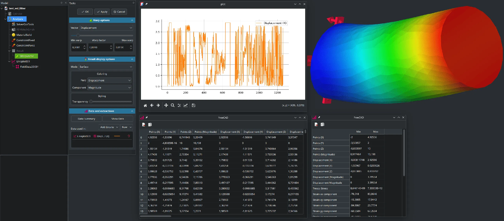
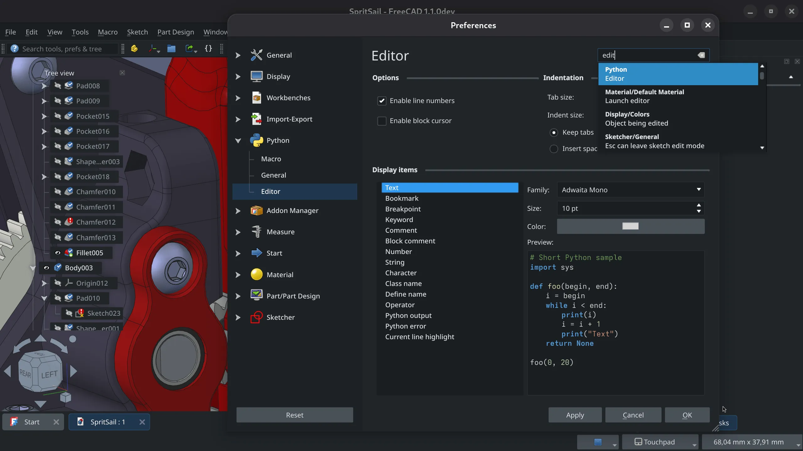

This week in FreeCAD development:

**Sketcher**:

- longrackslabs extended the new contextual input hints system to constraints and transform tools.
- tetektoza tweaked the behavior of the on-view parameters with regards to the lock state. It's best to read the [pull request description](https://github.com/FreeCAD/FreeCAD/pull/21943) to get the full picture of the changes.
- karliss patched the Select Constraints command to support points, edge endpoints, and axis.
- Fixes and code refactoring by FlachyJoe, matthiasdanner, and chennes.

**Part**: Rexbas added support to align selection to curve normal direction.

**PartDesign**: 3x380V cherry-picked several regression fixes from wmayer's branch to fix the single-solid check for Pad, Pocket, Fillet, Chamfer, Groove, Revolution, and Loft. For some of these operations, the check didn't even work before in the first place.

**BIM**: Numerous fixes by Syres916 and Roy-043.

**FEM**: ickby added filter data extraction and visualization to FEM post processing. The first patch adds a basic framework that can be extended later on. New objects are Lineplot, Histogram, and Table.

**CAM**:

- jffmichi improved the behavior of the job visibility toggle and contributed a few more improvements including the [sorting of toolpaths](https://github.com/FreeCAD/FreeCAD/pull/21531) for Engrave and Deburr operations.
- julian7 contributed an improvement that helps choosing the right CAM job when the document has multiple jobs, and something is already selected inside a job.
- tarman3 improved error messages for custom gcode.
- LarryWoestman added command line arguments for outputting machine name, path labels, and post operation.
- sliptonic refactored the Slot operation code.

**TechDraw**: ryankembrey contributed a couple of UI fixes, and WandererFan fixed detail highlight drag.

**GUI**:

- Various fixes by alfrix, tetektoza, and kadet1090.
- maxwxyz contributed toggle overlay icons.
- tiagomscardoso tweaked the position of hover tooltips to prevent them from overlaying menu items completely.
- xtemp09 contributed a fix for dark fringes around letters in Sketcher.
- OfficialKris [changed](https://github.com/FreeCAD/FreeCAD/pull/20864) the positions of items in the Tools menu to group them logically and make more important ones to the top.
- hyarion [changed](https://github.com/FreeCAD/FreeCAD/pull/22024) the elide mode from end to middle in the project tree. So now when long objects name don't fit the dock, you will see the beginning of the name, the end of the name, and elide (...) in the middle. It used to be an elide at the end.
- tetektoza added a search box to the Preferences dialog, it's in the top right corner. Clicking on an item in the drop-down list will switch you to the relevant page, scroll it down where unnecessary, and highlight the item you were looking for.

Additional improvements and fixes were contributed by chennes, knipknap, tarman3, Roy-043, kadet1090, wmayer, 3x380V, oursland, paullee0, furgo16, mosfet80, Syres916, luzpaz, maxwxyz, and Rexbas.

**PR stats**: since the previous report, 70 pull requests have been merged, and 34 new pull requests have been opened.

**Issue stats**: overall, there are 2907 open issues in the tracker, down by 14 from last week.

In other community news, Darek recently released v1.0 of his [Woodworking](https://github.com/dprojects/Woodworking) workbench. Here are some of the changes in the new version:

- VarSet option for position and size in magicGlue.
- Support for custom objects with Width, Height, and Length attributes.
- Parametric drawers & decorated handles.
- Back outside and inside for the cabinets.
- New tool to create panels from wires and add external geometry in sketches.
- New tool to manage views and export model to TechDraw.
- Support for minifix, sample and dowels points.

[See here](https://github.com/dprojects/Woodworking/releases/tag/1.0) for the full list of changes. You can see some of them in action on Darek's [YouTube channel](https://www.youtube.com/@dprojects.woodworking/videos).