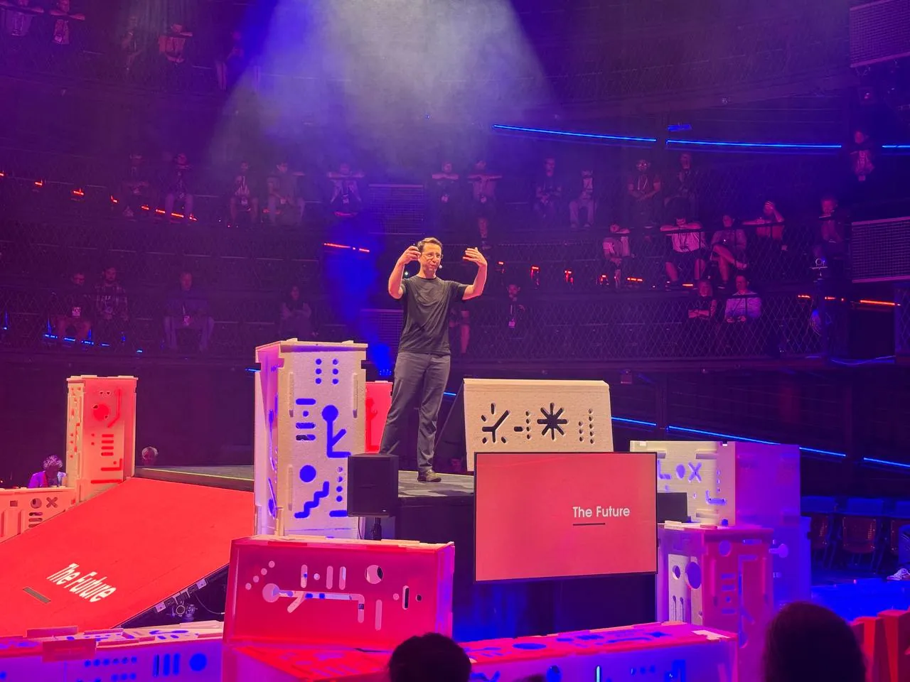
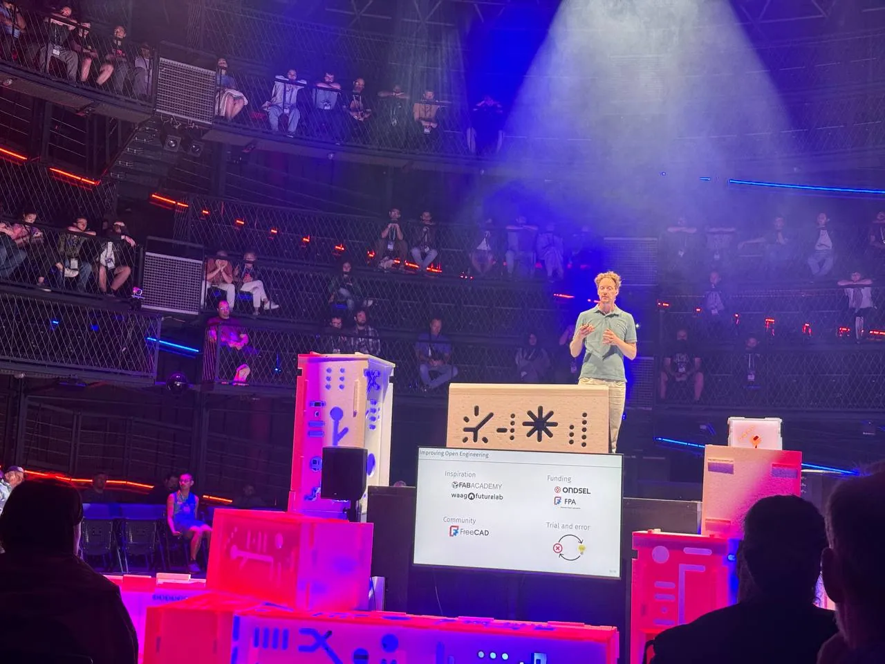

Between July 4th and 11th split between Brno and Prague, [FAB25](https://fab25.fabevent.org/), the latest iteration of the annual Fab Lab travelling conference, took place. Excellently we had representation from the FreeCAD community speaking at the event.

Both speakers spoke in the Open Engineering section with the first to speak being Chris Hennes. Chris took the audience through "FreeCAD 1.0. What's New and What's Next", a whistle-stop tour of what milestone features were achieved in 1.0 and how these and others continue to be developed into the future.

Second to the (very fancy rotating) stage was Pieter Hijma. Pieter presented "The Journey Towards True Variant Parts in FreeCAD". Beginning with an explanation of how variant parts differ from more standard parametric parts, Pieter then went on to outline how variant parts are incredibly useful for open engineering in terms of modularity and reuse across projects.

Later in the same session both these excellent speakers were also in the Open Engineering Q and A panel and both these talks talks and the panel are up on the FAB25 youtube channel starting at the timestamp in the video below.

