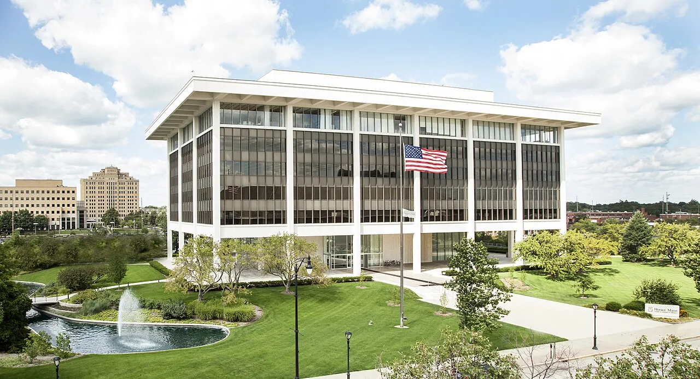

[Sign up now](https://cloud.freecad.org/apps/forms/s/SKB9wfjMYEeiSwZYA6PksRzY)!

The annual FreeCAD North American Meetup is taking place in [Springfield, Illinois](https://en.wikipedia.org/wiki/Springfield,_Illinois), on August 8-10, 2025.

The meetup will again be hosted by [Innovate Springfield](https://www.uis.edu/innovation/innovate-springfield), but the venue is changing from last year's to the [Horace Mann headquarters](https://www.openstreetmap.org/node/7141956335).

We are still only a few blocks away from the Old State Capitol, but with a much-improved view:

As usual, the first and the last days of the meetup will be free-form hackathon events. August 9 is reserved for some lightning talks where you can present your project made with FreeCAD or a FreeCAD add-on.

Rather than using Google Forms, an experimental [Nextcloud](https://nextcloud.com/) instance has been created for the FreeCAD project to [help keep our surveys private](https://nextcloud.com/blog/nextcloud-forms-to-keep-your-surveys-private/). Thanks Nextcloud!

Because of the ongoing problems with entering the US, we expect fewer attendees from other countries this year; a few contributors already told us they aren't coming. Still, whether you are inside or outside the US, [travel grants](https://fpa.freecad.org/programs/fosdem-travel-grants) are possible. Please send a request to [fpa@freecad.org](mailto:fpa@freecad.org).