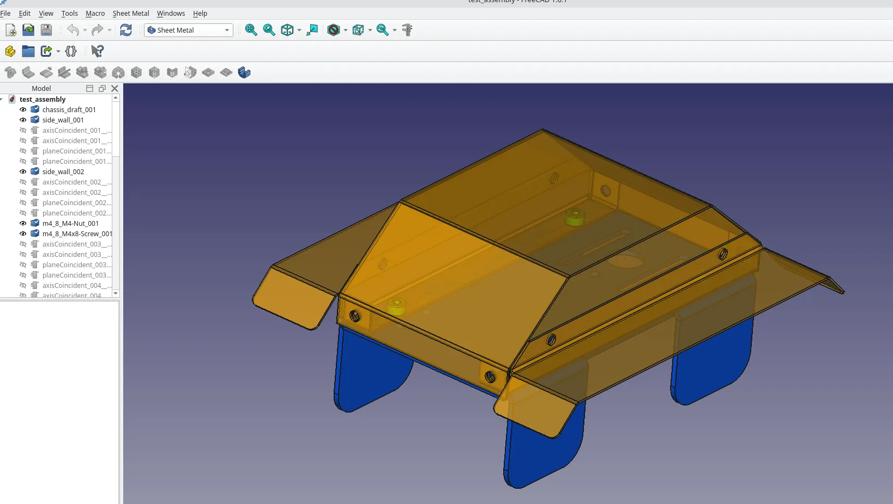
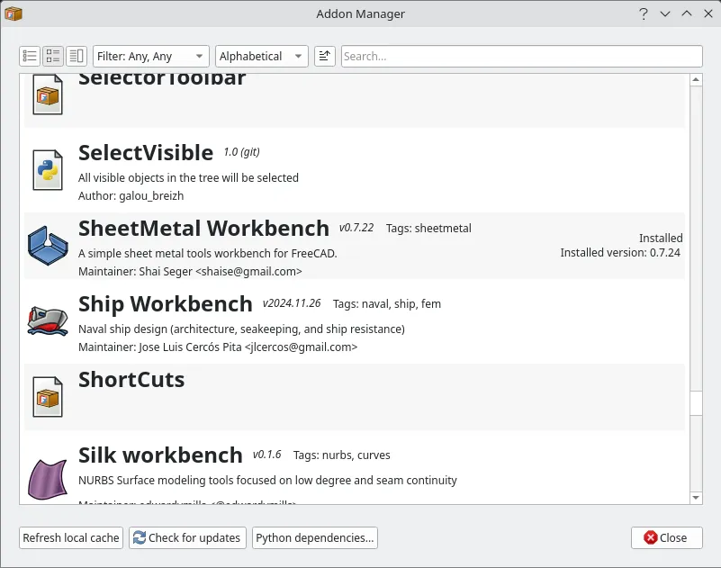
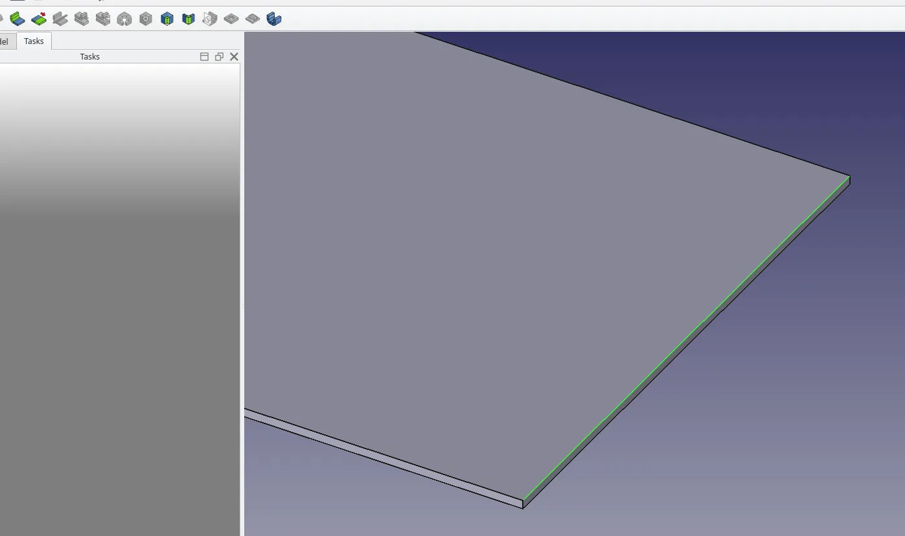
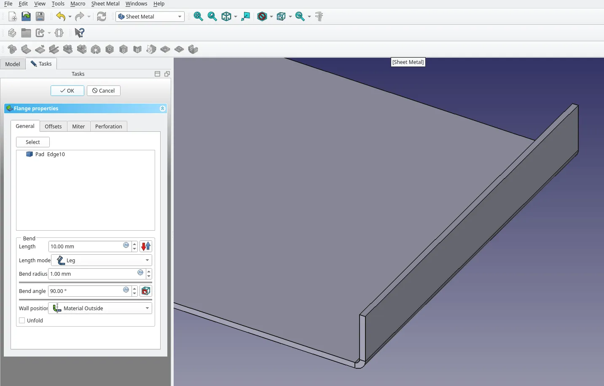
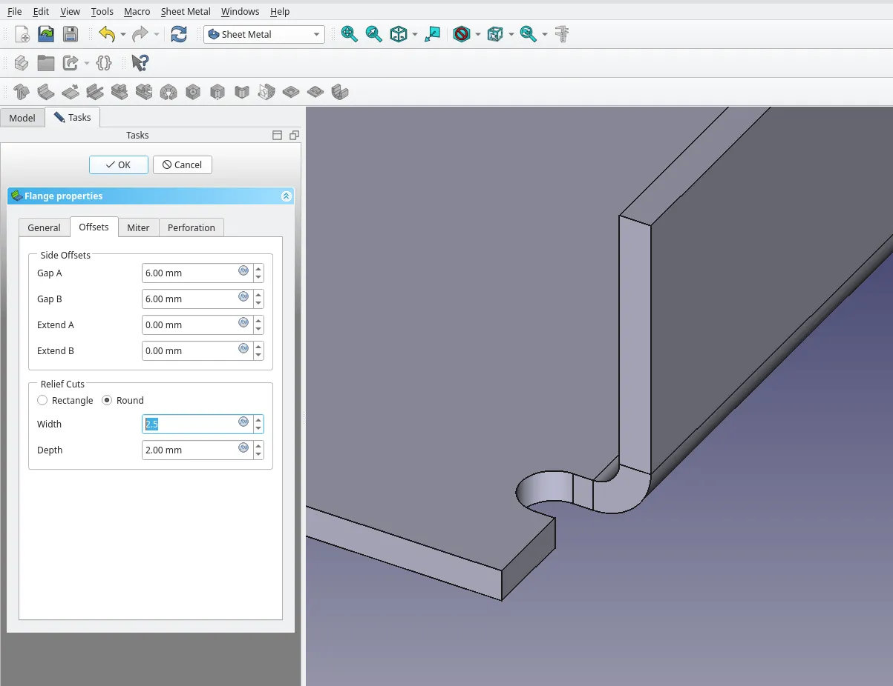
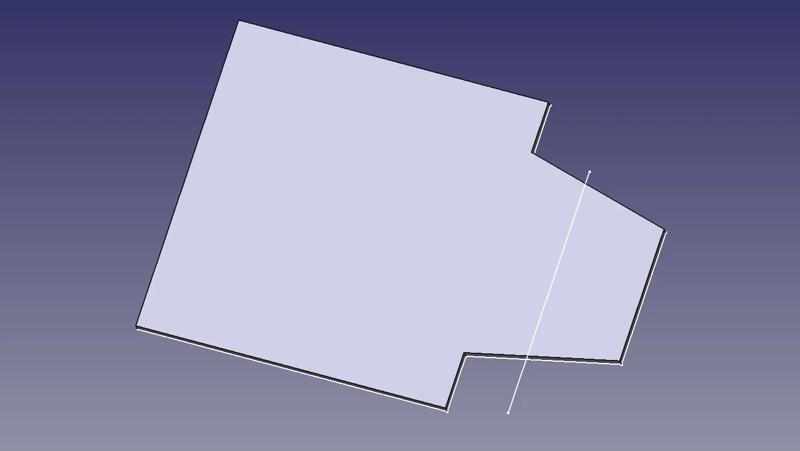
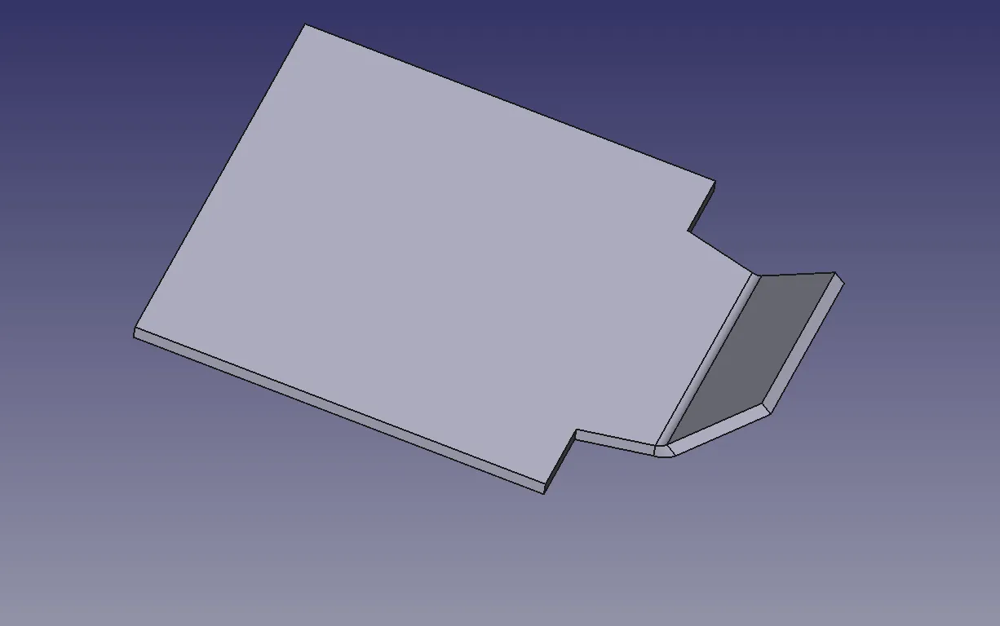
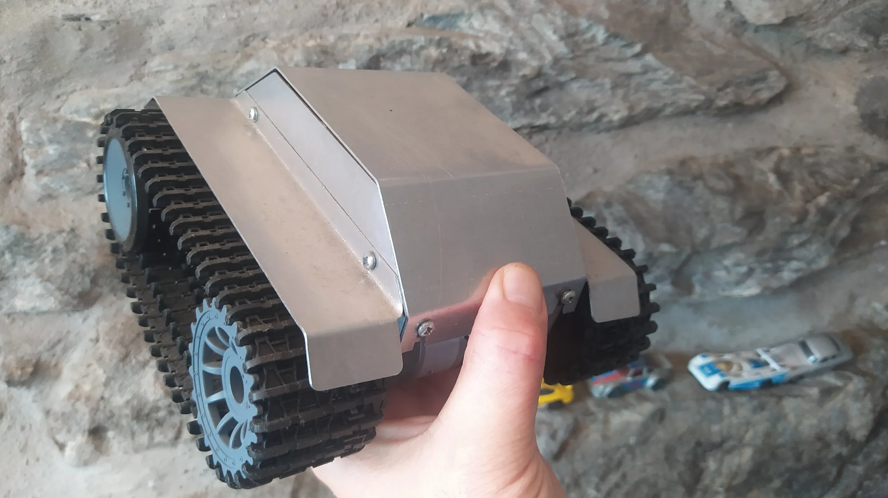

FreeCAD is excellent in that it can be used for design projects for all manner of fabrication approaches. A really interesting fabrication approach is cutting, bending and joining sheet metal. As such FreeCAD has a dedicated addon workbench that's incredibly helpful in designing for flat sheet materials. Let's run through some super simple examples to show off some of it's features. Remember that in these tutorials we always use the tooltip text name to describe a tool icon, so you can find tools mentioned by hovering over tool icons and reading the tooltip, coincidentally this is a great way to discover and learn about other tools!

First of all you'll have to open FreeCAD and install the workbench. Click "Tools > Addon manager" and the list of available addon workbenches should update. Use the search bar to search for SheetMetal and then click the install button. Wait for it to download and install and then you should be prompted to restart FreeCAD.

With FreeCAD restarted on the start page click to start a new parametric part project, or create an empty project, move to the Part Design workbench and then click to add an active body. As a first example let's draw a simple rectangle sketch and then extrude it to act as the first sheet of metal in our project. Click to add a new sketch, select the XY plane and in the sketch use the rectangle tool to draw a rectangle. In an ideal world we'd constrain our sketches, but for this simple example just close the sketch.

Next with the sketch highlighted use the Pad tool to pad the sketch, let's imagine our real world material is some 1.2mm aluminium so we can pad to a height of 1.2mm. Once the rectangle is padded let's move to the SheetMetal workbench. Click to select one of the edges of your padded rectangle and you should see some of the SheetMetal tool icons become available. Click the "Make Wall" tool. Automatically an extended section of sheetmetal is added with a fold section and a wall section at 90 degrees to your base object. Depending on whether you selected an upper or lower edge of your pad object will dictate the direction in which the wall extends. You should see a new object "Bend" in the file tree view, feel free to delete it and then try with a different edge to get the feel of how this works.

In the properties dialogue for a bend (double click on a bend object in the file tree to access) there are numerous settings to play with. Changing the length of the new section and the angle at which it sits relative to the base object are easy to adjust. The "Offsets" tab offers some interesting functions. Often we might want to add a wall that is larger than our base object, we can increase the "Extend A" or "Extend B" options to make this possible. We can also add "Gap" values and these can be critical to getting a good final design that works in metal. On our example we have adjusted the gap A and B values to 5 mm. This not only shortens the added wall/bend object, but also places small cuts into the base object. The reason for this is that if you create a folded part where the protruding section is smaller than the base section you'll create a distortion in the metal where the corner of the fold meets. You can relieve/reduce this distortion by adding a small relief cut into the base section. We can change the geometry of these little cut out sections to suit our production methods. If we are cutting the metal by hand we might leave them quite small and the profile as "rectangle" as we could use a small file to bring the corners square. If we plan to cut the design on a CNC milling machine though we might increase the size of the relief cut to accommodate the tooling, and as milling cutters tend to be round, we might make the cut rounded and large enough for the radius of our cutter with additional clearance. This makes it pretty straightforward to set up tool paths.

Of course sometimes you'll want to create more complex folded options. Another approach that enables more complexity is to draw a sketch of a more complex shape and then map another sketch to it with this second sketch containing fold lines. As an example in a new project we created a part design body, and drew a sketch in the XY plane. Back in the SheetMetal workbench we selected the sketch and then used the "Make Base Wall" tool to create our base sheet object and set it to the thickness of our target material. Next we highlighted the upper face of the object and moved to the Part Design workbench. We then created a sketch attached to this face. In this sketch we created a line across the angled section of the base object, note that we extended this sketch line beyond the base geometry as that's important when we come to flatten and export our design. Closing the sketch we can return to the SheetMetal workbench.

We can now perform a fold along the sketch line we just created. To do this we click to select the upper face of the object in the preview window (note this won't work if we select the whole object in the file tree) then we press the control key to multiselect and click the sketch item we just made in the file tree view. With those both selected we can then click the "Fold a Wall" tool icon and create our fold at the sketch line position.

Ultimately with a folded sheet metal design you will probably want to flatten/unfold the design at some point to create some kind of output flat plan file. This could be for printing and then sticking the print onto the sheet stock for manual cutting or indeed to create geometry for further CAM processing for machining. We can do this by first selecting a reference face that we want to flatten everything else relative too. So with our angled fold we just made we selected the upper face of the original unfolded section of the design. We can then click the "Unfold" tool icon and immediately we see a preview of the project flattened. In the "Unfold Properties" dialogue we can see a few options. We have some material settings which includes a "K" factor value. These values relate to the amount of material needed to accurately make the fold as at the fold point different materials will expand and compress at differing rates. These K values can be found in material reference books or online and you can adjust for your material and design.

 In the section below we find an "Unfold Sketch Generation" area and if we check the "Generate projection sketch" we can then directly export either a DXF or an SVG from this properties panel. DXF or SVG are perfect for print or for potentially using with a laser cutter or other machines, or, of course, they can make great input items for the Techdraw workbench to create technical drawings. You can also apply the flattening action and then you have the geometry that you might then use in the CAM workbench to set up for CNC machining. Even with just these basic uses of the sheet metal workbench you can realise accurate designs, for example the author made this aluminium body shelled robot rover some years ago using these methods!

As a final thought, whilst the workbench is called the SheetMetal workbench, it really can apply to any foldable/bendable sheet material. It's common to see this workbench used for cardstock cut on a vinyl cutting/dragknife machine or for designing for acrylic sheets that will be bent over a hot element. It's an incredibly useful workbench.