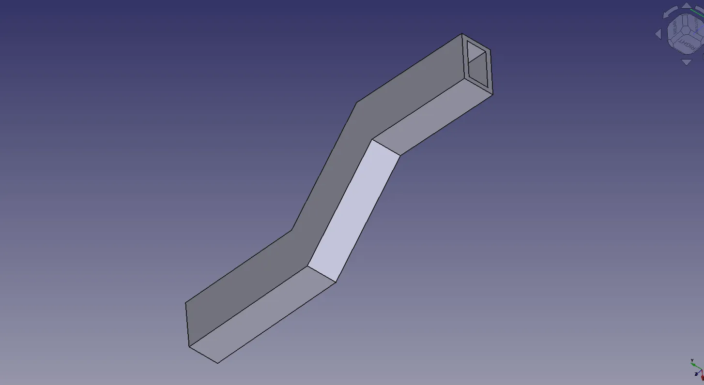
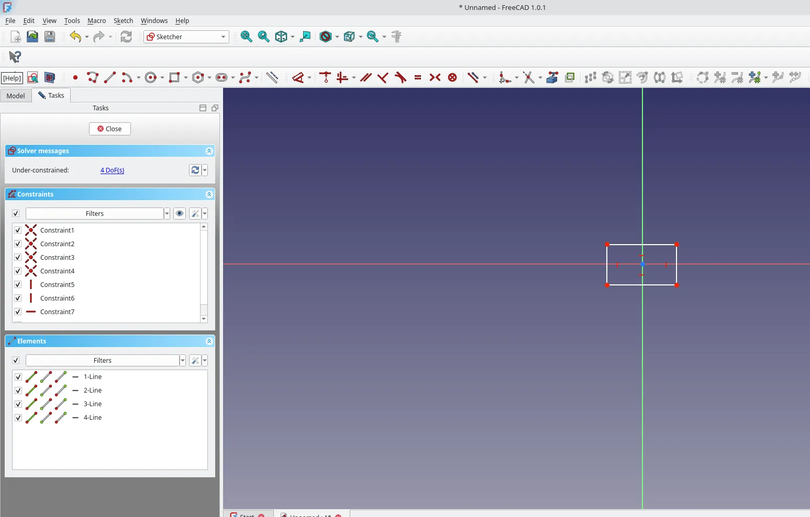
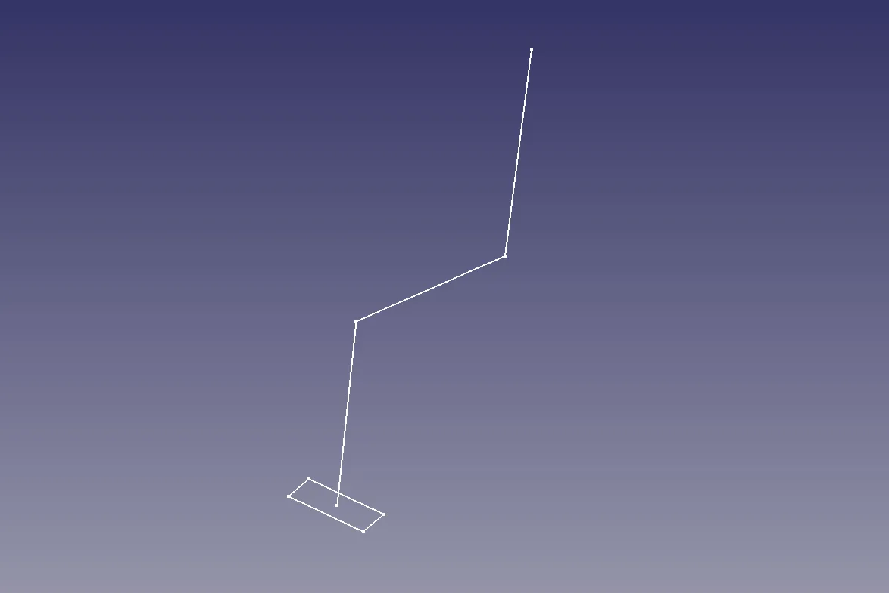
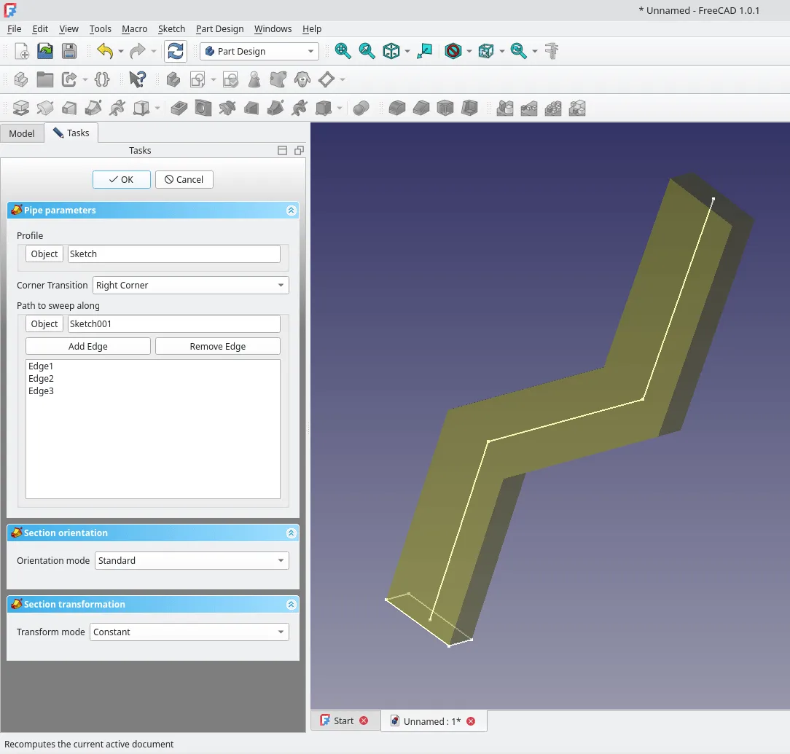
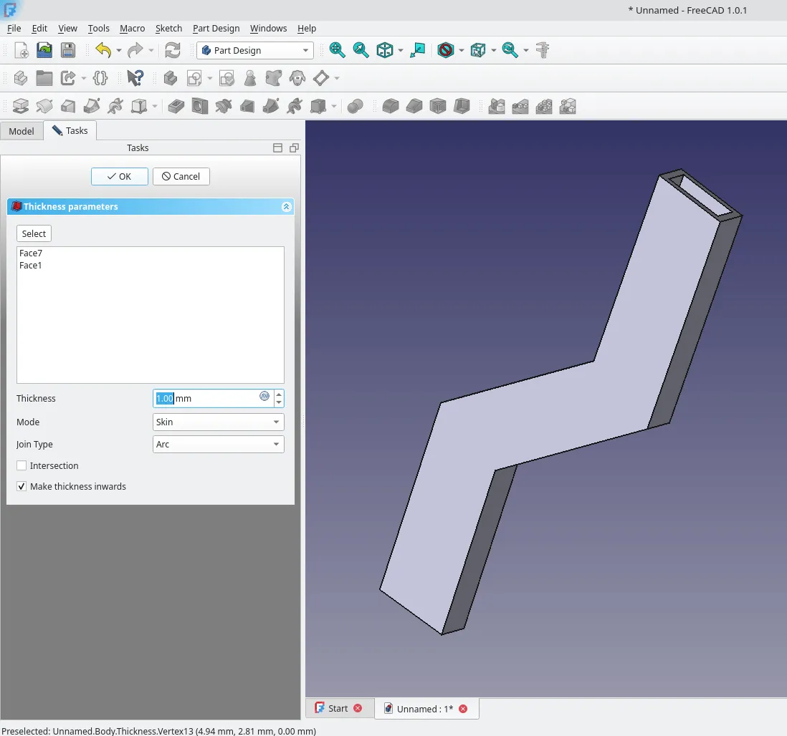

The additive pipe tool is an excellent tool that allows a sketch or sketches to be swept along a series of edges to create a solid pipe with the profile of the original sketch. It can also be used to create more complex geometric pipes that flow through a variety of profiles along their length. As a reminder in these tutorials we use the tool tip text that appears when you hover over a tool icon to describe tools, which is a good way to explore FreeCAD!

Launch a new project from the start page using the "parametric part" option from the New File area. This will create a new blank project in the PartDesign workbench and will have created an active body. In the active body click to create a sketch and select to add the sketch to the XY plane. In this sketch we are going to create a small drawing that will define the cross section outline of our simple pipe. Let's use the "Create rectangle" tool and then left click to draw a small rectangle roughly centred around the XY origin point. We aren't going to worry about constraining our rectangle for this quick experiment. Click "close" to close the sketch.

Next let's click to create a second sketch but this time in the XZ plane. In this sketch select the "Create Polyline" tool and draw a series of straight lines attached and starting on the XZ origin point. Don't worry too much about the polyline but know that this will be the path along which our pipe is formed. Having added two or three sections of polyline close the sketch.

In the file tree view highlight the original "sketch" item which contains our rectangle and then click the "Additive Pipe" tool icon. In the Additive Pipe dialogue the upmost tab is "Pipe parameters". In this tab we should see "Object" is set to "sketch" and further below we can find an "add edge" button. Click the "add edge" button and then select the first section of polyline we drew, connected to the XZ origin, in the preview window. You should see transparent preview of a pipe form along this section. Click the add edge again and add the next section of polyline and repeat this for all your polyline sections. Before we click "OK" to apply the changes let's change the Corner Transition value to "Right Corner" in the drop down menu. Feel free to return to this section and try the other corner transition options to see how they effect your pipe design.

For now let's click "OK" to apply the additive pipe settings and to close the additive pipe dialogue. You should see you now have a nice pipe object that flows with rounded corners along the polyine you defined. However, you'll also realise, it's not a hollow pipe! To make your pipe hollow select an end face of the pipe object and then left click the "Thickness" icon. In the thickness dialogue click the "select" button and rotate your pipe geometry in the live preview so that you can select the opposite end of the pipe. Select that face and click OK and you should now have a hollow pipe with a 1mm thick wall.