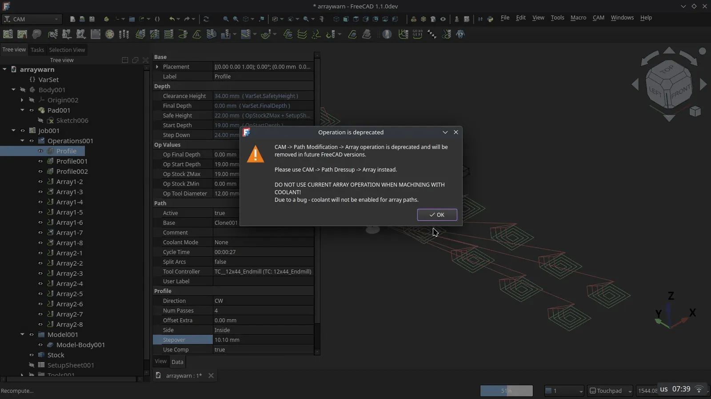
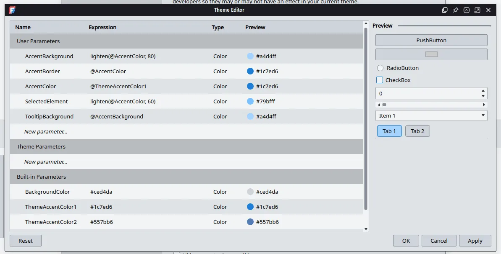

This week in FreeCAD development:

**Sketcher**:

- theo-vt fixed an issue in the new autoscaling feature, and NewJoker contributed a tooltip for it.
- fermino fixed an issue that could result in a crash in certain scenarios with missing references.

**BIM**:

- Roy-043 fixed the autojoin behavior so that it does not affect nested objects. He also added the handling of hosted objects, additions, and subtractions to the joinWalls function.
- tetektoza added an option to preload IFC types during document opening.
- zbynekwinkler fixed an issue where the placement property of a cached subvolume was modified each time the component, from which it was being subtracted, was recalculated.
- More fixes by Roy-043 and Syres916.

**CAM:**

- kadet1090 fixed the visual appearance of the origin indicator.
- tarman3 changed the warning about the Array operation becoming obsolete to show up only when you try to create a new array.

**GUI**: maxwxyz removed outdated links from the Help menu and added a link to the Developers Handbook.

Among other changes:

- Roy-043 fixed several issues in Draft and BIM.
- NewJoker enabled solid creation by default for Loft and Sweep tools in Part and swapped Width and Height fields for beam box section in FEM.
- davesrocketshop updated the materials system to support importing and exporting material fields supported in FCMat files but currently unavailable in the editor: reference source, reference URLs, and tag fields.
- zbynekwinkler tweaked the build system to simplify debugging FreeCAD with VS Code.
- oursland updated pixi dependencies to align with the [VFX Reference Platform](https://vfxplatform.com/) (2026).
- kadet1090 added Style Parameter Manager to contain theme parameters for defining and managing UI theme parameters on the fly.

Additional improvements and fixes were contributed by maxwxyz, Syres916, ryankembrey, kadet1090, chennes, luzpaz, and NewJoker.

**PR stats**: since the previous report, 36 pull requests have been merged, and 36 new pull requests have been opened.

**Issue stats**: overall, there are 2908 open issues in the tracker, down by 13 from last week.