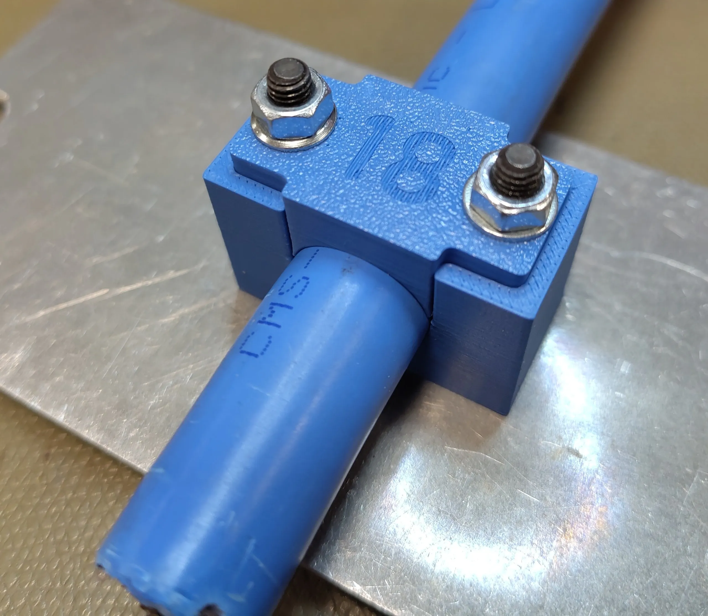
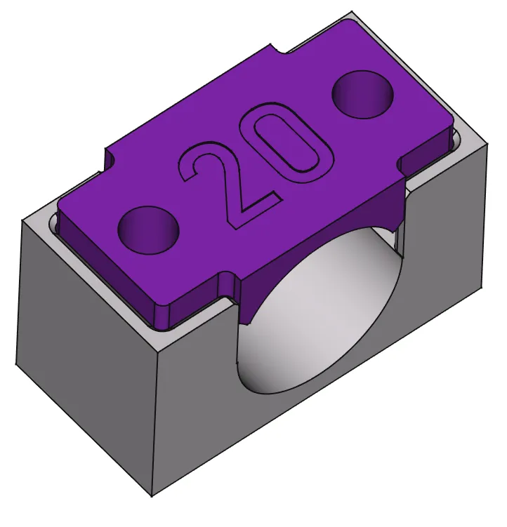

In case it passed you by, over on our [mastodon account](https://fosstodon.org/@freecad) and on the [X platform](https://x.com/FreeCADNews) we have run the hashtag #FreeCADFriday for a long time. It's a straightforward "show everyone what you are up to with FreeCAD" type affair and every week so many amazing projects show up as responses. Sometimes they are breathtakingly complex, beautiful, often though they are simple and  functional, but sometimes it's fun to see *where* FreeCAD is getting used!

These cable clamp designs from [cccpresser](https://mastodon.social/@cccpresser@chaos.social) are a pretty straightforward design, but it's wonderful to see that these two part clamps are to be installed in the [CMS detector at CERN](https://www.home.cern/science/experiments/cms). The cables form part of the drift tube system that detects muons with cables supplying power to the read out electronics. The lower part of this parametric clamp design has a captive M5 bolt so that installation is simple requiring only one driver tool to add the flange nuts to the upper side.

It's an elegant functional design and it's definitely worth following cccpresser as they also do wonderful work in KiCad and more. Do check out #FreeCADFriday for more inspiring community makes, and, whatever you're making with FreeCAD, do feel free to show and tell!