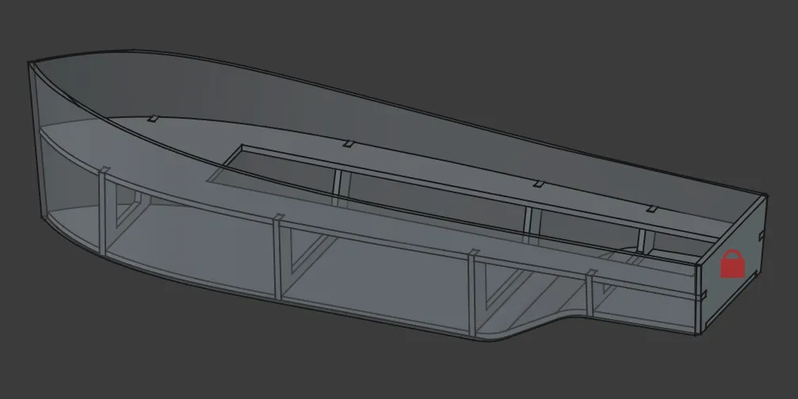
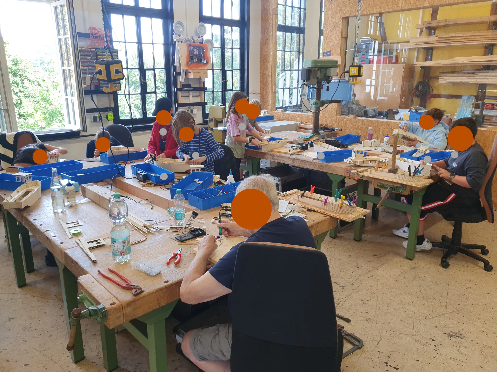
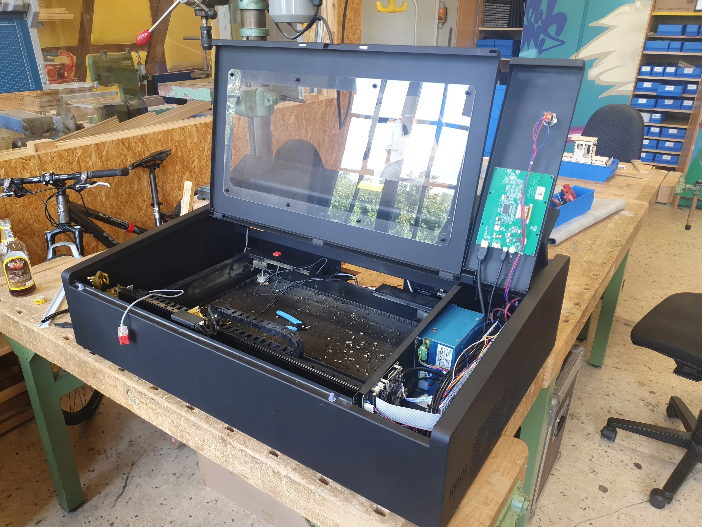
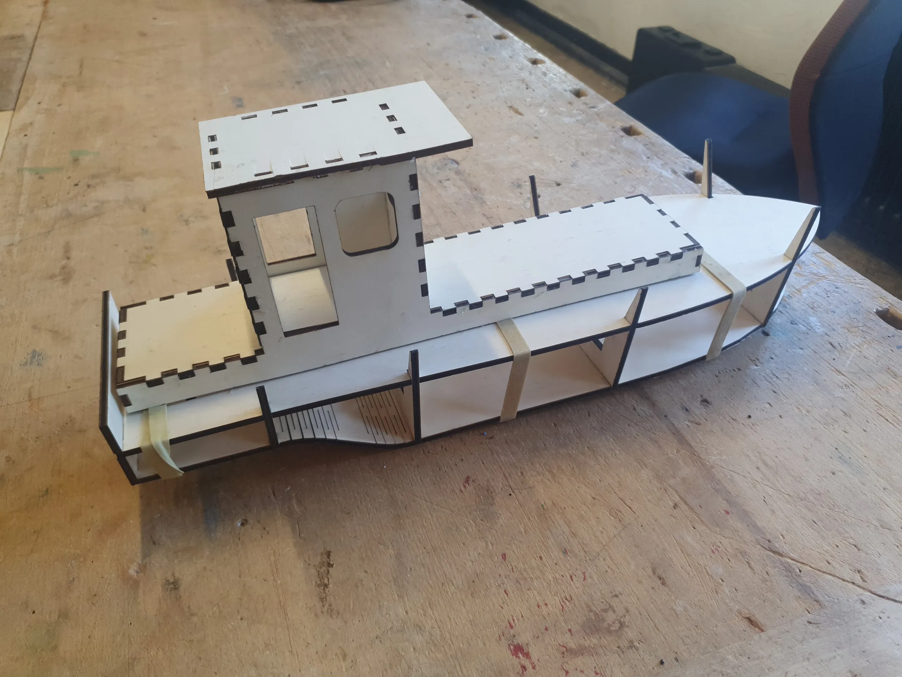
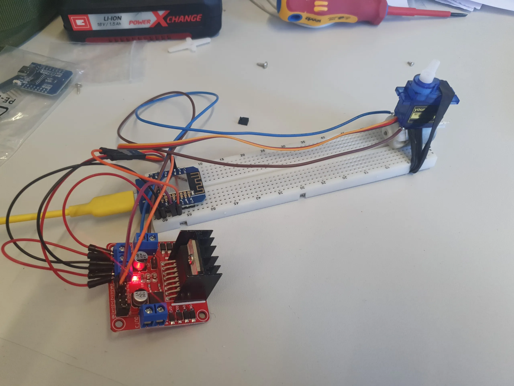

A couple of weeks ago on the #FreeCADFriday hashtag over on [Fosstodon](https://fosstodon.org/@FreeCAD), Hanser posted a lovely bit of FreeCAD design work for a RC boat hull. It was a great looking design, but even more wonderful was the story that unfolded in the thread that followed.

Over in Crailheim in South Central Germany is the [Juze Crailsheim,](https://juze-cr.de/) a independent youth centre that's been supporting and encouraging the young people of Crailsheim since 1974. Glancing over their website, there's lots of community activities, meditation, art classes and more, but it's also home to the 0xBA5E Makerspace.

The boat design was in preparation for summer activity where the young people got to assemble a fully functional web controlled RC boat. The FreeCAD boat design, once completed, was flattened for 2D export and then the "Living Hinge" and other joint aspects of the 2D design were added in the excellent [Inkscape](https://inkscape.org/) application.

One snag was that the laser cutter, of course, decided to have some problems just when the crew needed to cut all the components, but the dedicated team got the laser back up and running.

The workshop took place and ten young people between the ages of 8 and 12. Glueing and filling and painting the excellent boat kits was only part of the story. The young people also got involved with soldering what looks to be an ESP32 device and a motor driver board as well as a 9 gram servo for steering. The use of the ESP is brilliant as it keeps costs down and a WiFi/Web controller can be made that can run from a phone or laptop, this all reduces the cost of hobby grade RC equipment and increases the learning.

We've loved watching this story unfold and wish the Youth Centre and Makerspace all the best for their future activities.