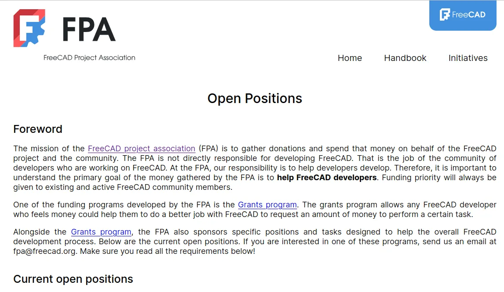

Recently the FPA have had numerous open positions available, and we are incredibly pleased to announce that all these positions have now been filled.

First up, we can announce that Brad Collete (sliptonic) is the successful applicant for the [FreeCAD Professional Network (FPN) Lead role](https://github.com/FreeCAD/FPA/blob/main/jobs/freecad_professional_network_lead.md). You can view the job description for this role on the link above, but it will include creating and curating a register of professionals using FreeCAD either as creators, companies or as educators.

Additionally there's lots of activity in this role around creating newsletters, blog content and other materials for FPN members and the wider community. We look forward to see this network develop over the next year.

Kurt Kremitzki (kkremitzki) takes on the [Infrastructure Maintenance Leader role](https://github.com/FreeCAD/FPA/blob/main/jobs/infrastructure_maintenance_leader.md). Covering the website, forums, wiki, and the add on cache this role will keep everything running as smoothly as possible. Kurt has a long history running much of this infrastructure already, and we are really pleased to consolidate this role.

John (PhoneDroid) takes on the [Addon Ecosystem Coordinator role](https://github.com/FreeCAD/FPA/blob/main/jobs/addon_ecosystem_coordinator.md). This role primarily works with add on developers to support moving add ons towards compatibility with future releases.

With PhoneDroid taking care of communication and coordination with those developers, a vote was held and the FPA approved to create an additional Addon Ecosystem Technical Lead. Frank Martinez (mnesarco) will fill this role and will also focus on the technical support of developers and the development of documentation and other support materials.

With some overlap in these roles it's felt the support of developers will be increased, leading to improvements and stability in add ons.

Finally, the [FPA Accountant Role](https://github.com/FreeCAD/FPA/blob/main/jobs/accountant.md) will be taken by Turan Furkan Topak (Reqrefusion). Turan is an FPA member and a fully trained accountant. We welcome the opportunity to have someone in this role who is so familiar with open-source software and open governance.

We'd also like to wish everyone all the best in their new roles. We look forward to posting updates here and elsewhere on the work they undertake helping us move forward with FreeCAD.