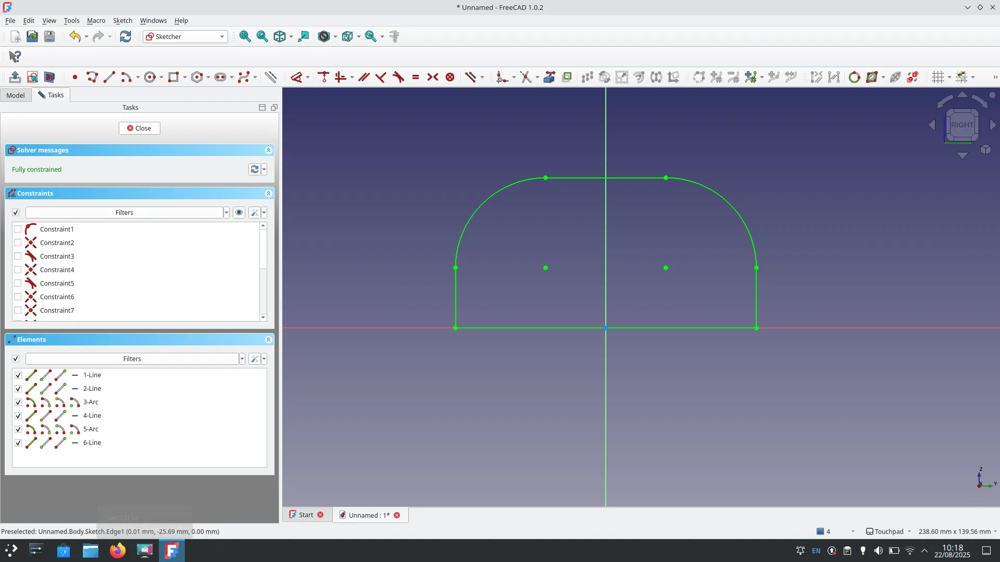
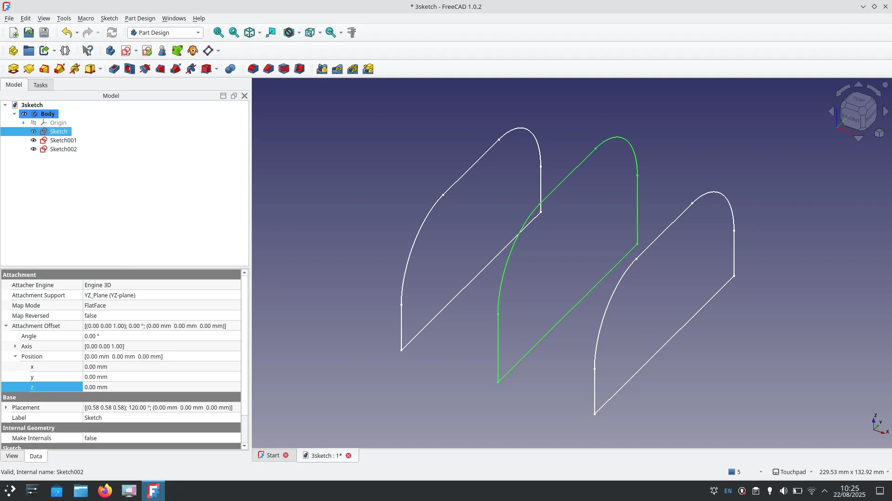
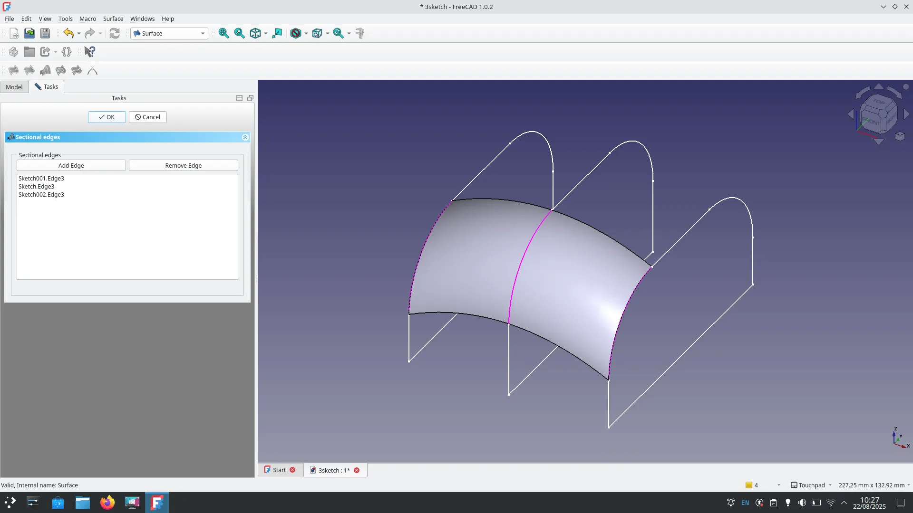
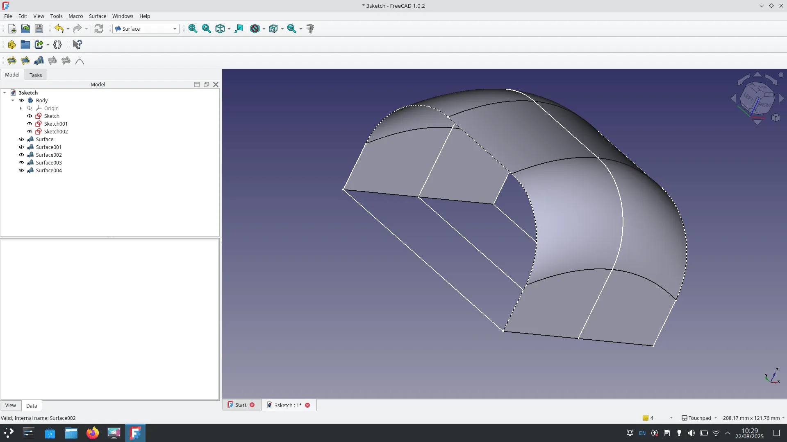
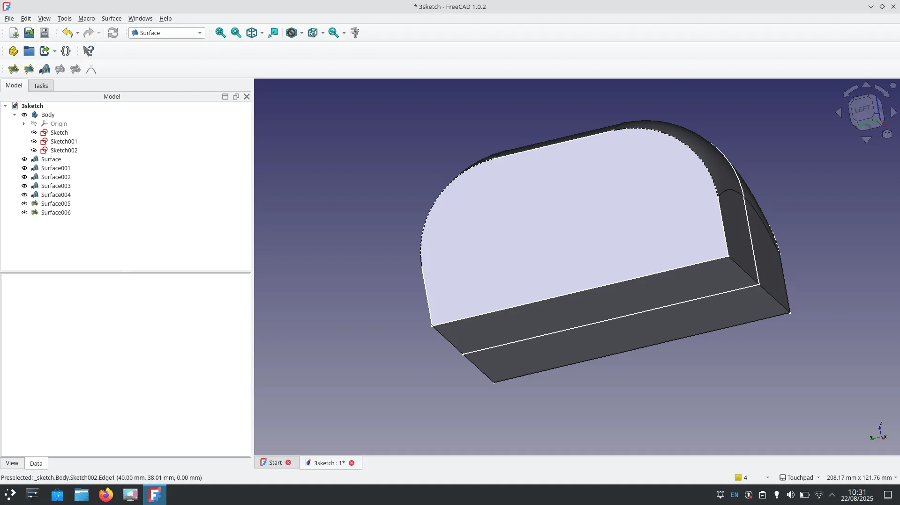
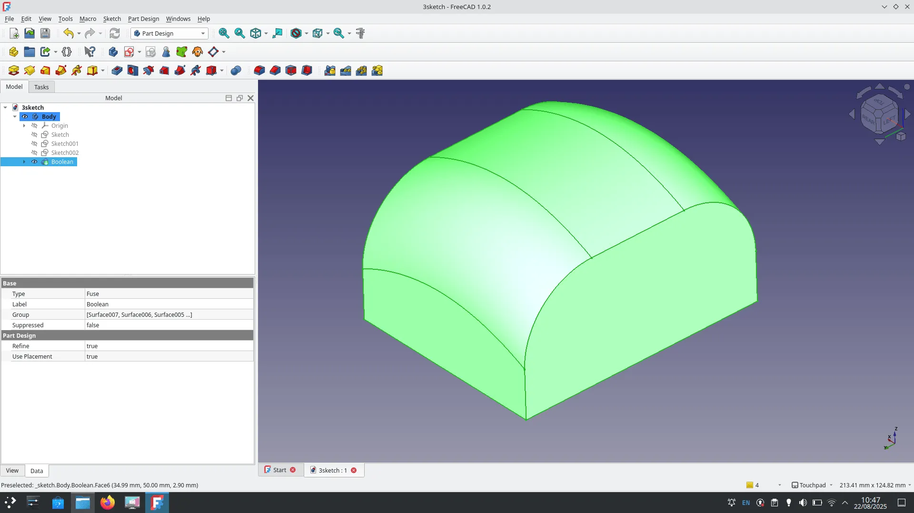

The surface workbench has some fantastic tools that simplify making surfaces allowing for complex parts to be made. Let's have a quick walk through some of it's basic approaches. As a reminder in these tutorials we always refer to tools using the names that appear in the tool tips when you hover over the tool icons. This encourages everyone to look around and discover more tools!

To begin, open a new project using the "Parametric Part" option in the new file section of the start page. This will open the Part Design workbench and create an active body. Next click to create a sketch either in the task tab or click the "Create Sketch" tool icon. When prompted attach the sketch to the XZ plane. This will open the sketcher workbench. We're going to presume you know the basics of sketching in this tutorial so create a sketch that looks somewhat like ours.

Having completed our sketch close the sketch to return to the Part Design workbench. Next we are going to copy and paste our sketch 2 times so we end up with 3 sketches. When you copy paste sketches they will be placed outside of the active body, left click and drag the copied sketch items in the file tree into the active body. You can then also delete any extra XY Plane object entries that exist outside the active body.

Next select one of the copied sketches by left clicking on it in the file tree view. Then in the objects dialogue use the Attachment Offset drop down to adjust the position of the sketch in the Z axis direction. We moved one sketch 40mm and another sketch -40mm to spread out our sketches. Finally, just to show the capability of the surface workbench, we went back in and edited the sketch in the centre of our design so that it was larger than the others. Our sketches ended up looking like the image below.

Next let's move over to the Surface workbench. The first tool we are going to use is the "Sections" tool. This tool enables the creation of surfaces between sectional edges like the ones in our sketches. Left click the "Sections tool" and a dialogue launches, click the "Add Edge" button. Then click one of the curved sections of one of the sketches, in turn click the similar positioned curve in the next sketch and then the similar curve in the final sketch. Do this in a sequential order moving across the sketches along the z axis, rather than selecting the middle sketch curve then the outer sketch curves. As you add the edges you should see a curved surface appear.

Once you have selected the three curved edges and created this first surface you can then click the OK button. Repeating this process we created additional surface items for the top and sides of our item.

At this point it's worth noting that you could add a thickness, or use offset tools to make these surfaces into a solid object, however we are going to use a different tool to make the whole of our sketches surfaced into a complete object. For the remaining surfaces which are all in single planes/flat we can use a different surfacing tool. Click the "Filling" tool icon. For either the ends of our object or the base item, we again clicked the "Add Edge" button in the "Boundary Edges" dialogue section. We then could click edge elements in sequence working around the perimeter of the desired surface. As you do this the surface adapts and often looks quite incorrect until you work fully around the boundary of the surface. Once you are happy each surface is complete click the OK button and relaunch the "Filling" tool to work on the next surface.

With all the surfaces complete you might now notice that the surfaces have all appeared separately outside the active body. Commonly you might want to join these surfaces together to create a single object perhaps for export for 3D printing or other onward processes. To do this click and drag to highlight all the surface items in the file tree list and then click the "Boolean" tool icon. This will create a new "boolean" item that will be placed inside the active body.

