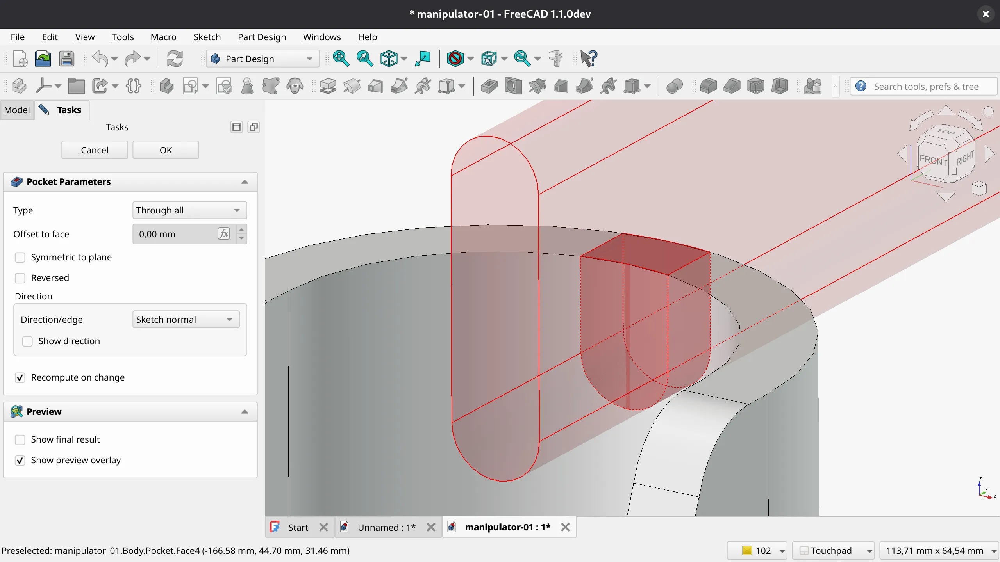

This week in FreeCAD development:

**Sketcher**:

- kadet1090 changed dimension extensions lines to be smaller and relative to the arrow size (see [PR#23071](https://github.com/FreeCAD/FreeCAD/pull/23071) for some examples).
- PaddleStroke fixed several issues related to the **Fit All** zoom command. He also made the first step towards overconstraint reporting, similar to what's there in Assembly (see [PR#22751](https://github.com/FreeCAD/FreeCAD/pull/22751) for details).
- matthiasdanner fixed a crash on setting constraints to a virtual space.
- Rexbas fixed a bug where highlighting a point would cause that point to disappear.

**Part Design**: kadet1090 contributed long-anticipated transparent previews for Pad, Additive and Subtractive Loft/Pipe/Helix, Pocket, Fillet, Chamfer, and Thickness commands. A separate pull request added the transparent preview to the Draft feature. Colors, transparency levels, and other properties for the transparent previews are all configurable.

**TechDraw**:

- WandererFan fixed several bugs, including one where the welding information would not be attached to the leader line.
- ryankembrey replaced the old static view frames with new dynamic ones. Here is the demonstration:



**CAM**:

- sliptonic fixed a bug with the loop completion tool and merged the initial CAM roadmap; [see here](https://github.com/FreeCAD/FreeCAD/tree/main/src/Mod/CAM/Roadmap) for details.
- tarman3 fixed a bug where a new operation couldn't be created after certain supplemental commands.

**GUI**:

- pieterhijma added support for renaming properties, and kadet1090 fixed a minor regression in that patch by restoring proper object names for panels.
- B0cho fixed the default positioning of the Expression editor and the Vector editor.
- hyarion and maxwxyz fixed a couple of issues in navlib.

**Other changes**:

- Roy_043 patched some of the user-visible strings in Draft.
- NewJoker and marioalexis84 contributed a few small fixes to FEM.
- drwho495 contributed fixes for two toponaming issues ([#22395](https://github.com/FreeCAD/FreeCAD/issues/22395) and [#20277](https://github.com/FreeCAD/FreeCAD/issues/20277)).
- theo-vt fixed a bug in QuickMeasure that occurred when selecting a subshapebinder created from a cylindrical face.

Additional improvements and fixes were contributed by oursland, maxwxyz, Syres916, marioalexis84, wwmayer, 3x380V, Abhay-lostfromlight, FC-FBXL5, drewler, PaddleStroke, pieterhijma, hyarion, and luzpaz.

If you are interested in testing the latest weekly build, you can grab it [here](https://github.com/FreeCAD/FreeCAD/releases/tag/weekly-2025.08.13).

**PR stats**: since the previous report, 49 pull requests have been merged, and 41 new pull requests have been opened.

**Issue stats**: overall, there are 2943 open issues in the tracker, down by 6 from last week.

The developers also [published the schedule](https://forum.freecad.org/viewtopic.php?t=99009) for v1.1 feature freeze:

- **September 1st** - Deadline to mark PRs as ready for review if they are intended for inclusion in v1.1. This allows a two-week window for review, revisions, and merging.
- **September 15th** - Feature Freeze: No new features will be merged for v1.1.
- **September 30th** - Deadline for UI and translation-affecting changes (to give translators and documentation contributors enough time).
