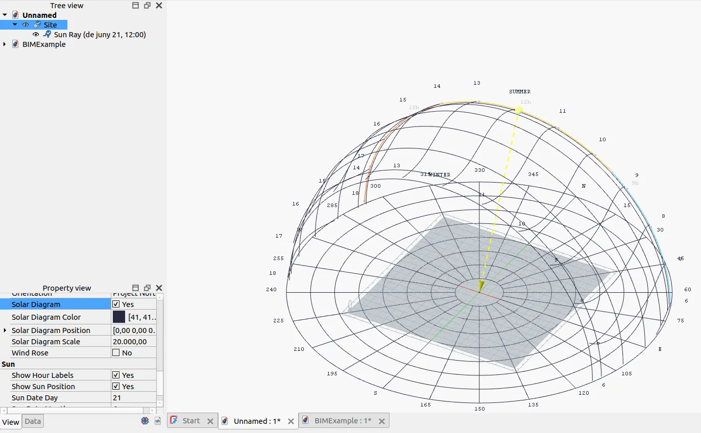

This week in FreeCAD development:

**Draft**: Roy-043 added hints for the tools in the Draft Creation toolbar. He also added support for relative paths for hatch patterns and fixed a couple of issues.

**Sketcher**:

- PaddleStroke backported a patch from RT's fork that adds a "MakeInternals" property so that you can select and pad faces in sketches. He also fixed an issue with the constraint icon size.
- tetektoza fixed construction lines becoming solid after box selection.
- matthiasdanner made it possible to select a constraint when it was rendered in a group with other constraints because the calculation of the cursor position was wrong inside the constraint group.
- pierreporte fixed the position of the circle diameter constraint. It is now set where the on-view parameter has been validated.

**Part**:

- kadet1090 fixed 2D offsets of faces and relaxed boolean requirements so that even small, unrelated model issues would not prevent the boolean from being computed.
- maxwxyz and tetektoza fixed several issues.

**Part Design**:

- kadet1090 contributed several fixes and improvements:
  - Fixed a regression where the Transformation tool wouldn't show the grabber for PD Clones.
  - Unified deletion behavior for all PartDesign features.
  - Added a new check that prevents a hole from claiming other features as children.
  - Fixed an issue where visuals would be copied from ShapeBinder.
- PaddleStroke added a two-sided extrusion and enhanced the Linear Pattern tool. You can now create two-dimensional arrays and multiple spacings in one go. Here is a video from the developer:



**Assembly**:

- PaddleSroke improved the behavior of selecting a grounded joint object and fixed a couple of cosmetic issues.
- tetektoza allowed editing joint references and fixed a crash that occurred when closing a document while having the Task panel opened.
- oursland fixed a bug in Ondsel Solver.

**TechDraw**:

- Wandererfan fixed two issues: the inability to remove old cosmetic lines in clip groups and a crash that occurred when selecting multiple vertices and edges.
- theo-vt added undo-redo support for view dragging.
- ryankembrey fixed view frames resizing on select/hover.

**CAM**:

- sliptonic and davidgilkaufman updated the CAM development roadmap to add epics for circular hole improvements, core dressup improvements, and fixing user pain points.
- tarman3 fixed a bug where the toolbit would show up in job dialogs (Create, Edit, and Stock). He also fixed another bug where hidden bodies of tools would remain in the document tree after removing a job.
- corpix tweaked the UI in the Task panel for some of the content to become visible (see [PR#23067](https://github.com/FreeCAD/FreeCAD/pull/23067)).

**BIM**:

- Roy-043 fixed the direction of panel waves and fixed conflicting default shortcuts for Draft_Split and Arch_Space commands.
- paullee0 fixed a regression in Slab/Structure Face Maker settings and patched Clone and Link to support Sill change.
- furgo16 added interactive sun position and ray visualization to Arch Site (see [PR#22516](https://github.com/FreeCAD/FreeCAD/pull/22516) for more info).

**FEM**:

- NewJoker fixed xdmf exporting of second-order meshes. He also added writing of result displacements from REF NODE and ROT NODE of rigid body constraint to ccx_dat_file, which is useful when simulating torsion (to check the angle of twist).
- wwmayer fixed a crash when writing mesh to z88 files.
- ickby patched the code to extract postprocessing data only when it's available.
- marioalexis84 patched the code to acquire the Global Interpreter Lock before running Python code.

**GUI**:

- MisterMaker replaced the Preferences page icon for Part/ PartDesign.
- Rexbas fixed zooming at a new rotation center in the Revit preset.
- maxwxyz deactivated Inspection, OpenSCAD, Robot, Test Framework, and `<none>` WB options by default.
- kadet1090 removed unused blank space in the Document Recovery dialog.

**Other changes**:

- wwmayer improved the OBJ importer to allow loading files created with Blender (patch cherry-picked by maxwxyz). He also fixed a couple of Measure-related issues (cherry-picked by 3x380V).
- drwho495 fixed another toponaming issue ([#23249](https://github.com/FreeCAD/FreeCAD/issues/23249)).
- tetektoza improved the performance of loading thumbnails on the Start page.
- maxwxyz and chennes fixed various Crowdin-related issues that affected translators.
- thyssentishman fixed two issues when editing materials.
- z0r0 added more missing Python bindings (in Assembly and CAM).
- mnesarco changed Expression Grammar to support direct expressions as ternary operator conditions.

Additional improvements and fixes were contributed by NewJoker, pieterhijma, luzpaz, tetektoza, maxwxyz, MisterMaker, kadet1090, Roy-043, pinkavaj, mosfet80, xtemp09, and adrianinsaval.

If you are interested in testing the latest weekly build, you can grab it [here](https://github.com/FreeCAD/FreeCAD/releases/tag/weekly-2025.08.27).

**PR stats**: since the previous report, 89 pull requests have been merged, and 44 new pull requests have been opened.

**Issue stats**: overall, there are 2932 open issues in the tracker, down by 26 from last week.