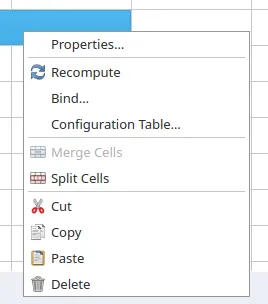

This week in FreeCAD development:

**Draft**: Roy_043 fixed an issue where splitting a line would move that line. He also fixed the file button size in the Hatch task panel and the display of the cross-shaped cursor.

**Sketcher**:

- matthiasdanner fixed the drawing of angle constraints that would go beyond the center point of an arc or have a negative value.
- tetektoza patched SoDatumLabel constraints to make the corresponding extension lines and arrowheads selectable (please see [#21920](https://github.com/FreeCAD/FreeCAD/pull/21920) for a video demo).

**Part Design**:

- wwmayer fixed applying Loft between curved faces (cherry-picked by 3x380V).
- FlachyJoe added the code to attempt to auto-fix self-intersecting and degenerated edges in helix objects.
- tetektoza added a user-visible switch in Preferences that allows users to stop Part and Part Design switching to the Tasks tab by default every time they switch the workbench.

**FEM**: NewJoker added support for amplitudes with CalculiX, as well as support for references for CalculiX's initial temperature (so that initial temperature can be applied to individual regions).

**TechDraw**: WandererFan fixed a display issue with B-Splines at certain scales ([#22101](https://github.com/FreeCAD/FreeCAD/issues/22101)).

**CAM**:

- knipknap fixed 11 issues and minor annoyances-both internal and user-visible-in the tool manager.
- J-Dunn reverted a regression in the grbl_proc postprocessor, as it was incorrectly setting OLD_Z if current machine_z was below G81 retract plane in the R parameter.

**Core**:

- B0cho added a core 'Skip Recompute` command, so you can now create a toolbar button for it and/or assign a shortcut.
- mnesarco made it possible to use Boolean expressions in functional style: all, any, bool, not. Please [see here](https://github.com/FreeCAD/FreeCAD/pull/22506) for some examples.

**Other changes**:

- pieterhijma added support for adding enum items directly in the VarSet's Add Property dialog.
- z0r0 implemented the generation of Python bindings for FEM, TechDraw, and Assembly with pyi files (see [#21784](https://github.com/FreeCAD/FreeCAD/issues/21784) for more information).
- xtemp09 simplified the context menu code in Spreadsheet and added icons there.

Additional improvements and fixes were contributed by ryankembrey, NewJoker, Roy_043, 3x380V, oursland, MisterMakerNL, theo-vt, chennes, luzpaz, kadet1090, and CarlosNihelton.

**PR stats**: since the previous report, 47 pull requests have been merged, and 37 new pull requests have been opened.

**Issue stats**: overall, there are 2937 open issues in the tracker, down by 1 from last week.