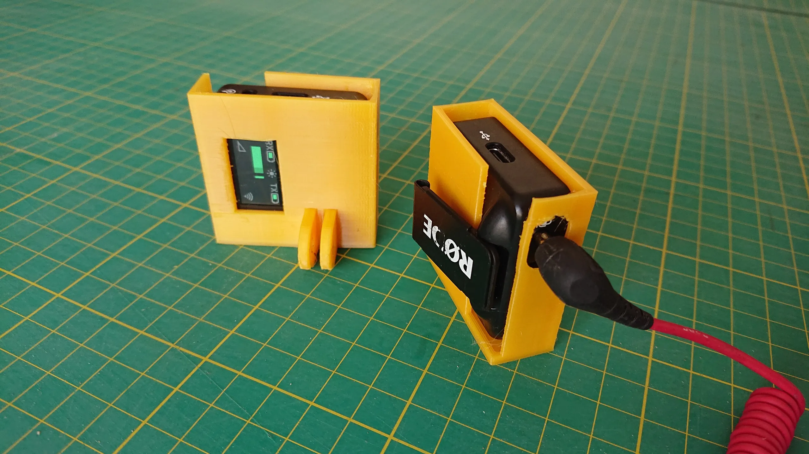
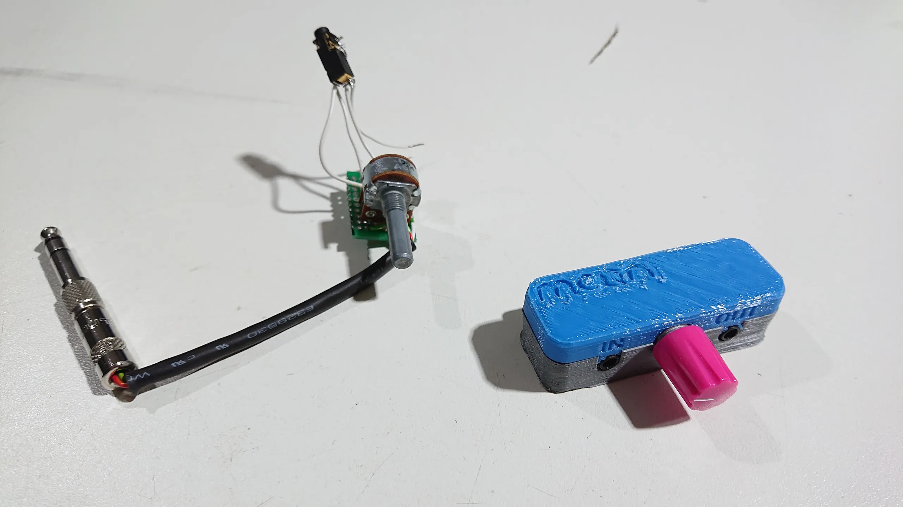
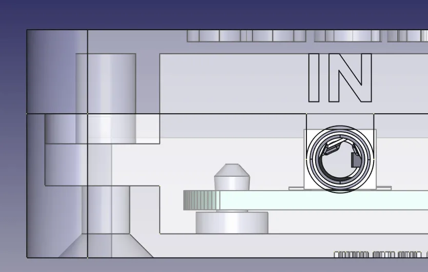
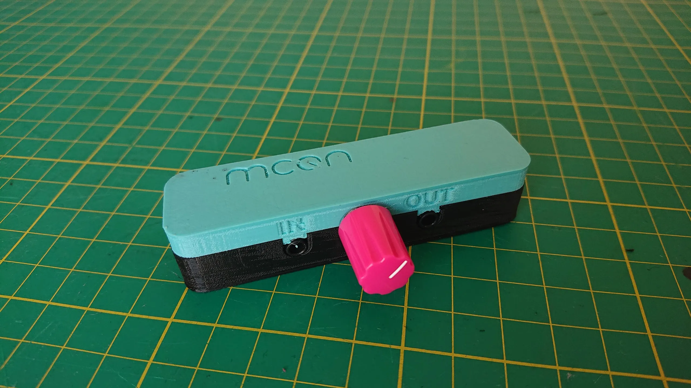
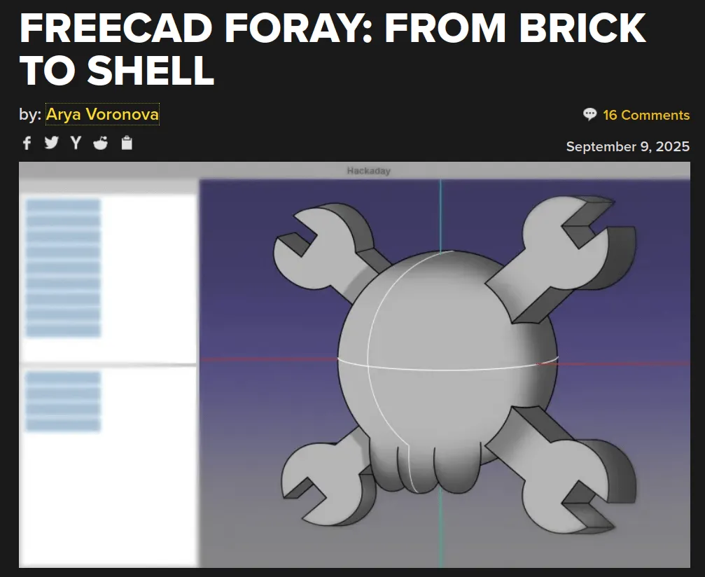

It feels fitting to write a KiCad related story this week as [KiCon Europe](https://kicon.kicad.org/europe2025/) is currently underway in Bochum Germany. We send best wishes to our KiCad friends and colleagues and hope they are having a wonderful time.

Meanwhile, in Liverpool UK, there's a great Friday night social bike ride community where people get together and, well, ride bikes.

In an effort to extend the community riding into the darker seasons there's been copious use of Neopixels. In fact, the subject of this Forged in FreeCAD, Adrian from [MCQN Ltd](https://mcqn.com/)is the creator of the WLED based, "[My Bikes Got LED](https://mcqn.com/ibal234/)" kit which makes adding and crucially powering, Neopixel strips to bikes easy.

With the lighting somewhat covered another interesting challenge for group riding was a group sound system, they like to play music with a playlist being streamed from a phone to some powered portable speakers. This obviously has to cover a range of distances with 40 plus bikes stretching out to form a long group, beyond the range the Bluetooth can reliably provide.

The working solution has been to use a wireless microphone transmitter and receiver unit, mounted atop a selfie stick to connect the front running powered speakers to the ones at the back of the peloton! Not wanting to risk his nice Rode set to Selotape and zip ties Adrian used FreeCAD to whip up a nice pair of action camera clamp compatible cases with cut outs for all the access and cabling.

However, the solution wasn't perfect. The microphone transmitter is, well, built for a microphone input, not a line level input that the front running speakers can output. Some attenuation was needed or else the audio supplied to the rear of the group ride system could well be distorted. A pretty straightforward attenuation circuit can be made which is simply a variable resistor and a couple of capacitors to block any DC current. A prototype was quickly lashed together and tested and was deemed to be an adequate solution.

Around the time that FreeCAD 1.00 was released, Adrian was working on this circuit and thought it might be a great idea to check out some new FreeCAD features, as well as consolidating the circuit onto a proper circuit board. KiCad made quick work of the circuit design, but Adrian had some particular potentiometers left over from another project which didn't have a KiCad footprint.

For those who don't know, a KiCad footprint module includes the component outline, perhaps some silkscreen drawings and markings to help you place the component, copper pads and holes and more. Optionally a more complete footprint in KiCad also has a referenced 3D model. This means that you can not only make nice renders of your PCB and component assembly, but can be incredibly useful when checking physical clearances when designing an enclosure.

If you are making component models in FreeCAD for KiCad footprints, then there is the excellent [KiCad StepUp workbench](https://github.com/easyw/kicadStepUpMod)which has an incredibly useful set of tools. Using the KiCad StepUp workbench you can import kicad_mod files into FreeCAD (the component footprint files) and then create perfect alignment for your 3D component model before exporting back to your local KiCad libraries.

You can also load KiCad PCB layouts and parts into FreeCAD and to model to, or indeed to convert to STEP or IGES files for further processing.

With his potentiometer model and KiCad footprint setup, Adrian continued to use FreeCAD and KiCad in combination to model his iterations of enclosure. Loading up the KiCad project in FreeCAD as a STEP file, Adrian could then use the ShapeBinder functions to be able to use the KiCad PCB geometry as reference in his enclosure design.

Adrian also dived in to exploring the (then) new Assembly workbench and through all these techniques modelled a really well-fitting enclosure for a 3D print. We think the results and the process look great and certainly more robust than the soldered to a bit of Veroboard prototype!

As we write this post, it's interesting to note there are a few conversations around combined KiCad and FreeCAD use. Over on [Hackaday.com](https://hackaday.com/2025/09/09/freecad-foray-from-brick-to-shell/), Arya has documented their adventures in learning FreeCAD for PCB enclosure design. And in the comments, we can see Elliot, the Hackaday Managing Editor, discussing using the shape binder techniques that Adrian has used here.

It's great to see people discussing these approaches. Finally, and also related, [we spotted over on Mastodon](https://mastodon.social/@morgan@leds.social/115170458222837269) this week that [Morgan is actively working on KiConnect](https://blog.freecad.org/2025/06/20/kiconnect-at-kicon-new-interoperability-between-freecad-and-kicad/), KiConnect is another FreeCAD workbench which offers extensive push and pull between KiCad and FreeCAD, so for example it's possible to move a board edge in KiCad and have your enclosure design respond around the changes in FreeCAD! Exciting stuff that's certainly worth keeping an eye on.

Thanks to Adrian for taking the time to talk to us about this project. The audio shifter, as well as many other designs from Adrian, are [OSHWA certified](https://certification.oshwa.org/uk000066.html) and the [repository for this Audio Level Shifter project is here](https://github.com/mcqn/audio-level-shifter).