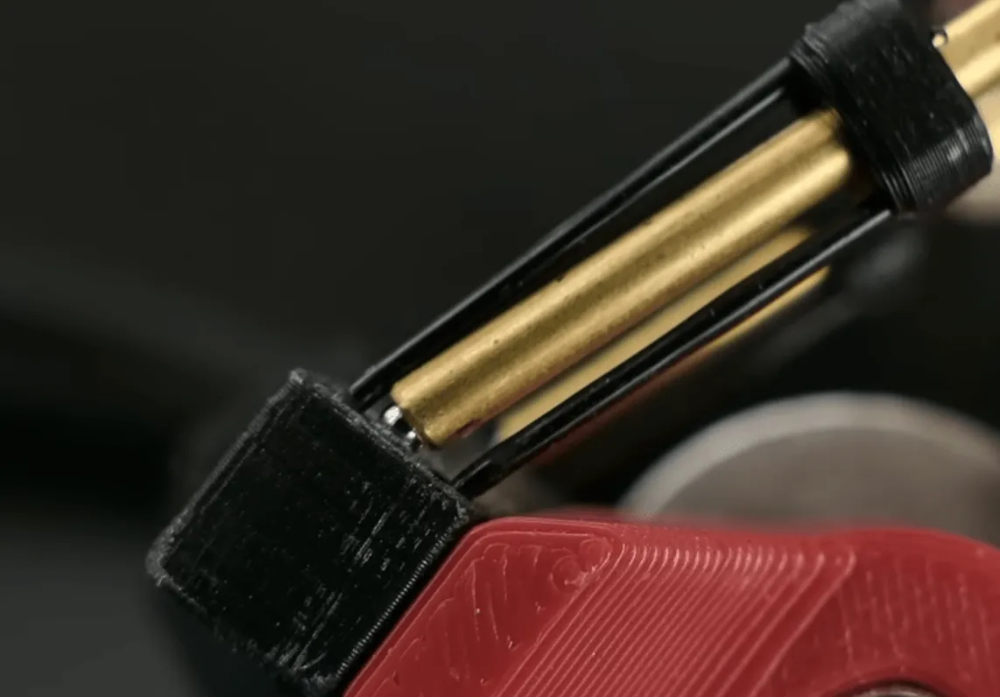
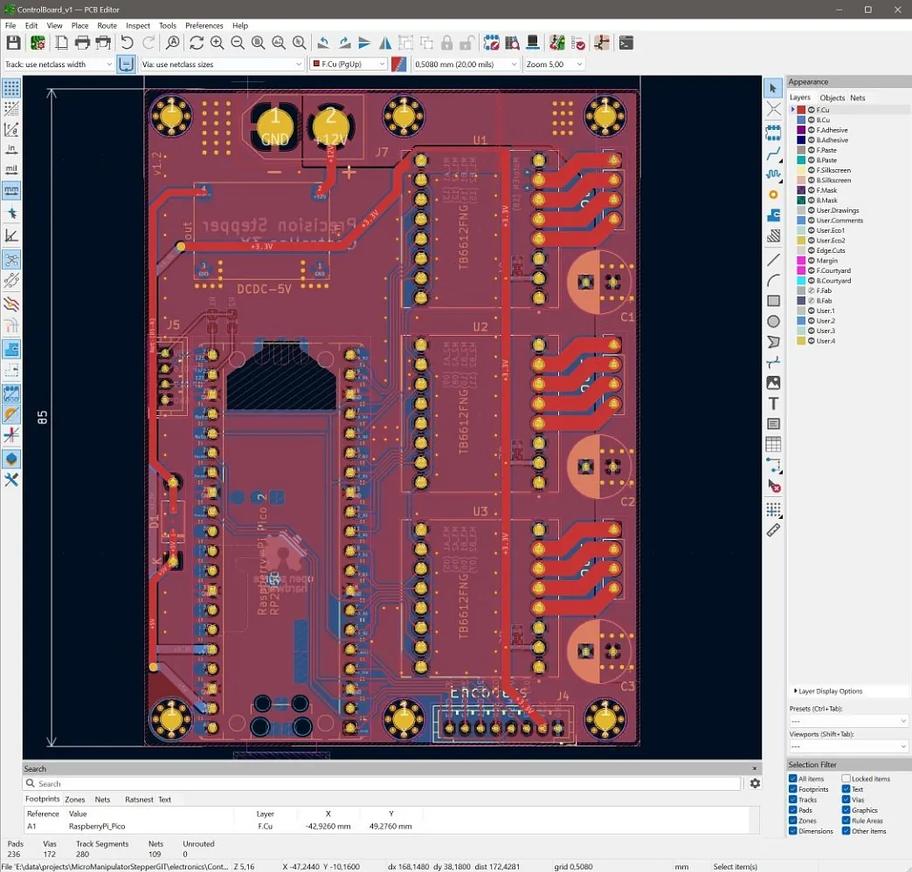

It's a wonderful thing when you see a very cool opensource hardware project and then a further delight when you see that the toolchain to build the device is also completely open.

Using FreeCAD, KiCad and other opensource projects like Python and GRBL this XYZ micro manipulator is fascinating in multiple aspects.

First, it has an excellent combinational design of a ball joint with flexures that creates a fabulous joint with smooth movement using tiny ball bearings and 2mm brass tubing. We have to confess it's built so well that we imagined the tubes to be much larger when we first saw them.

Then there's some very clever exploration of using magnet arrays to emulate a single rotating magnetic field to create a very accurate encoding system using a large 3d printed part attached to a common stepper motors.

The motor driver boards are reasonably common modules hooked up to a RP2350 Raspberry Pi Pico2 in turn all mounted and routed on a custom, KiCad-created PCB. A bespoke firmware is supplied over on the repository, and there are some example python scripts for homing and calibration and more.



So what can it do? Well, looking through the excellent video over on YouTube the device is extremely capable of accurate positioning and there some brilliant examples with the device set up moving a stage and an IC silicon sample under a microscope.

There's also a fun section in the video where the device travels the paths to draw a scale cross section of a "Benchy", at just 20um across!

It's superb work, and it's wonderful to see screenshots of the design assembled in FreeCAD 1.1 on the [project repository](https://github.com/0x23/MicroManipulatorStepper).