FEM is a highly specialized workbench used to simulate various physical phenomena with the finite element method. The workbench is very actively developed, and thus it's recommended to always use the newest available FreeCAD version (possibly up-to-date [weekly builds](https://github.com/FreeCAD/FreeCAD/releases)).

The FEM workbench supports two main solvers:

- CalculiX is the best choice for mechanical (strength) and thermomechanical calculations.
- Elmer is the best choice for electromagnetic, flow, and thermal, as well as coupled (multiphysics) simulations.

CalculiX is provided with the Windows version, other solvers require [installation](https://wiki.freecad.org/FEM_Install).

## Geometry preparation

Before proceeding to run FEM simulations on your design, you should prepare the geometry as described on the [FEM Geometry Preparation and Meshing](https://wiki.freecad.org/FEM_Geometry_Preparation_and_Meshing) wiki page. This mainly involves:

- Choosing the right type of geometry (fully solid or simplified to surface/line if it's thin/slender). Currently, it's not possible to mix those types,
- Simplifying the geometry: removing unnecessary small details, utilizing symmetry.
- Combining all parts of an assembly into a single object using Part boolean operations (usually Boolean fragments with **Compsolid** mode + **Compound** filter) - currently, multiple meshes are not supported, and a single object to mesh is needed.

For the purpose of this tutorial, go to the Part workbench, add **Cube** (**Part_Box**), and only change the **Length** property to 100 mm. We will use this geometry to simulate bending and torsion of a cantilever beam with a square cross-section.

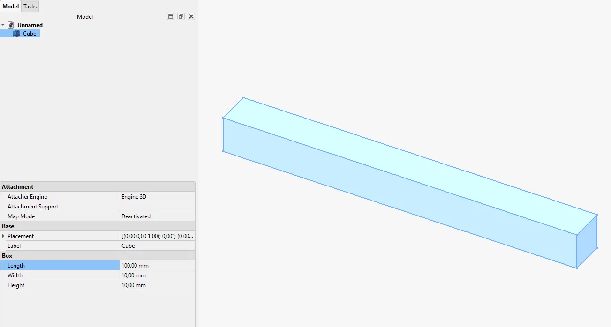

## Analysis container, meshing, and material assignment

After opening the FEM workbench, you have to add an **Analysis** container to activate the grayed-out tools. This will also add the default solver's object if set in the **Preferences**. Otherwise, add the solver's object manually. Here we will use CalculiX.

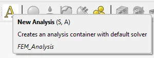

Now it's time to mesh the geometry-divide it into finite elements of simple shapes. Two meshers are available-Gmsh and Netgen. You can choose whichever you want, but the latter may be trickier to install. Gmsh is typically included with FreeCAD.

Select the single geometry object (**Cube** in this case) and click on the proper mesher button:

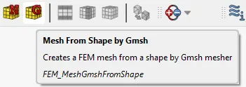

Now you just have to specify the maximum element size (use 2 mm in this case) and click **Apply**, then **OK**.

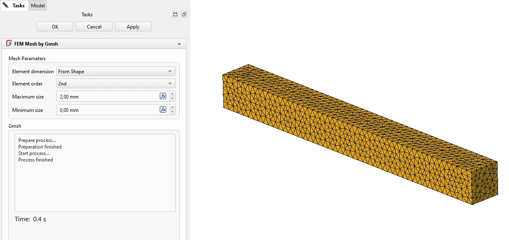

You can locally refine meshes (the **FEM_MeshRegion** command) when you need to increase the accuracy of the results in some critical locations, such as around holes.

It's also necessary to assign material(s).

Select **Solid Material** (yellow button next to **New Analysis**) and pick one from the list. Here, select "CalculiX-Steel".

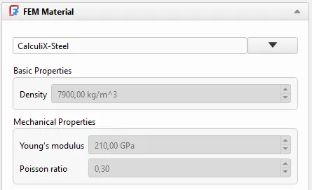

Optionally, you can use the task panel to change the properties used in analyses. Mechanical simulations need Young's modulus, Poisson's ratio, and density (only for frequency calculations or gravity/centrifugal force loads). Leaving a material with no geometry reference selected means that it will be applied to all geometry regions without material assignments.

To account for permanent (non-elastic) deformation, you can add a Non-Linear Mechanical Material object to the existing MaterialSolid and define plasticity using points from the material's stress-strain curve specified according to CalculiX's syntax.

Simulations with surface geometries (shell or 2D elements) also require thickness definition (the **FEM_ElementGeometry2D** tool), while for line geometries (beam elements), you need to define a profile (the **FEM_ElementGeometry1D** tool).

## Boundary conditions and loads

Static simulations require boundary conditions (supports) sufficient for static equilibrium. In most cases, they are applied as a Fixed Boundary Condition or a Displacement Boundary Condition. The first one restrains movement in all directions, while the second one lets you select the directions (degrees of freedom) and displacement values (0 means fix, non-zero values enforce motion). Keep in mind that rotations can be controlled only for shell and beam elements.

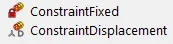

Sometimes it's necessary to specify boundary conditions (or force loads) in cylindrical coordinates. After that, you can use the local coordinate system.

In this case, you just have to fix one square face of the beam.

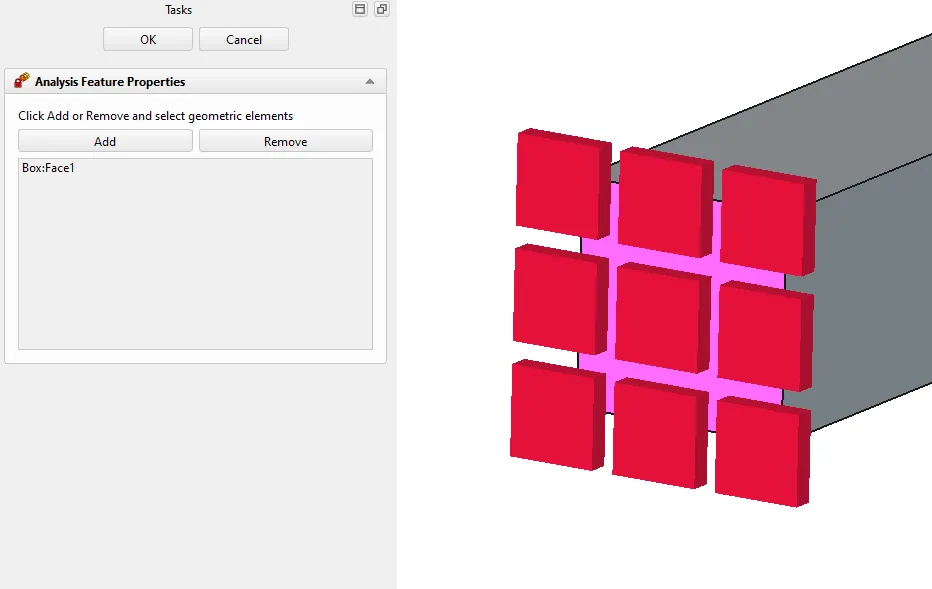

There are several types of loads available:

- **Force**: applies force in N in the specified direction
- **Pressure**: applies pressure in Pa in the normal direction
- **Centrifugal force**: applies centrifugal force to simulate the load to which parts rotating with a specified frequency are subjected
- **Gravity (self-weight)**: applies gravitational acceleration to account for the weight of the model (if it's significant)

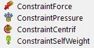

*For this tutorial, follow these steps:*

1. *Add the **Force** load and set it to 200 N.*

2. *Select the square face of the beam opposite to the one with the **Fixed** boundary condition.*

3. *Select a vertical edge, and click on **Direction** to change the direction in which the force acts to follow that edge.*

4. *Invert it by checking the **Reverse direction** box at the bottom.*

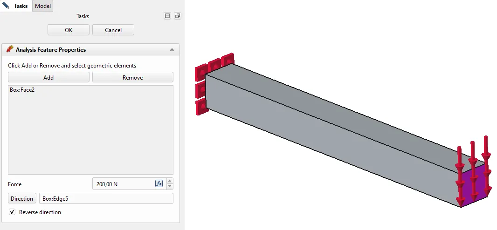

In the case of assemblies, you may have to define tie constraints (perfectly bonded surface pairs) or contact (surface pairs where surfaces may press against or slide on each other).

There are also several boundary conditions and loads for thermal (initial temperature, prescribed temperature, heat flux, and body heat source) and electromagnetic analyses, but let's skip those for now.

## Running an analysis and post-processing the results

If you need to change the analysis type or some solver settings, select the CalculiX solver's object in the tree and use the **Property** view to access the appropriate **Data** properties. Many analysis features also have additional options in their Property view.

*When everything is defined, just double-click on the solver's object in the tree and click **Apply**. Or **Write `.inp` File** and then **Run CalculiX** if you have an older CalculiX solver implementation enabled ("Result object: Pipeline only" CalculiX preference unchecked in FreeCAD 1.1). When it completes, close the task panel and check the results.*

Older CalculiX solver generates **CCX_Results** objects that don't have a legend and require double-clicking on them to display the results, but offer quick insight into minimum and maximum values of the selected outputs. Both solvers also generate results pipeline objects. Those have a color legend and show the results all the time if visible.

Note that the older ccx solver has displacements in meters and stresses in Pascals in its pipelines, while the refactored one uses more convenient mm and MPa units, respectively.

*Here, do the following:*

- *If you have the older ccx solver enabled, double-click on **CCX_Results**, select **Displacement Z**, and notice the minimum value in the task panel.*

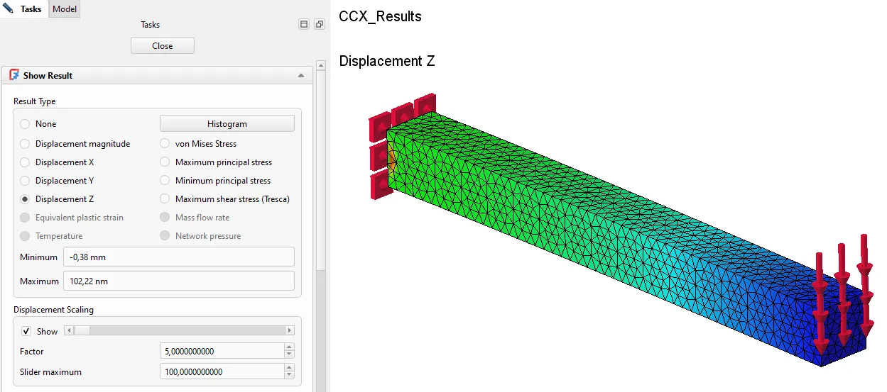

- *If you have the refactored ccx solver enabled, double-click on the **SolverCalculiXResult** pipeline object, make sure **Field** is set to **Displacement** and **Component** to **Magnitude** or **Z**, and notice the maximum (for **Magnitude**) or minimum (for **Z**) value on the color legend.*

_The displacement should be around 0.381 mm, according to hand calculations._

You can also select the results pipeline and add the **Warp** filter to visualize the deformation with a given scale factor (or use the slider in **CCX_Results**). Other filter types (e.g., for section cuts or probing results at the selected points) are also available.

## Rerunning the simulation with torsion

Before finishing this basic tutorial, let's go back to the available analysis features and discuss the **Rigid** body constraint shortly. It was added in FreeCAD 1.0 and can be very useful since it transfers the specified force, moment, or displacement/rotation boundary condition from one reference point to the selected region of the model (usually a face).

The reference point's coordinates can be specified. With this feature, it's possible to apply remote loads or simulate torsion of arbitrarily shaped parts. We will use it for exactly this purpose.

*Follow these steps:*

1. *Hide or delete the results of the cantilever beam analysis.*

2. *Suppress (right-click → **Suppressed**) and hide or just delete the **Force** object.*

3. *Add **Rigid Body Constraint**.*

4. *Select the same face on which the force load was applied, and set the reference point coordinates to (100,5,5).*

5. *In the **Rotational Mode** section, set **X** to **Load**.*

6. *In the **Moment** section, specify 10 Nm (or 10 J in FreeCAD 1.0 because it didn't support the Nm units) for X. This will apply torque around the X axis to twist the beam.*

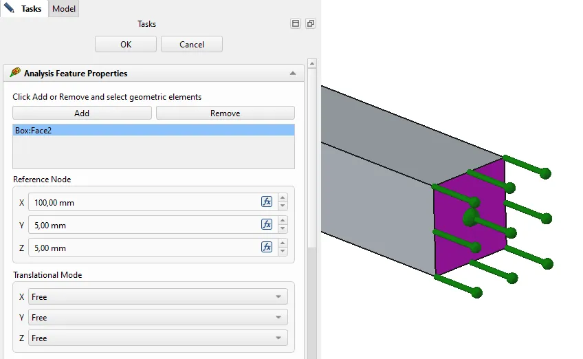

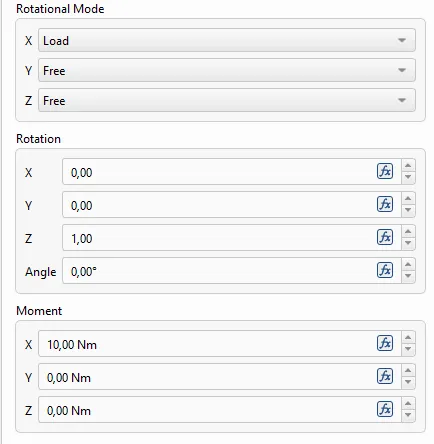

*Rerun the analysis and:*

- *If you have the older ccx solver enabled, double-click on **Pipeline_CCX_Results** and change the **Field** to **Stress xy** component. Here the stress on the color legend will be in Pa, so you have to divide it by 10^6 to have it in MPa.*

- *If you have the refactored ccx solver enabled, double-click on SolverCalculiXResult, change the **Field** to **Stress** and **Component** to **XY**, and check the maximum value on the color legend.*

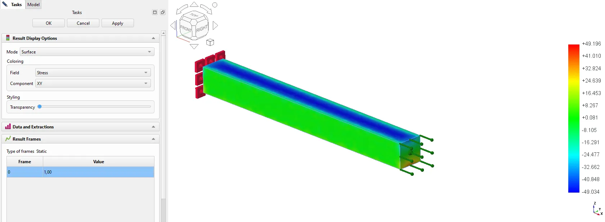

_The maximum shear stress result should be around 48.08 MPa, according to hand calculations._

## What's next?

Now you are ready to continue exploring the FEM workbench on your own or with the help of wiki tutorials and built-in [FEM Examples](https://wiki.freecad.org/FEM_Examples). There is also a similar beam analysis within the Start page example files. Just remember that the wiki documentation pages for this workbench's features (listed on the main [FEM Workbench](https://wiki.freecad.org/FEM_Workbench) page) are the best up-to-date reference. Practicing is really crucial for mastering FEM simulations. If you get stuck and encounter some issues, reach out to us on the [FEM forum](https://forum.freecad.org/viewforum.php?f=18).