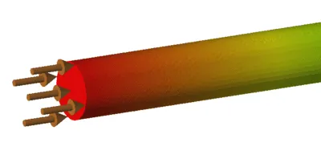
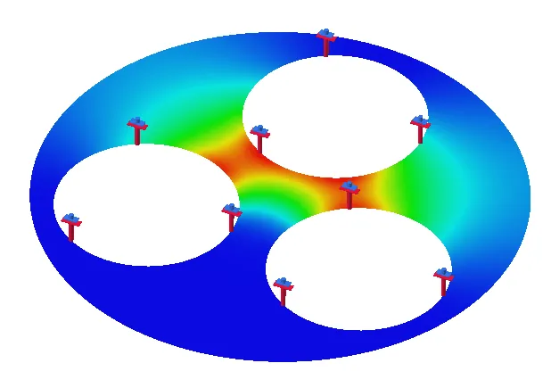
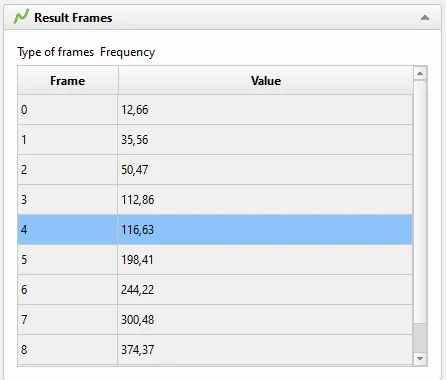
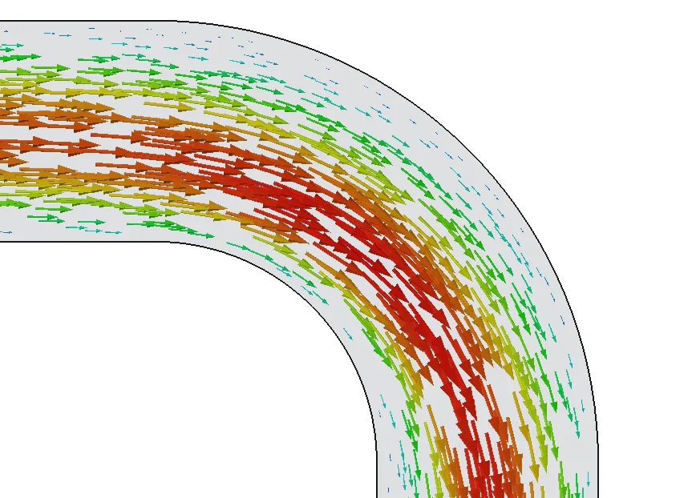
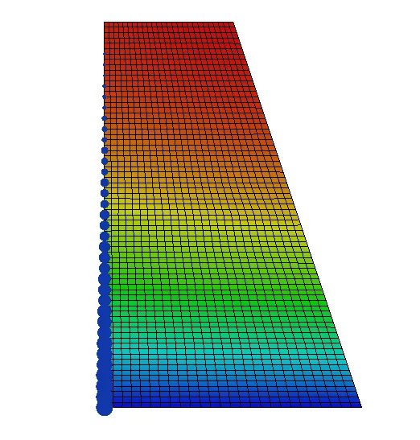
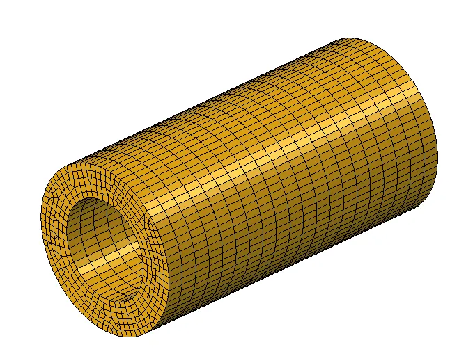
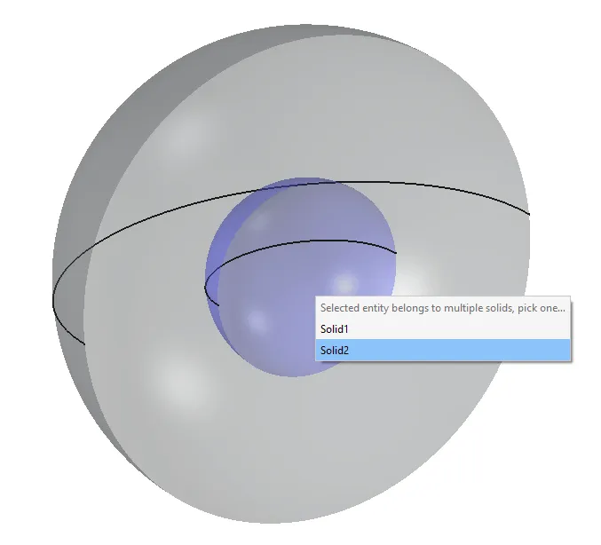

Now that the feature freeze for FreeCAD 1.1 is on, and we are not too far off from the final release, let's summarize the main changes in the FEM workbench. Just like in the case of the revolutionary 1.0 release (see [this blog post](news/2024/09/major-fem-workbench-improvements-for-freecad-1-0)), FEM dominates the [release notes](https://wiki.freecad.org/Release_notes_1.1). There have been many significant improvements, so let's go through them.

## Electromagnetics

In this release cycle, the main focus was on electromagnetic (EM) analyses, postprocessing, and key missing CalculiX features. The range of supported electromagnetic simulations was extended with the introduction of Elmer's static current conduction solver implemented as [EquationStaticCurrent](https://wiki.freecad.org/FEM_EquationStaticCurrent). It doesn't just allow direct current (DC) flow simulations: when combined with the Heat equation, it may also be used to model resistive (Joule) heating. There is a dedicated [FEM Example](https://wiki.freecad.org/FEM_Examples) for it, including analytical verification of results.

Another major change for EM workflows was the addition of the [electric charge density load](https://wiki.freecad.org/FEM_ElectricChargeDensity). It can be used in electrostatic analyses to prescribe total charge in Coulombs or charge per unit area/volume.

Speaking about electrostatics, this type of analyses is now also possible (even in 2D) with the newly refactored CalculiX solver, which we will cover in more detail below. This implementation utilizes the analogy of differential equations for electrostatics and steady-state heat transfer.

We improved the existing EM boundary conditions and loads. There are two modes for the current density boundary condition (Custom and Normal), while the electrostatic potential boundary condition can be used to prescribe electric flux density in C/m^2. These two constraints now have symbols too. Also, we overhauled the task panel for the magnetization boundary condition.

## Postprocessing

As mentioned in the beginning, we made several big improvements in the area of postprocessing. They mainly affected results pipelines. If the new Result object: Pipeline only preference is enabled, a refactored CalculiX solver implementation is used. The main difference is that it doesn't generate the legacy CCX_Results objects and only adds one results pipeline object to avoid cluttering the tree. Thanks to ickby's effort, there's no need for multiple pipeline objects anymore, as they support results from multiple frames - users can easily switch between them in the task panel.

The refactored ccx solver has other advantages too - it supports electrostatic analyses and provides results in mm and MPa units. However, it's not yet fully developed and doesn't support some result types as well as preprocessing warnings.

Other significant enhancements in terms of postprocessing are two new pipeline filters:

- Calculator creates custom result fields by performing mathematical operations on the existing fields.
- Glyph creates symbol plots helpful to visualize vector quantities.

There is also a new Data and Extractions widget for pipelines and three tools allowing detailed exploration of the numbers obtained from simulations. The following data extraction objects are available:

- line plot
- histogram
- table

Finally, the legacy CCX_Results objects now have a task panel option enabling simple animations of the deformed result shapes. There is also a Python function Fem.frdToVTK which can be used to convert CalculiX results to the ParaView format.

## CalculiX features

We added several useful CalculiX keywords and options to further extend the support of FreeCAD FEM for its main solver. This includes, among others:

- additional beam sections - box and elliptical;
- tie constraint applicable to shell faces;
- definition of reference temperature for thermal expansion;
- offset for shell elements;
- thermal contact (gap conduction);
- hard (automatically determined stiffness) and tied (bonded) contact;
- cavity (surface to surface) radiation;
- amplitudes for most boundary conditions and loads to define their time variation;
- region selection for initial temperature;
- prescribed temperature field in static analyses;
- membrane (shell with no bending stiffness) and truss (beam with no bending stiffness) elements;
- printing contact forces and rigid body constraint's reference point displacements to ccx_dat_file;
- pressure and heat flux load, as well as contact and tie constraints applicable to edges in 2D analyses;
- body heat source and centrifugal force loads applicable to faces in 2D analyses.

## Other improvements

Among other major features, there are some mesher enhancements, such as support for simple extruded hexahedral-dominated meshes with Netgen.

This mesher can now also use local refinement, generate second-order meshes by linear interpolation of nodes, and create conformal meshes. Previously, those features were only available with Gmsh.

We made it possible to suppress (deactivate) not only constraints but also other FEM features for which suppression makes sense.

Another handy new feature is a pop-up menu to select the proper solid of a CompSolid when picking its face belonging to both solids. This facilitates material assignment.

## Summary

FEM has been actively developed in the v1.1 development cycle. Such progress wouldn't be possible without the invaluable contributions of [marioalexis84](https://github.com/marioalexis84) and [ickby](https://github.com/ickby), as well as other devs occasionally contributing to FEM. There's still a lot to improve, such as:

- more CalculiX and Elmer features;
- mixed and multiple meshes;
- multistep analyses;
- further postprocessing usability improvements (including unit handling and color legend issues);
- a framework for additional specialized solvers.

Thus, we welcome all new contributors to help make FEM even better!