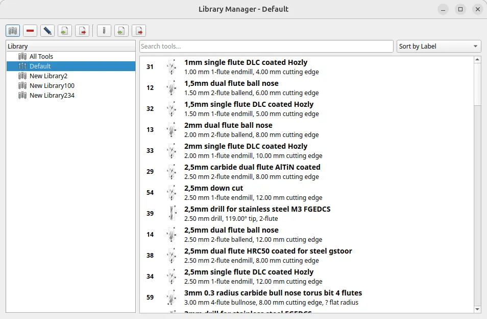

The main development branch of FreeCAD entered the hard feature freeze on Monday, so we are now pretty much in bugfix mode until the release of v1.1. There is no schedule for the release other than "we do it when we hit zero release blockers".

For v1.0, we entered the feature freeze in June 2024 with approx. 40 release blockers and released the final version five months later, in mid-November. You probably should not expect exactly the same gap. However, the ETA ultimately depends on how many blockers we end up fixing and how many people participate in fixing them. Incidentally, the FPA now has a pilot [bugfix rewards program](https://blog.freecad.org/2025/08/14/pilot-bugfix-rewards-program/) you could be part of.

The next milestone is September 30th: this is the last day before the v1.1 release when maintainers can merge changes that affect the user interface and translatable UI text.

With that information out of the way, let's move on to what's been brewing under the lid for the past week.

**Sketcher**:

- matthiasdanner fixed several registered issues, including two release blockers: one related to inputting numbers into on-view parameters, another one happening when toggling construction geometry.
- theo-vt fixed a release blocker that would crash FreeCAD when trimming arc/lines.

**Draft**: Roy-043 fixed an issue with the Continue Mode

**Part**: pieterhijma added a deprecation warning for users and addons that still attempt to use Part import/export.

**Part Design**:

- PaddleStroke fixed two release blockers, both were crashers happening when users created new sketches.
- captain0xff fixed a couple of issues in the new gizmo code.

**TechDraw**:

- ryankembrey drove one new feature through the closing gates of the hard feature freeze: the dimension task panel now has number decimals and reference dimension options.
- Other changes in this workbench are bugfixes by ryankembrey and WandererFan. No blocker fixes this time, but there are just a few of blockers in TD anyway.

**CAM**:

- tarman3 improved selecting face loops and searching for non-planar tangent edge loops.
- jffmichi patched the code to select rows rather than cells in the Drilling task panel.
- deimi and davidgilkaufman contributed several fixes, including one for a regression in adaptive profiling.
- Connor reordered minor parts of the UI and replaced the tool library manager with a new one. Here is a screenshot:

**GUI**:

- pieterhijma contributed a new feature that managed to squeeze through into the upcoming v1.1: a new dialog to edit a property tooltip in Property View. He also replaced the old "Add Property" dialog in favor of the "Add Property" dialog of VarSets, which is now a generic feature (see [PR#23426](https://github.com/FreeCAD/FreeCAD/pull/23426)).
- tetektoza fixed the use of Ctrl+A (Select All) in the Report View.

**Materials**: pmjdebruijn added a PMMA (Acrylic), POM-(Homopolymer'Copolymer)-Generic, Aluminum-7075-T6, and PEEK-Generic, and updated Aluminum-6061-T6.

*On that note, check out Dave Carter's new [Woods](https://github.com/davesrocketshop/Woods) addon-a wood materials database. It's available for installation through the Addon Manager.*

**Other changes**:

- marioalexis84 fixed a regression in netgentools.
- Roy-043, paulee0, and furgo16 fixed several issues in BIM/Arch.
- PaddleStroke fixed a simulation crash with limits in Assembly.

Additional improvements and fixes were contributed by pieterhijma, NewJoker, Roy-043, mrpilot2, sliptonic, longrackslabs, and PaddleStroke.

If you are interested in testing the latest weekly build, you can grab it [here](https://github.com/FreeCAD/FreeCAD/releases/tag/weekly-2025.09.17).

Translators: your recent changes were merged from Crowdin on September 15.

**PR stats**: since the previous report, 74 pull requests have been merged, and 35 new pull requests have been opened.

**Issue stats**: overall, there are 2970 open issues in the tracker, down by 2 from last week. **49 known release blockers** remain unfixed for v1.1, up by 3 from last week.