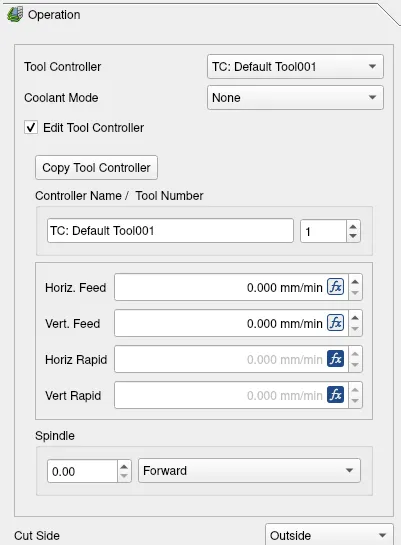
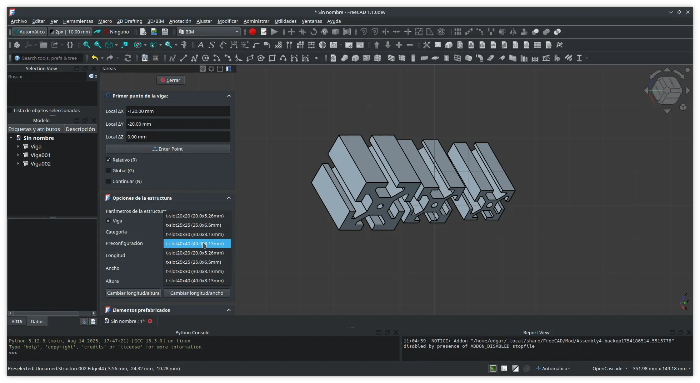
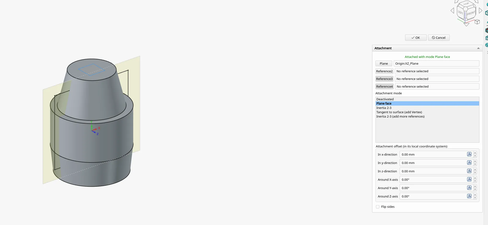

This week in FreeCAD development:

**Draft**:

- Roy-043 added an edge-face intersection snap, adjusted the placement of the newly created 3-point arcs, and applied a couple of additional cosmetic fixes.
- tetektoza patched Hatch to automatically add the hatch object to the same group where the affected geometry is.

**Sketcher**:

- Most changes arrived from tetektoza:
  - Added the Select All (Ctrl + A) command to select all geometry in a sketch.
  - Patched the selection code to use different outline colors for touch/window selection (see [PR#23261](https://github.com/FreeCAD/FreeCAD/pull/23261) for a video demo).
  - Patched geometry moving and rotating to copy expressions.
  - Disabled autoscaling if the new constraint value is so small that it's below the precision threshold.
- matthiasdanner fixed a crash when selecting a constraint in a group.
- longrackslabs added a Preferences option to decouple constraint symbol size from the dimension font size in Sketcher.

**Part Design**:

- PaddleStroke fixed regressions in Pad and Pocket. He also made it possible to select a sketch as the base plane of another sketch.
- drwho495 made the revolution operation use the TopoShape of the base sketch, which essentially fixed the revolution's toponaming support.
- kadet1090 implemented transparent previews for Boolean commands ([PR#23062](https://github.com/FreeCAD/FreeCAD/pull/23062)). He also added a Preferences option to toggle highlighting profiles for profile-based features.
- captain0xff contributed his GSoC project code that adds interactive draggers for Pad, Revolution, Pocket, and all other PD commands except Draft and the eight additive/subtractive primitives. Here is a quick demo to give you an idea what it looks  and works like:



**Assembly**:

- oursland fixed debug builds in OndselSolver.
- mgth fixed the inconsistent positioning in the Distance joint validation.
- PaddleStroke started working on a UI framework for reporting the state of joints (conflicting, redundant, etc.).

**TechDraw**:

- WandererFan fixed a bug where views that belong to a clip group may become impossible to drag if they are moved outside the clip rectangle. He also fixed a bug where setting the line spacing to ISO would have no effect.
- wwmayer fixed a bug where the smart dimension tool would not support 3D dimensions (patch cherry-picked by 3x380V).
- ryankembrey fixed another issues, and mosfet80 removed some dead code.

**CAM**:

- jffmichi fixed a bug where the V-carve expression would output incorrect geometry under certain conditions, such as when a model was rotated.
- J-Dunn fixed a bug in the GRBL postprocessor.
- tarman3 and sliptonic fixed several other issues in the workbench.
- davidgilkaufman fixed occasional freezes when computing ramps for long paths and added UI for editing values of an operation's tool controller from within the operation's edit user interface (see [PR#23180](https://github.com/FreeCAD/FreeCAD/pull/23180) for more information).

**BIM**:

- Roy-043 fixed a regression in Wall, Stairs, and Structure.
- EdgarJRobles added a T-profile option.

**FEM**:

- marioalexis84 added more CalculiX features:
  - 2D loads: Tie, Contact, Pressure, Heat Flux, and Body Heat Source constraints.
  - a new Surface Behavior property to toggle between Linear (default), Hard, and Tied surface behavior types.
  - a Defined Temperature field in the Initial Temperature constraint.
- NewJoker added support for CalculiX truss elements and fixed a typo in the Z88 preference tooltip.

**GUI**:

- ryankembrey made the customization dialog wider by default.
- pieterhijma added a binding for the Delete key to remove one or more properties from a property container.
- Rexbas patched the navigation code to prevent it from showing the context menu after panning or rubber band selection.
- tetektoza fixed a bug that resulted in displaying an incorrect Center Of Mass icon when creating measurements.
- kadet1090 made the axis cross visible on top of all shapes and patched the Attacher to show placement and plane.

**Other changes**:

- wwmayer removed a requirement (added in v1.0) that the shape of a FeatureBase must contain a solid. He also improved the speed of imported points' translation (cherry-picked by 3x380V).
- chennes made it possible to use all valid Python 3 identifier characters.
- theo-vt patched Quick Measure to make it easier to measure holes` positions, as well as to compute the diameter of circles and cylinders when they are closed (see [PR#23385](https://github.com/FreeCAD/FreeCAD/pull/23385) for more info).
- PaddleStroke fixed a bug where PolarPattern would fail when using LCS as reference.
- 3x380V patched the core to distinguish between energy and torque physical quantities when dealing with units.
- Roy-043 and chennes fixed a couple of buglets in Mesh.

Additional improvements and fixes were contributed by luzpaz, marioalexis84, wwmayer, maxwxyz, kadet1090, chennes, Roy-043, PaddleStroke, pinkavaj, and tetektoza.

If you are interested in testing the latest weekly build, you can grab it [here](https://github.com/FreeCAD/FreeCAD/releases/tag/weekly-2025.09.03).

Translators: your recent changes have been merged from Crowdin, you can test your changes live now.

**PR stats**: since the previous report, 90 pull requests have been merged, and 61 new pull requests have been opened.

**Issue stats**: overall, there are 2945 open issues in the tracker, up by 13 from last week.