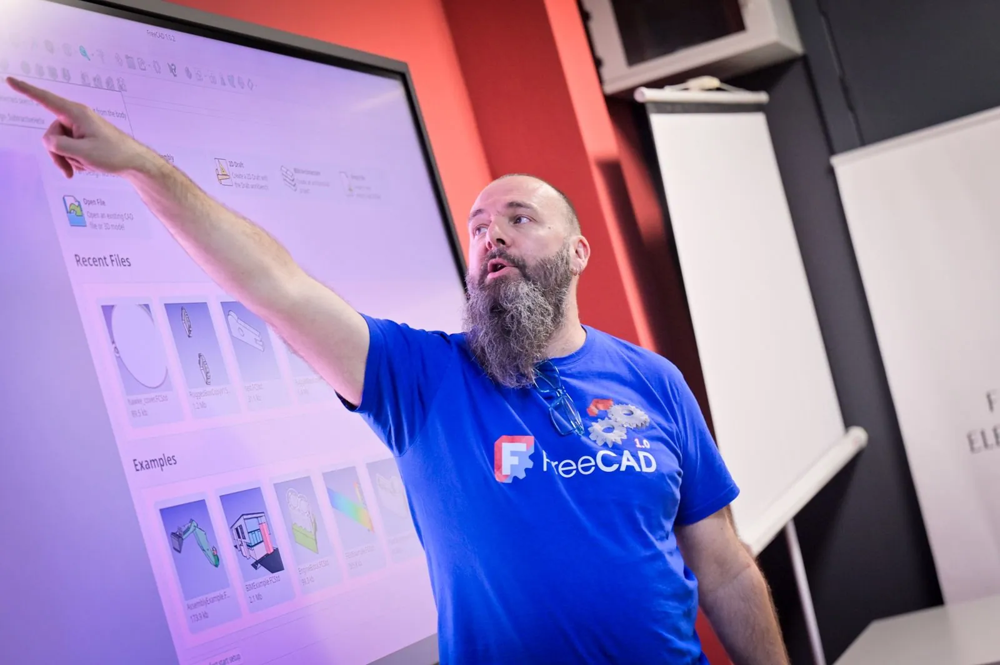



The author of this post has been out representing FreeCAD and other open source projects at the fantastic [SFK25 Conference](https://flossk.org/events/software-freedom-kosova-2025/). Arranged by the dedicated Free Libre Open Source Software Kosova [(FLOSSK) team](https://flossk.org/) this has been a vibrant international conference with a great array of talks and workshops over 2 days.

I delivered numerous workshops there as well as the Sunday keynote address. A 2 hour "FreeCAD for CAD Beginners" workshop was well attended with over 20 people working through some basics on the Part and the Part Design workbench as well as a little show and tell of what FreeCAD is capable of.

Brilliantly I met a fellow speaker, Julián Caro Linares, from the [Arduino team](https://www.arduino.cc/). After discovering Julian was a FreeCAD user, we chatted and he decided to explore installing FreeCAD on the new Qualcom powered Arduino UNO Q. It was great to see that not only was the install completely straightforward but that FreeCAD performed really well on the device.

It's definitely an interesting time ahead when our Arduino's can run FreeCAD!