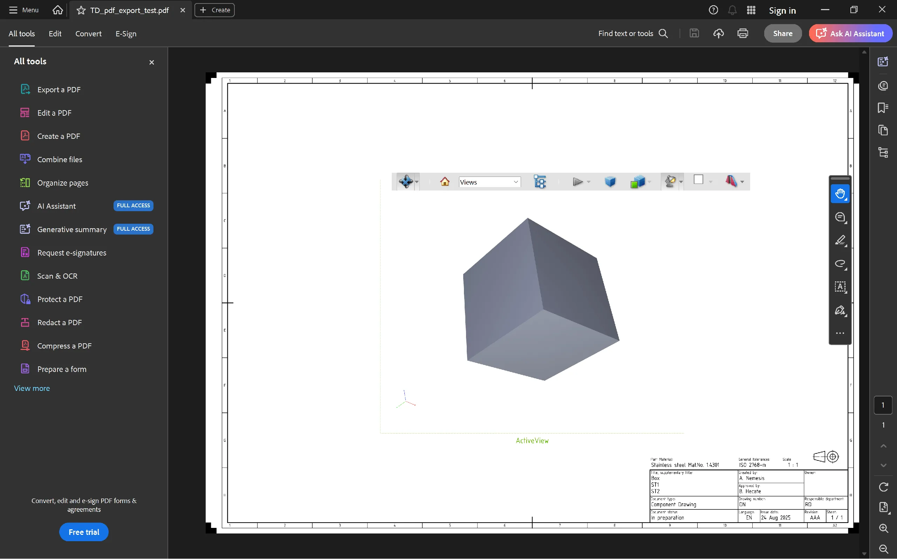
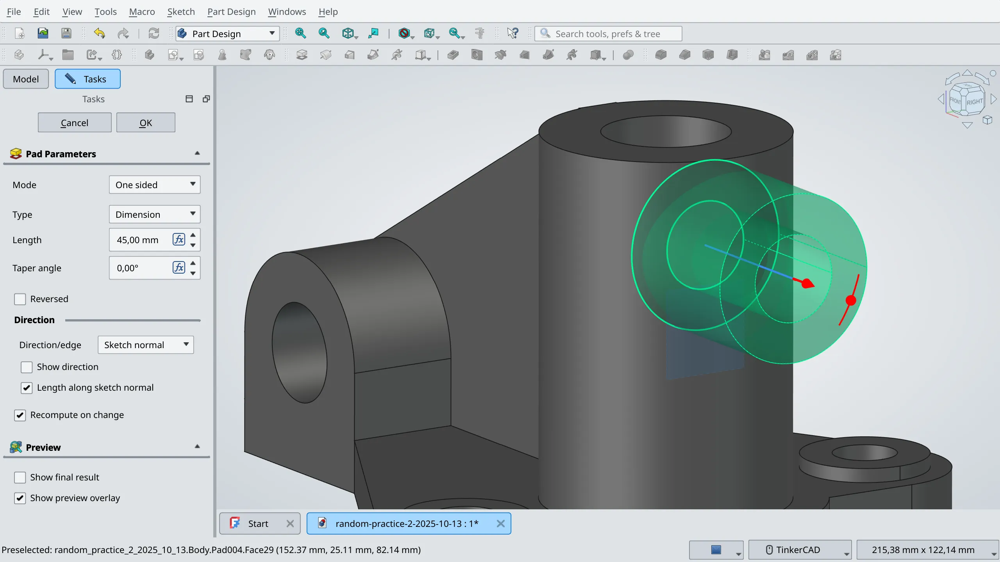

This year, we had three students working on FreeCAD. All projects have been successful. Here is a quick recap.

chiragsingh1711 implemented 3D PDF exporting in the TechDraw workbench and added an exporter to the general list of exporting options. The code is [mostly complete](https://github.com/FreeCAD/FreeCAD/pull/23335) and requires some fixes to bring it closer to our coding standards. The maintainers team scheduled this feature for inclusion in v1.2.

theo-vt worked on multiple files' parallel editing. This project's aim was to remove the limitation where one document cannot be edited until an operation on another document is completed. The patch is also mostly complete. Because the project ended when the feature freeze was already in effect, and the change affected every aspect of FreeCAD, this feature was postponed to v1.2 to avoid delaying the release of v1.1.

Sayantan Deb (captain0xff) [added](https://github.com/FreeCAD/FreeCAD/pull/22880) interactive controls to the 3D view in the PartDesign workbench. You can now use various draggers when you use Pad, Pocket, Fillet, Helix, and other commands. This feature will be part of the upcoming FreeCAD v1.1 release.

For people who don't like this kind of UI, there's a switch in Preferences.

Sayantan submitted [another patch](https://github.com/FreeCAD/FreeCAD/pull/23912) to enhance this new feature by adding on-view parameters for interactive gizmos. The patch is currently in review and won't be merged for v1.1 as we are well past the feature freeze cut-off. If all goes well, expect it in v1.2.

We thank all students, mentors, and admins for the great work!