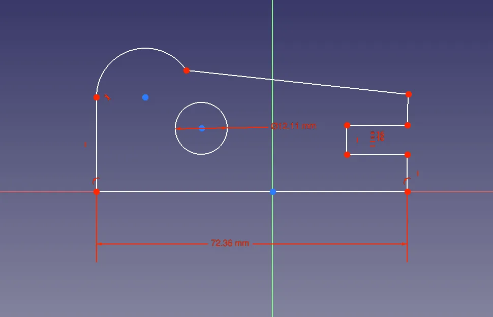
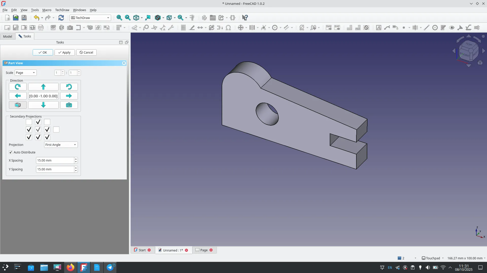
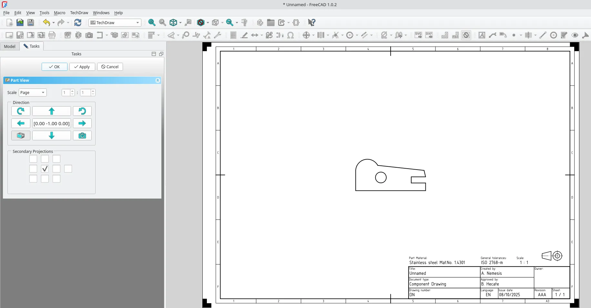
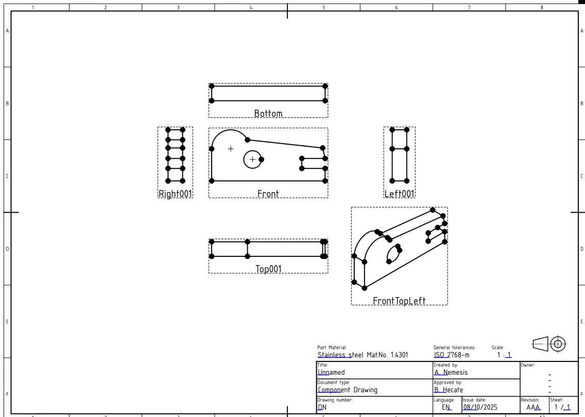
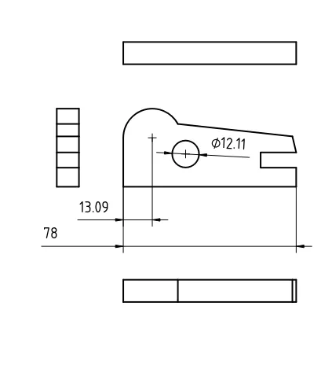
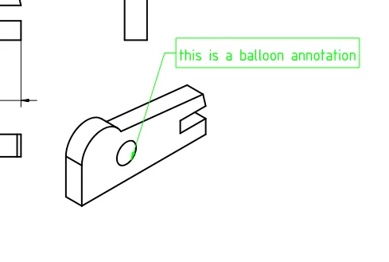

Sometimes we might need to share a 3D design in the form of a 2D technical drawing. FreeCAD has an entire workbench, TechDraw, with a collection of tools to help you do this.

To explore TechDraw we need to have an object that we want to make a technical drawing of. Let's just quickly create an object. On the FreeCAD start page click the "Parametric Part" option from the "New File" window. This creates a new file and jumps to the Part Design workbench and creates an active body. Click the "tasks" tab and select to "Create sketch" or click the "Create sketch icon". Let's select to draw our sketch in the XY plane.

Draw a sketch similar to the one in our image. We simply used the "Create polyline" tool to draw the outside line using the "M" key to toggle to change to an arc line for the curved corner. Don't worry too much about your design. We drew a circle inside our perimeter polyline to help show some Tech Draw features later on. We don't need to constrain our sketch fully for this example, but let's give the base line of the sketch a length constraint  and set a diameter for the internal circle. We just constrained these to the sizes they are as drawn. Close the sketch and let's pad the sketch to the default 10mm.

Next let's left click the workbench drop down menu and select to move to TechDraw. On first launch in a new project there will only be two tool icons that are selectable. "Insert Default Page" and "Insert Page using Template". First let's left click on "Insert Default Page". You'll notice a new object "Page" appear in the file tree and you should see a blank white page launched in a new tab in the preview area. For the sake of exploration, single left click on the "Page" object and let's delete it. In turn click the "Insert Page using Template" option. You should see a "Select a Template File" window appear containing lots of different template options. These are listed with paper sizes so "A4" or "A3" and more, and also different standards such as ANSI A, ANSI B, ISO5457 and more. Let's select "A3_Landscape_ISO5457_minimal.svg" and click "open". This again creates a "Page" item in the tree and launches the blank template in a new tab. This template has some standard fields added in the lower right hand corner which, of course, can be edited with your project drawings details. Double left clicking on an editable field launches a small dialogue where you can edit the field with your details.

Left click back onto the tab containing our padded part. In the file tree left click to highlight the "Pad" part and then left click the "Insert View" tool icon. You should now see, irregardless of the orientation of the part in the preview window, a front view created in the technical drawing page. In the task tab a dialogue titled "Projection Group" appears. In this dialogue you can perform numerous adjustments to your inserted views. You should see a cluster of tick boxes and you can tick these boxes to add corresponding views into your technical drawing. If you leave the "auto distribute" box ticked then you can use the X Spacing and Y Spacing inputs to increase or reduce spacing between the view. Likewise you can adjust the scale of the drawing by setting the "Scale" drop down to "Custom" and then adjusting the ratio. You can also flip the axis of the projected group to create custom layouts. Notice you can also switch between first angle projection and third angle projection. A good primer on orthographic views, first angle and third angle projection can be found on [Wikipedia here](https://en.wikipedia.org/wiki/Multiview_orthographic_projection).

Note that if you manipulate the scale, or the projection angle those fields in the template page will not update automatically. We can edit the scale fields but we can't easily edit the angle projection symbol as these are set as part of the specific template.

Select some views, and then click OK to close the "Projection Group" dialogue. You'll notice that the individual views inserted into the page are labelled with a view description "front left" "Bottom" etc and that they are surrounded by a dashed line. Whilst this view is enabled we can move the entire cluster of projection views by moving the main "Front" view. Left click on the "Front" view frame and drag to move the entire group. If we click and drag an individual view frame we can move it limited to the axis the view is projected on. For example if we click and drag the "Left001" view we can only drag it left and right in the page. This is because it would be easy to place a view in an incorrect projection area otherwise, leading to errors when reading the technical drawing. A note on view placement is that if you double click to reopen the "ProjGroup" item and you keep the "Auto Distribute" option ticked then whenever you click "OK" or "Apply" any views you have moved in the page will reset to there original positions.

We can toggle the view frames on and off using the "Turn View Frames On/Off" tool icon which also then tends to act as a positional lock for the views. We can now begin to add some dimensions and other information to our technical drawing. Left click on the base line of the "Front" view object and then click the "Insert Dimension" tool. This tool should look familiar to you as it uses the style and naming conventions used by the equivalent tool in the sketcher workbench. The "Insert Dimension" tool should correctly guess you are wanting to add a length dimension and should insert and allow you to place this dimension.

Rather nicely now you can experiment with going back to the sketch of the original item and changing the length constraint for the base of the item, changes should be pushed automatically through to the dimensions in your technical drawing. Changing our, as drawn, 72.36mm length constraint to 78mm, we can see that this value is updated in the technical drawing. Next lets click the "Insert Dimension" tool and select the circle/hole in the front view. This should automatically add a diameter dimension that can be placed attached to the circle. However unlike in a sketch, you may notice that we don't have a circle centre mark we can use as a reference for the position of the circle centre. Click the Front View and in the "View" tab under the "Decoration" heading, toggle the "Arc Centre Marks" value to "True". You should now have a centre mark in both the circle and for the arc made as part of the part outline. You can then select the centre mark, and another point and create length dimensions to describe the position of the centre of your hole.

Sometimes in technical drawings it can be useful to add labels and text descriptions that aren't particularly a dimension or other imported linked value, a good option for this is to use the "Insert Balloon Annotation". Left click on the tool and then click on the technical drawing where you would like the pointer attached to the annotation to be. A simple pointer line and circular text balloon will appear. We can then double click on this and the "Balloon" dialogue will appear. In this dialogue we can add our text, and also manipulate other settings, balloon shape, font, colour and more to meet our need.

There's lot's left to explore on the TechDraw workbench, but you probably know enough now to explore further features, it's also definitely worth looking at the official [TechDraw documentation](https://wiki.freecad.org/Category:TechDraw)which has lot's of information on all the TechDraw tooling. Finally you can export your technical drawing at any time by clicking either the "Export Page as SVG" or "Export Page as DXF" tool icons.