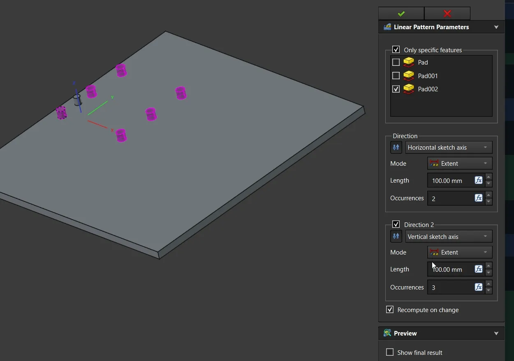

This week in FreeCAD development:

**Sketcher**:

- PaddleStroke fixed 5 issues including a release blocker where creating a B-Spline would result in an error message.
- matthiasdanner fixed the Angle Constraint jumping to the opposite side on movement, and FlachyJoe fixed a low-level issue.

**Part and PartDesign**:

- kadet1090 fixed two issues in PD.
- PaddleStroke fixed a bug in Part's offset tools and moved the second direction options in Linear Pattern (PD) under a separate group disabled by default.

**TechDraw**:

- ryankembrey fixed 3 issues, including a regression and a release blocker, all to do with vertex hide behavior.
- WandererFan fixed leader positioning.
- PaddleStroke fixed a HiDPI bug in the rich text editor.

**GUI**:

- pieterhijma fixed a regression where including link properties when adding properties became impossible, as well as two more bugs in the property editor.
- hyarion enabled Quick Measure and input hints by default.
- chennes fixed a release blocker where dragging & dropping could fail depending on the document name.

**Other changes**:

- PhoneDroid added more missing SPDX license identifiers to the license boilerplate in the source code.
- tetektoza, marcuspollio, furgo16, and bleeqer fixed several issues in BIM.
- PhoneDroid removed all outdated UTF-8 encoding markers in CAM.
- PaddleStroke fixed a regression in Assembly where negative values for joints min/max length property would be replaced with 0.

Additional improvements and fixes were contributed by marcuspollio, PhoneDroid, chennes, FlachyJoe, Roy_043, adrianinsaval, and schmidtw.

If you are interested in testing the latest weekly build, you can grab it [here](https://github.com/FreeCAD/FreeCAD/releases/tag/weekly-2025.10.15).

**PR stats**: since the previous report, 45 pull requests have been merged, and 36 new pull requests have been opened.

**Issue stats**: overall, there are 2989 open issues in the tracker, up by 20 from last week. 27 known release blockers remain unfixed for v1.1, down by one from last week (fixed three, but two regular bugs apparently got reevaluated as blockers).