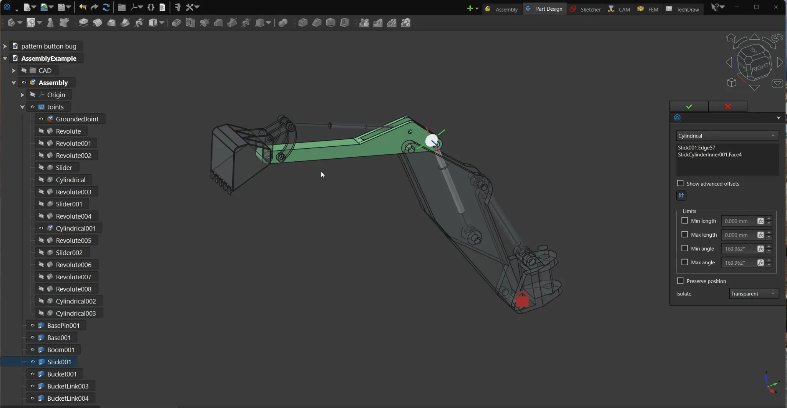
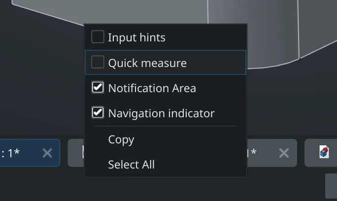

This week in FreeCAD development:

**Sketcher**: PaddleStroke fixed two regressions, including one where Symmetry didn't work on arcs with constrained centers.

**Assembly**: PaddleStroke fixed 5 issues and added [visual isolation](https://github.com/FreeCAD/FreeCAD/pull/23680) of joint components when creating or editing a joint.

**CAM**:

- tarman3 fixed three issues in the LeadInOut dress-up and a bug in the old CAM simulator.
- Connor fixed a toponaming issue.

**GUI**:

- sliedes patched the code to request 24-bit color precision where possible, as Qt would settle for RGB565 in some scenarios, so you'd see banding in gradients in the 3D view.
- Rexbas fixed the conflict between the Transform tool and the OpenSCAD navigation style.
- hyarion added a selector to the status bar's context menu to toggle quick measure and input hints.

**Other changes**:

- WandererFan, johndoe2323, and aqeel13932 fixed several issues in TechDraw.
- Roy_043, paullee0, and furgo16 fixed 7 issues in BIM.
- PhoneDroid added missing SPDX license identifiers to source code files.

Additional improvements and fixes were contributed by marcuspollio, chennes, Syres916, pieterhijma, mrpilot2, pyro9, ipatch, furgo16, ifohancroft, and PhoneDroid.

You'll notice two new features despite the feature freeze. The PRs were selected for inclusion before the cut-off. However, the patches needed a minor tweaking before the maintainers could merge them.

Translations are now automatically synced between GitHub and Crowdin every Sunday/Monday midnight, thanks to a CI patch by OPGL.

If you are interested in testing the latest weekly build, you can grab it [here](https://github.com/FreeCAD/FreeCAD/releases/tag/weekly-2025.10.08).

**PR stats**: since the previous report, 56 pull requests have been merged, and 23 new pull requests have been opened.

**Issue stats**: overall, there are 2969 open issues in the tracker, up by 15 from last week. 28 known release blockers remain unfixed for v1.1, down by 2 from last week.