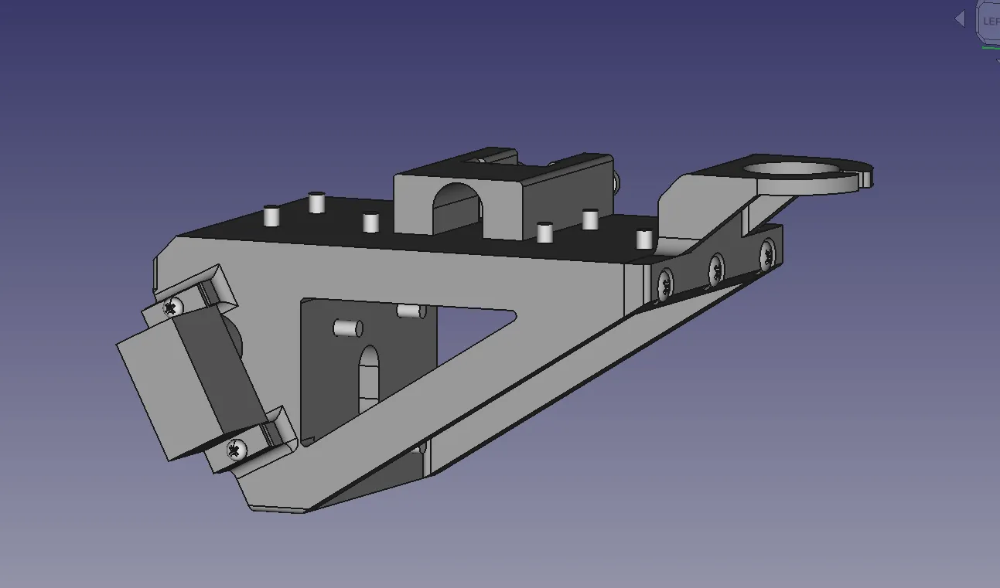

It's a given that the FreeCAD community is awesome and make amazing things. Every now and again though a project really stops us in our tracks. None more so than this, the [SL-24, an open source record lathe](https://git.sr.ht/~slyka/SL-24).

Part CNC and part high end DIY record deck this project allows people to experiment with cutting grooves to create their own records. Whilst more complex than home taping or digital copying, vinyl has a special place in audiophiles hearts, why shouldn't we create our own?!

The base of the unit is formed from plywood as is part of the gantry system, the main turntable is made with weight and rigidity by casting concrete. It's a 3 axis machine and apart from the concrete cast rotary axis the cutting head has 2 linear axis for left and right and vertical motion. As well as laser cutting and casting there is some 3D print, a good example being 3D printed dampers to reduce and isolate motor induced vibrations and also external vibrations, all of which could impact the audio quality of a recording.

This long running project has been modelled in FreeCAD, the project began before FreeCAD version 1.0 and therefore doesn't use the Assembly workbench. In fact the complex machine is broken into numerous CAD sub assemblies and often these are just project files with numerous bodies/parts manually placed.

The source for this project can be found linked over on the [project Sourcehut](https://git.sr.ht/~slyka/SL-24) page. Included in the source is a PCB design in KiCad for a small motor control board using a STM32 board and there is an Arduino sketch provided as a small program to run the lathe. There's also some tools and utilities for applying EQ to your recordings.

Finally, check out [https://pawb.fun/@slyka](https://pawb.fun/@slyka) on the fediverse, where they often post updates about this fabulous project.