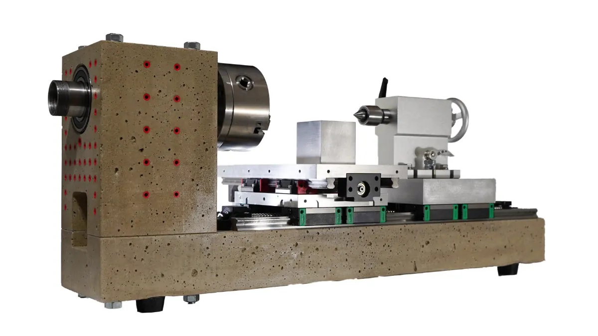
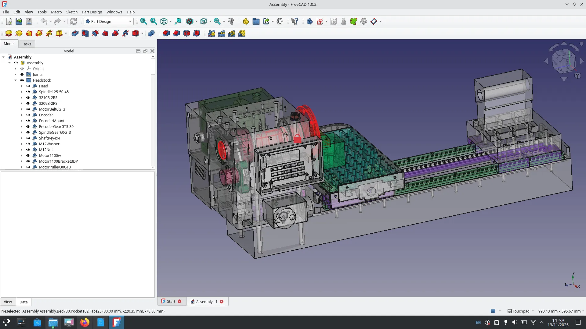

In an amusing twist, this Forged in FreeCAD story will contain similar words to the last Forged In FreeCAD story, most notably, "concrete" and "lathe"!The last "[Forged in FreeCAD" story was the SL-24 Opensource Record Lathe](https://blog.freecad.org/2025/11/11/forged-in-freecad-sl-24-an-open-source-record-lathe/), and indeed this story is a lathe story that includes concrete in the construction.

The [Modulathe](https://github.com/kachurovskiy/modulathe/tree/master/v2) has a couple of design version with V2 being a pretty fully featured desktop metal cutting lathe. The Modulathe V2 can be built for manual operation but is also CNC ready.

For a lathe to be able to machine metals, rigidity is key. Many commercial lathes have large sections made in cast iron which add weight and rigidity, but it can be tricky to have a cast iron capable furnace at home! The Modulathe V2 uses cast concrete to create large heavy sections of the design and these are quite easily cast into 3D printed moulding designed in FreeCAD.

The earlier V1 design (source still available) was largely 3D printed, with 3D printed sections being filled with small grain self compacting concrete. This was achieved by the clever use of Gyroid infill, which has a useful property in that it doesn't create closed sections within the body of a 3D print. The new version has less 3D print in the actual tool, but uses a lot of 3D print for the moulds with large sections of the design being directly cast with concrete.

Added to the concrete construction are off the shelf linear rail systems as well as off the shelf lathe and spindle components. It's a great combination of decent parts and local home production. It's not a hugely cheap build but cost for cost you will end up with a more capable lathe for the price point than if you bought off the shelf. Even if building a lathe isn't particularly of interest, it's a fascinating project and well worth downloading the source files to take a look at the excellent FreeCAD work!