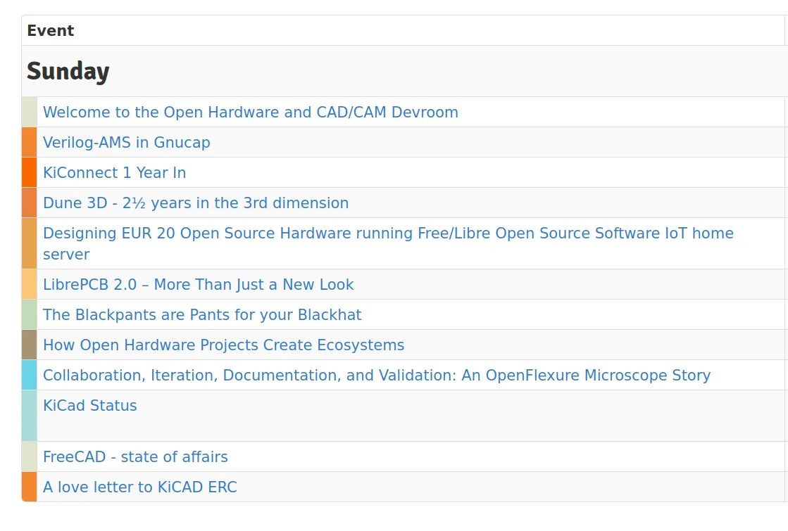

We recently posted about the planned [FreeCAD activities around FOSDEM 2026](https://blog.freecad.org/2025/10/28/fosdem-2026-freecad-day-and-the-open-hardware-and-cad-cam-devroom-cfp/). These include the FreeCAD Day on the 30^th^ January and the joint KiCad/FreeCAD booth at FOSDEM itself on the 31^st^ and 1^st^. We also mentioned that Chris Hennes (chennes) and Jo Hinchliffe (concretedog) are co-ordinating the Open Hardware CAD/CAM room talk track at FOSDEM on Sunday the 1^st^ February.

We are really pleased to announce the, mostly, confirmed speaker line up for the room and it's looking fabulous. It's great to see a real diversity of talks and topics. There are some classic talks for this room, with KiCad and FreeCAD state of affairs talks, as well as an update on KiConnect, a workbench connecting FreeCAD and KiCad. There's also "[How Open Hardware Projects Create Ecosystems](https://fosdem.org/2026/schedule/event/how_open_hardware_projects_create_ecosystems/)" with Arya and Lina.py, and the tantalisingly titled "[The Blackpants are Pants for your Blackhat](https://fosdem.org/2026/schedule/event/the_blackpants_are_pants_for_your_blackhat/)" by Ryan Walker. There's also a couple of speakers yet to click the "confirm" button one of which is a talk on OpenCascade Techology (OCCT) which we imagine will be a popular talk for this room. Check out the full [list of excellent confirmed talks here](https://fosdem.org/2026/schedule/track/open-hardware-and-cadcam/).

Massive thanks to everyone who submitted proposals, the applications were all of a great standard and we were indeed oversubscribed for the time we have available.