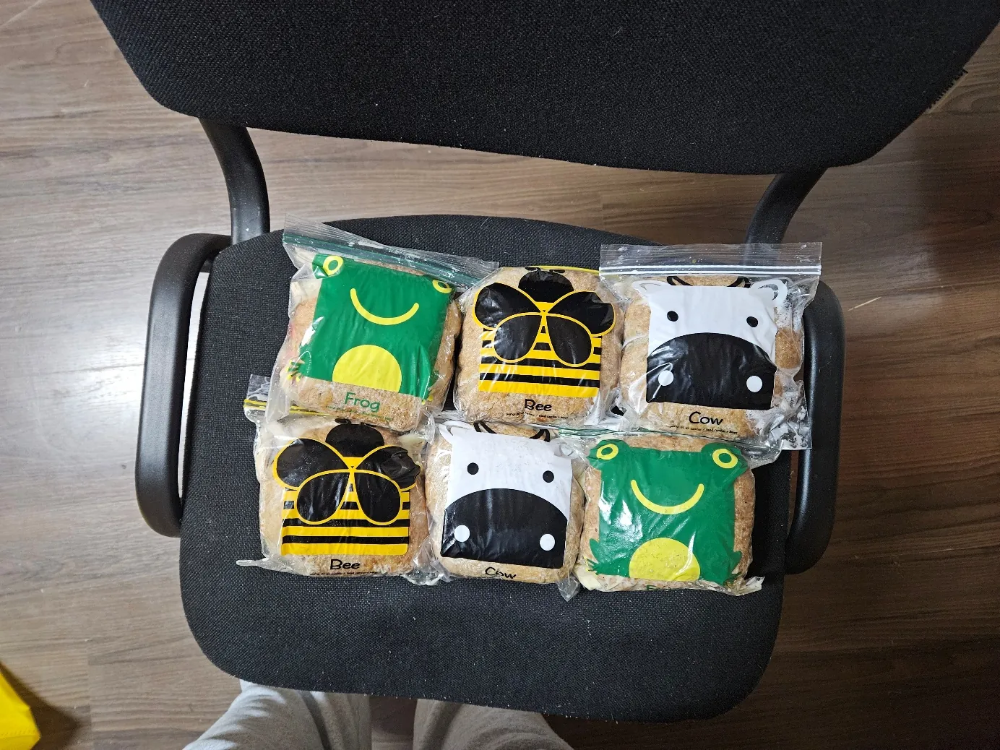
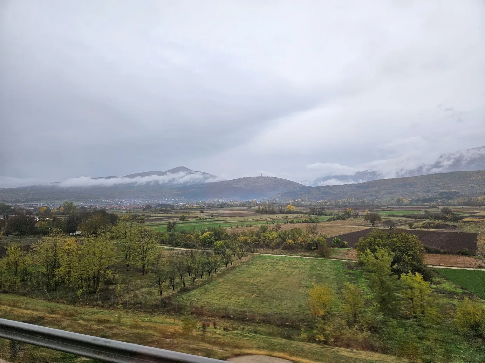
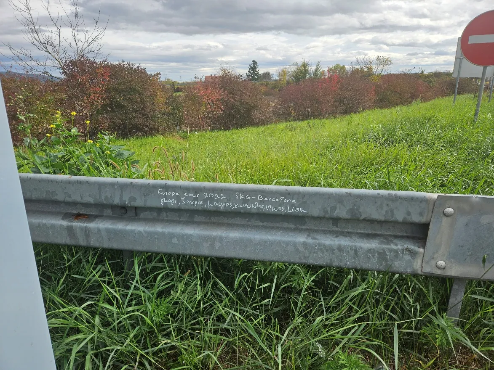
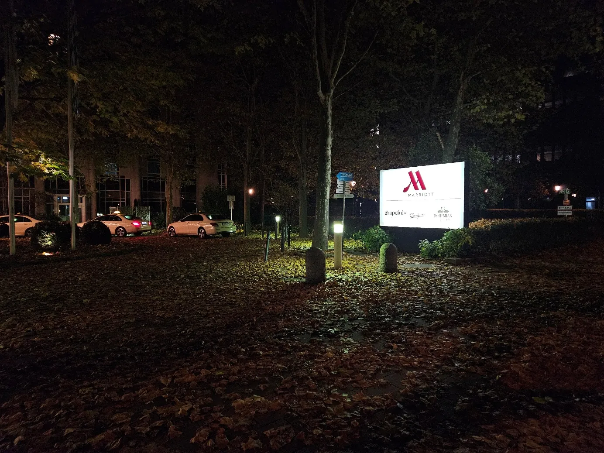
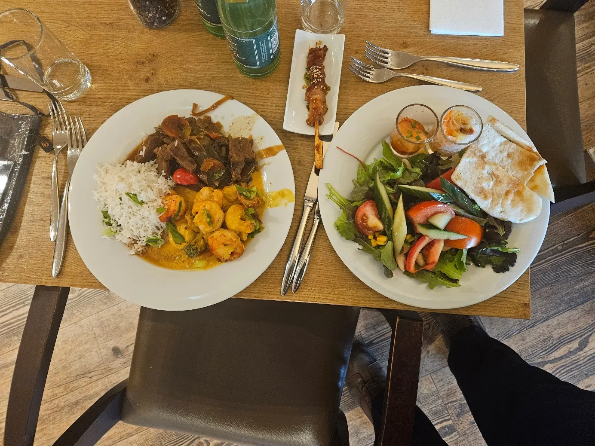
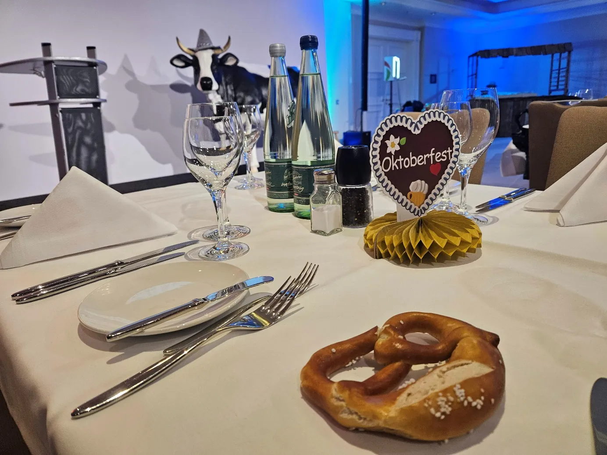
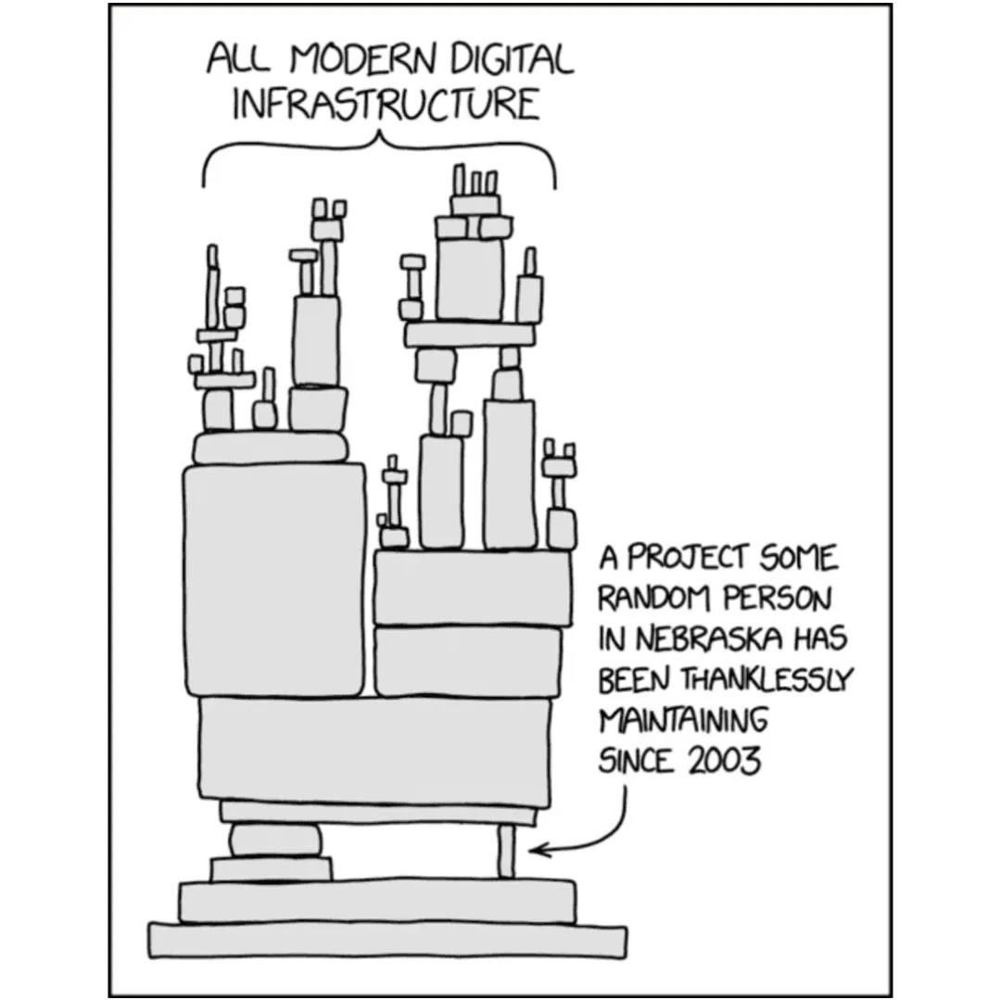

*The following text is a guest post from Turan Furkan Topak reporting on their trip to the GSOC Summit. Many thanks for taking the time to write this report. /Jo*

When I applied to be a mentor for GSoC, my intention was actually just to mentor in my own area of interest. That was how the process worked anyway: you were, in a way, a candidate candidate. But because we didn't have many mentors, I ended up serving as a second mentor on all the projects. And there wasn't even a project related to documentation, which is my area of interest.

Then, because of some political events, messages started going around that the mentor summit shouldn't be held in the US. To be honest, I wasn't really paying much attention at the time. But in the end the decision was made and the summit was moved to Munich, Germany. I still wasn't that invested, since I knew I would have to go through a difficult visa process and I wasn't sure if it would be worth it. I told Yorik, the organization admin, that I would like to go if no one else wanted to attend, and no one else stepped forward. By chance, I came across an opportunity that would have me in Sofia during the summit and give me a long-term visa. After that, there was nothing left to stop me from going.

Of course the first and most sensible option that comes to mind is to fly. But when you have the chance to really see, or rather pass through, most of Europe, why just fly over it? So yes, I bought bus tickets for both directions. Bulgaria, then Serbia, Croatia, Slovenia, Austria and finally Germany. A 23-hour trip. What could possibly go wrong?

Naturally, going on such a long trip means preparing provisions. At first I was thinking of the standard cheese and salami, but then I thought: why not cook some chicken, shred it and use that instead of salami? And since there would also be the return trip, I needed to make plenty. I added some tomato and mayonnaise for a bit of color. We also had mushrooms at home and they definitely wouldn't be in better shape when I came back, so I cooked them together with the chicken and made six sandwiches, each enough for a full meal.



I went a bit early and started waiting for my bus, and there I met an Austrian photographer who was waiting with us. He was also a mountaineer and had very heavy equipment with him. We chatted a lot during the breaks on the journey. Because we set off at night, my plan to witness the scenery of the Balkans had to wait. Since we were passing through non-EU countries, we had passport checks at the borders, and during those I talked with the Austrian photographer. Eventually the sun rose and I could finally reach my goal. Where I come from, if you travel by bus you mostly see endless steppe: small shrubs, earth in shades between yellow and orange, and rocks that you can imagine as anything. That has its own charm, of course, but the Balkans are something else entirely. Vast landscapes containing every shade of green stretched out to hills that, with the morning mist hanging above them, looked like mighty mountains whose summits touched the clouds. In some valleys there were towns, and the mix of old and new houses made the view even more interesting. I wondered who owned that old wooden house and how it was still standing. Smoke from the chimneys blended into the mist on the hills. It was a procession of views you can't really photograph, only see.

The estimated arrival time was 20:00. I was worried about whether I would get there quickly enough to catch dinner. That worry was resolved shortly afterwards. Our bus broke down near the Croatian border. My travel companion was heading somewhere else, so the replacement bus for his route arrived quickly, but I had to wait for the next bus to Munich, which would come seven hours later.

There must have been another bus that had broken down where ours did, because I came across a note left behind by six friends who had done a Europe tour in 2022, and it made me smile a little. I wondered how long they had had to wait.

Eventually our bus arrived and I got on, but by then the scenery had retreated and left only darkness behind. My arrival time no longer looked reasonable either. I fell asleep while trying to figure out how I was going to get to the hotel. Sometimes waiting tires you out even more, especially waiting this long.

We arrived in Munich at 3 a.m. and I woke up. Unfortunately, if I wanted to use public transport, I would have had to wait a long time. One advantage of travel by bus is that terminals are not as far out of the city as airports, so the hotel was only 7 km away, along a route going through the city. I wasn't going to have time to explore Munich, and I wanted to hear the sound of this huge city. Cities have their own sounds, and you usually hear them on long night walks when no one else is around. Of course my recommendation is to take these night walks in summer. October looks like it should work too, but once certain flute-like sounds are added to the city's voice, you may start to think it's not such a good idea. After a while my navigation app started acting up and sending me into dark parks with no lights, so I turned it off and tried to find the way myself. I almost got lost near a place where they were clearing away the remains of a tram accident, but eventually I found my path. I reached the hotel around 5 and checked in. As I passed by the GSoC boards, I saw that the day would start at 7:30. I had missed enough already and didn't want to miss any more.

I got up early, picked up my badge and the other relevant things, and then went to the restaurant for breakfast. I filled a plate from the buffet and sat at an empty table. Later, a girl who had come with her mother because of visa issues sat down at my table with her. We talked mostly about how hard it is to get visas. She was quite talkative, and as the end of breakfast time approached, her plate was still full. At 9:15 the Google team gave the opening talk and then the organizations' short talks began. They mainly talked about one of that year's GSoC projects. I was also going to give a talk, but in the afternoon session. Among the speakers there was someone I was sure shared my native language. Just as Dante, even when he went to hell, was looking for someone to whom he could say "Si", I, in this beautiful place, wanted to approach someone to whom I could say "yes" in my own language and talk about GSoC, so after the meeting ended we chatted a bit. He said it was the first year their organization had participated and that they had two students; one had disappeared during the process, and the other, although good at communicating, wasn't actually progressing on the project.

After the talks, the sessions began. First of all, this summit is a conference without a conference. You only really understand what that means when you get there. In short, you write down an interesting topic you want to talk about and stick it on the board in the time slot of the relevant room, and whoever wants to talk about that topic comes to that room. Among the first sessions there was also a GSoC Feedback session, but I was more interested in a session on which tools are used to communicate within communities, so I went to that. The reason was that there had recently been a discussion inside FreeCAD about some communication tools, and I was curious about the situation in other organizations. However, the person who had proposed the session didn't show up, and since it was the first session, it mostly turned into introductions. It wasn't a very crowded session either. We also talked about the tools that were being used. The situations the attendees described weren't very similar to the ones we experience. First of all, FreeCAD is much more intertwined with its user base, and that user base spans generations. This is probably because we have a large user community. In this session I especially appreciated how intertwined the FreeCAD community is. It was great to meet new people and mostly listen to their communication adventures in GSoC. One participant even gave me a GSoC 2025 bracelet that his wife had made.

For the next slot I joined the session on the future of software engineering with AI. I approach the whole AI situation as philosophically as I do pragmatically. In my view, "real" AI should rule the entire world, but what is currently being sold to us is an illusion that is very far from being an intelligence. You could say it's smarter than many people, but the accurate statement is that it looks smarter than many people. In this session they also mentioned AI's impact on the training of juniors, and I insisted that its impact on the environment be added to the discussion. Personally, I don't see AI itself as harmful to the environment; the truly harmful thing is the people trying to turn it into money. And then there was the topic that took up the most space: copyright. Copyright was originally introduced as a monopoly to encourage inventing new things. Like every monopoly, it became corrupt and concentrated in certain hands. But what can be subject to copyright? In theory, everything, but once commercial elements are involved, it becomes restricted. Here's an interesting bit of information: humans are born able to walk, but every baby has to invent crawling for themselves and optimize it. If that's the case, can crawling be copyrighted, since it's something invented? That's why copyright law says that an invention must be something that could not easily be created by a person skilled in the art. Of course that probably makes every issue quite complicated. AI makes it even more interesting. Can something discovered by an entity that isn't even an expert in the field be subject to copyright? Which leads us to this: can what we currently call AI really discover anything? Or is it just a slightly more advanced version of the "Ctrl+C" buttons?

And finally it was time for lunch. It was a wonderful buffet of East Asian food, probably my favorite menu of the whole summit. But because of the nature of the summit, you barely even have time to eat. While you're meeting people and talking about their organizations, you suddenly realize the next hour has arrived before you've finished your plate. During lunch I talked about our GSoC processes with a British vegan gentleman from an environment-related organization. Afterwards we went up to the ballroom for the group photo, squeezed together quite a bit, and the picture was taken.

After that, unfortunately, the two sessions most relevant to FreeCAD were at the same time. One was a 2D/3D geometry session and the other was an open source hardware session. Sadly, I had to choose one. Personally, I hate choosing. But I picked the open source hardware session. Later I learned that the 2D/3D geometry session had turned into a full-on CAD meetup and FreeCAD was the only one missing; they even asked me why I hadn't come. I was honestly sad I couldn't be in two places at once. Since I've briefly mentioned the session I missed, let me talk about the one I attended.

With FreeCAD 1.0 we gained a start screen feature, and we actually want to refresh those images with every release, but we need to put in some work for that. I also think FreeCAD should be more intertwined with the open source hardware community and be part of a more mutualistic ecosystem. As the writer, there's something else I want to note. I remember who everyone I spoke to at the summit was and which institution they were from, but I thought it would be better not to mention that. However, here I'll be talking about some projects, and in at least some cases it wouldn't make sense to hide the names. The session was organized by FOSSASIA, and they asked me what Realthunder is doing these days; one of them said they had met him at a conference before, and I replied that he hasn't been very active in FreeCAD lately. They had brought some cool badge displays with them. We started by talking in general about open source hardware: licensing, maintainability, modularity, needs, safety and reproducibility. Then everyone began, one by one, to show what they are currently working on. Robert Kaye talked about his hologram fan project and said he had last used Bartendo, the automatic cocktail-making machine that was everyone's favorite, at a house party. Everyone asked why such a wonderful device wasn't on every street corner. Mr. Kaye was about to answer, but let me cut in a little. When you go to a bar, is what you are really buying the drink? In most cases the person there simply transfers the liquid from the bottle to the glass. In cases like cocktails, they mix the things in those bottles. But what you're actually paying for is the same thing you pay for at the theater: the right to watch a performance, and the fact that this performance is being done for you. It's the price of enjoying, for a little while, the same situation as a king. Back to our topic: Mr. Kaye said the device is expensive to produce, and that when they offered it to bars, the bartenders were against anything that might replace them. Then Till Kamppeter, the man who makes your printer work if you use Linux, talked about the Open Printer project. He said it is something extremely easy to understand and repair, and that they would soon be opening it for funding. After that, Deepak Khatri showed BeagleConnect's new Zepto board. He listed a long and impressive set of features for such a small board and said its cost was very low. When I told him it sounded almost like he was talking about the Holy Grail, he laughed. He also showed some cool projects from his own startup, Upside Down Lab, like driving an RC car with brain power and making music with muscle movements. When we spoke again later, I learned that he uses FreeCAD while doing these things. When it was my turn, unfortunately I didn't have a project of my own, but I said that if anyone in the room had a project made with FreeCAD that they thought would interest people, we could put it on the start screen or on our site. They really liked the animated content on the site, and a lot of people seemed interested. But time flew by and the session came to an end.

I actually thought the lightning talks were next, and my talk was among the first, so I went to the ballroom, but I had mixed up the times. The talks were an hour later; at that moment they were discussing the GSoC+AI survey in the ballroom. As in every AI conversation, the topic broadened and turned to the organizations' policies. Someone asked who among those present had an organization that banned the use of AI. A representative said they had completely banned it in their organization. Someone else, quite reasonably, asked how they made sure whether something involved AI or not, and the answer was that these two things were unrelated. And that's really how it is: detecting whether something was done by AI has nothing to do with whether you accept AI as a matter of policy. If AI contributes something so good that it can't be told apart, is that really AI? But there is a problem here: no rule should push people towards cheating. The purpose of rules is to be exceptional measures that prevent bad situations. Freedom is the default. Here I also shared the AI policy we use in FreeCAD: "Contributions must meet existing quality standards. Raw AI output is not accepted under any circumstances. AI may be used only as an assistive tool; in all cases, the resulting content must be reviewed, validated, and justifiable by the contributor. The contributor should be able to explain design and code decisions, answer reviewers' questions, and ensure that AI use does not waste reviewers' time during review. That being said, the use of AI is not recommended under any circumstances or in any manner." As you can see, our policy is tuned to prevent situations we don't want, not to enforce our personal opinions, but for the health of the project. And regarding copyright, which is another problem area: this is not just an issue with AI, so regulating it only on the basis of AI would be wrong; a human can create the same problems here. Our policy was very well received; someone even said the others present should steal it. In fact, it may be wrong to talk about the problems AI currently creates, because in the future it will cause problems different from the ones it causes now, and we may eventually reach a point where we can't even distinguish it from a human. I believe our policy is future-proof with that in mind.

Then the lightning talks came, and I was sixth in line. I was honestly quite nervous on stage. While I'm at it, I'd like to once again thank Theo-vt, Captain and Chirag for being such great students. And of course Kadet, Pieterhijma, Chennes and Caddialog for being such great mentors. And of course Yorik, who wasn't a mentor this year but kept the organization running. In my short talk I wanted to mention everyone and all the amazing things they did, but unfortunately I couldn't fit it all in. From what I heard and learned talking with mentors from other organizations, I can say that we were one of the organizations with the highest success rate this year. After the presentations, an email arrived saying that speakers could pick some gifts, and I chose a few things from the list.

Since there was time until dinner, I wanted to chat with other mentors and see the famous chocolate room. From what I learned, the chocolate room is a GSoC summit tradition: people from all over the world bring chocolate from where they come from so others can taste it. I tried many of them; I found some real favorites, and there was also a lot of very high-percentage dark chocolate. There I talked with another mentor about what states really are. Should states be an average of the people who make them up, or should they try to move those people forward? We talked a bit about language, about how you can never quite escape your mother tongue. In the end we recommended books to each other. I suggested Diana Wynne Jones's *Howl's Moving Castle* trilogy. All three books are very good, but I like the film more; it's a wonderful potpourri of all three.

And of course, dinner eventually arrived. They were making secret preparations in the ballroom that they were trying to hide from everyone. If I had taken a moment to think about it, I could probably have guessed what they were doing, but I didn't have the time even for that. It was October and we were in Germany, so of course they were preparing something with an Oktoberfest theme. It was the only GSoC summit with a cow. Despite the music playing in the background, I kept chatting with the mentors next to me. After dinner we said goodbye to Stephanie, who was leaving early in the morning. And as you could guess from the presence of a sound system, karaoke began. One of the funniest things, in my opinion, was that they used YouTube for it and we had to sit through long ads. Then some people stepped up and found a way to block the ads. You would expect something like that from a group like this. In keeping with the spirit of the day, I sang John Lennon's "Imagine". I definitely did not secretly type "easiest karaoke songs to sing" into the internet. Someone even congratulated me on my choice. After a while group performances and even a list formed, but it was getting late, and we ended the night with the hall manager's performance of "Closing Time".



I got up at half past seven for breakfast and, of course, spent the time talking with some mentors again. I had to check out during the day, and since there wasn't anything in the next sessions that interested me that much, I went up to my room, packed, then checked out and left my things in storage.

Next I attended Google's own talk on documentation. It discussed an analysis done for their sister project, Google Season of Docs, which had been discontinued the previous year. They had hired someone to analyze the problems there, and that person had prepared archetypes for documentation contributors. The stickers they made for those archetypes were great, but I can't say the actual study was. First of all, I can say that most organizations at the meeting didn't distinguish between developer and user documentation. Maybe the organizations there don't need such a distinction; I don't know. But even so, the study didn't touch on this in any other context either. I also learned that translation support is usually handled separately. For FreeCAD, translation support is officially provided from a single central place. My view for user documentation is that anyone who reads it should be able to contribute. What needs to be done is to make contributing as easy as possible and encourage people to do it. Another issue is synchronization between documentation and code, that is, making sure that a newly added feature is also added to the documentation. I think this could be done with some kind of GitHub workflow. But that won't be happening any time soon.

The next session referenced a meme about open source taking up a huge place in public infrastructure. Naturally, the topic was how, despite being so important, that infrastructure is not supported. How much do the institutions that use open source tools in such critical places actually give back? Unfortunately, very little. And do we really want to be that guy in Nebraska, or are we that resilient? It was a great session on funding.

The next slot was unfortunately only a half-hour session. I went to the Vintage Computing session. We talked about some cool machines: the ones they currently have and the ones that had passed through their hands, and the difficulties involved. It was a fun conversation.

And then it was lunchtime. There, a mentor from a 2D-related organization asked me why I hadn't come to the 2D/3D geometry session, and I told him about the other session. Then we talked about how organizations work. I mentioned how useful our meetings are and described our meeting structure: a weekly merge and funding meeting and a biweekly developer meeting. He said they might try some of those things.

Later I joined a session where we shared strange stories we had experienced or heard about AI. My favorite story was about spam copyright notices: at first they simply said there was no such thing, and later they started replying with long AI-generated petitions designed to keep the other side busy for a long time. Before sending their next spam, the other side had to wade through pages of meaningless text. Another story was about an AI used to promote cars in a gallery in Canada that was tricked into selling a car for one dollar. We also talked about the curious kinds of fun AI brings into our lives.

In the last session I attended Robert Kaye's meeting about the European Open Source Academy's awards. He talked about how it's an organization aimed at increasing the visibility and funding of open source in Europe, and how open source should be a full-time job, even though most people there still work in jobs unrelated to open source. He also talked about the academy's nomination process. You can nominate anyone you like through the academy's website.

And with that, all the sessions were over. I bought dried vegetables, fruit and nuts to eat on the way. While waiting for the bus I chatted with other mentors and tried to find the other CAD mentors. But what I was actually waiting for wasn't the bus standing at the platform; I had already begun waiting for the next GSoC to come, for the day I'd get to experience this magical atmosphere and process all over again.