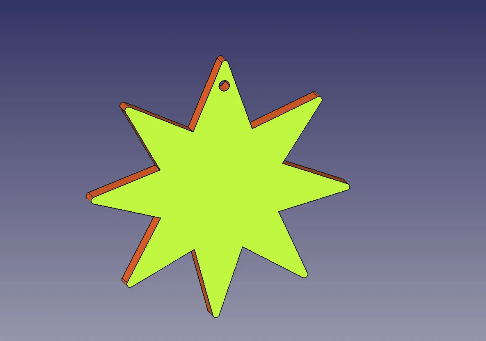
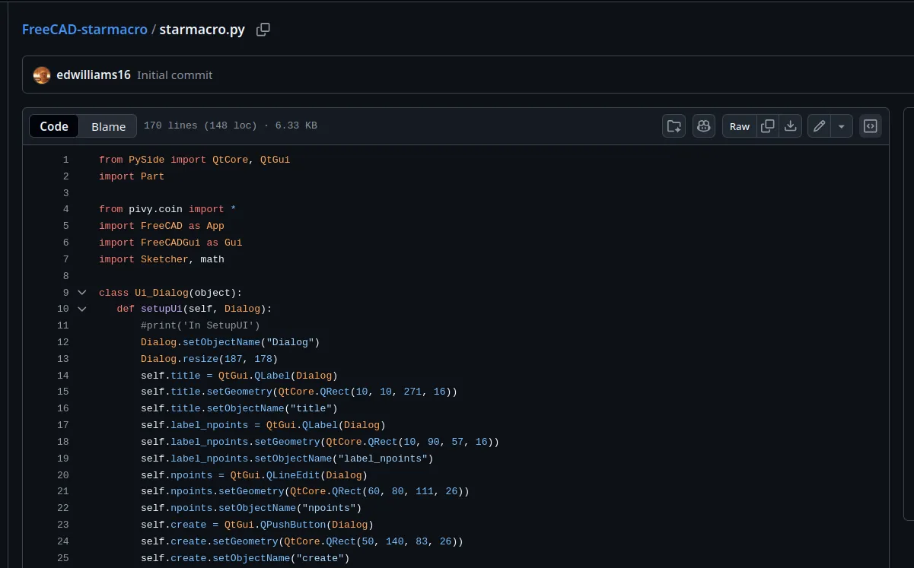
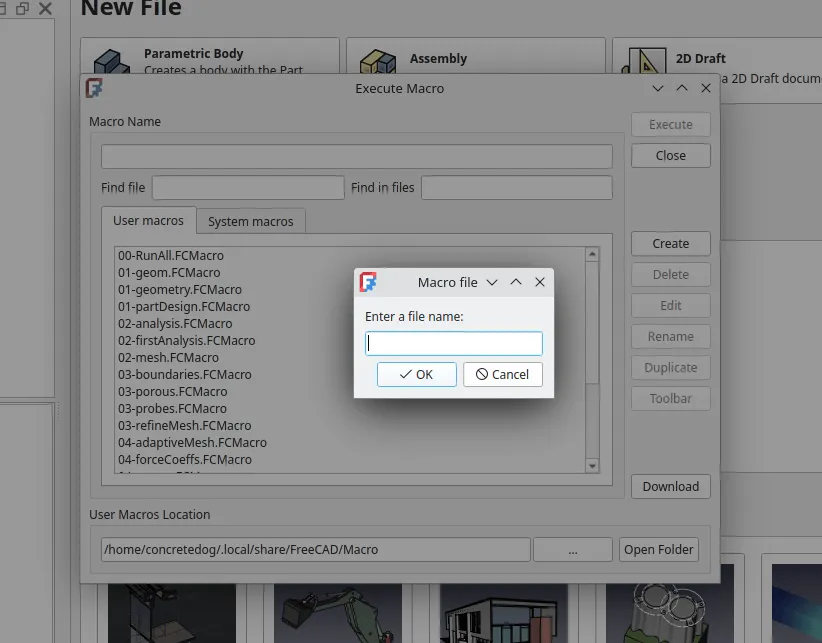
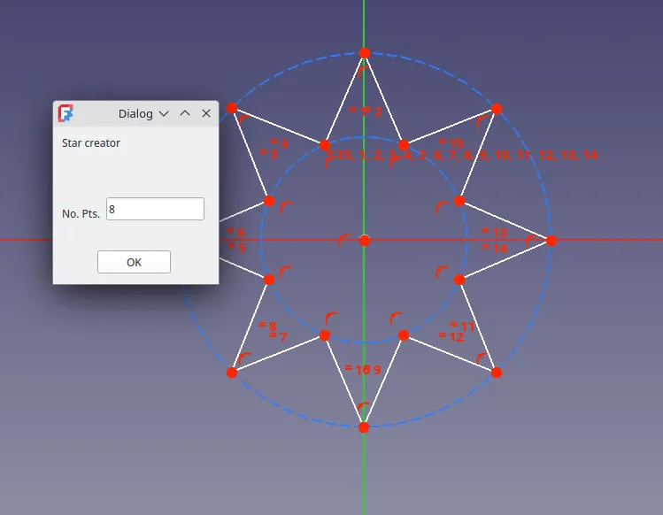

Around this time last year we created a [small tutorial to make a festive tree decoration](https://blog.freecad.org/2024/12/13/tutorial-festive-tree-decoration-using-the-revolution-tool/), shamelessly using the winter holidays to actually write a tutorial that, whilst pretending to be festive, really explained the use of the revolve tool! This year we are aiming for similar, we are going to create a star shaped decoration suitable for 3D printing, but we are going to learn how to use a community created macro.

Macro's in FreeCAD are essentially small scripts that can be played back to repeat a set of commands and functions. They take the form of small python files and there are thousands of them out there in the community to be explored. Of course, you can also dive into creating your own macros, but that is another story.

You could, of course, draw a star in many ways, you could place and edit numerous triangles in sketcher or you could indeed use the Polyline tool and lots of positional constraints. However, it would be nice to draw a star automatically. To do this navigate over [to this repo](https://github.com/edwilliams16/FreeCAD-starmacro) and highlight and copy all the code in the starmacro.py file.

Next open up FreeCAD (we used version 1.1 rc1) and then left click the "Macro" drop down and left click on "Macros". In the "Execute Macros" window click the "Create" button and give this new macro a name such as "StarMacro". You should then see a new empty tab appear in the preview window. Paste the contents of the Macro we copied earlier from the repo into this tab and then click the save button. You can now close that tab.

Next create a new project from the start page using the "Parametric Body" button in the "New File" window. In this project click to add a sketch and select the XY plane as the working plane. This will launch the sketcher workbench. Once in the sketcher workbench again left click "Macro - Macros" from the tool bar and then in the "Execute Macros" dialogue scroll down to find your new star macro in the list. Highlight the macro in the list and then click "Execute".

A small dialogue will appear that simply asks for you to input the number of points you require your star to have. Type in what you require and then left click in the sketch at the centre point of your star and left click again where you would like the edge of your star and your star will appear. Simple!

Closing the Macro dialogue we can then either further constrain the sketch, or simply close the sketch and then click the "Pad" tool to create our 3D star. As final touches we then left clicked on the surface of the star, attached another sketch and made a small hole to hang our decoration with. We also then, after saving the file, selected a point on the star and used the fillet tool to add a fillet and selected every tip of the star to make the tips a little rounded. Finally, you can select the item in the tree view and use the "File - Export" menu to export you item as an stl or obj or other formats ready for slicing and 3D printing.

Whilst this isn't a huge project it's a nice small introduction to using the macro system and we hope you enjoyed it. Finally, we hope wherever you are and whatever you do or don't celebrate, that you are having a peaceful and restful time!