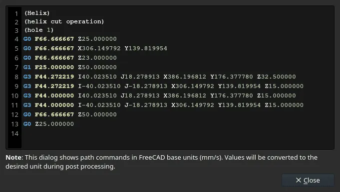
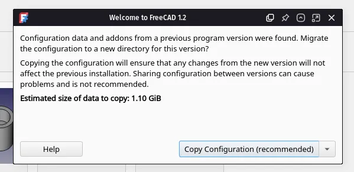

Maintainers have been backporting some of the fixes to the v1.1 branch where possible - 33 backports in the past 7 days. The list of changes in this recap applies to the main development branch (future v1.2).

This week in FreeCAD development:

**Sketcher**:

- PaddleStroke fixed a warning that is displayed when using the Dimension tool ([PR#25920](https://github.com/FreeCAD/FreeCAD/pull/25920)) and the importing of external geometry as construction regardless of user's preference ([PR#25733](https://github.com/FreeCAD/FreeCAD/pull/25733)).
- marbocub fixed an issue that occurred when applying a horizontal or vertical dimension constraint to a point ([PR#25813](https://github.com/FreeCAD/FreeCAD/pull/25813)).
- tetektoza fixed an incorrect approach to storing expressions during geometry transformations ([PR#25742](https://github.com/FreeCAD/FreeCAD/pull/25742)).

**PartDesign**:

- captain0xff fixed the misbehavior of draggers when the symmetric mode is enabled, and the type parameter is changed to two angles ([PR#25656](https://github.com/FreeCAD/FreeCAD/pull/25656)).
- PaddleStroke patched the Polar Pattern tool to accept negative angles ([PR#25621](https://github.com/FreeCAD/FreeCAD/pull/25621)).

**Assembly**: PaddleStroke fixed error messages that show up when you attempt to insert a new part without saving the assembly document first ([PR#25730](https://github.com/FreeCAD/FreeCAD/pull/25730)). He also fixed the lack of visual body element selection when editing a joint ([PR#25687](https://github.com/FreeCAD/FreeCAD/pull/25687)).

**TechDraw**:

- Syres916 fixed a compiler warning ([PR#25798](https://github.com/FreeCAD/FreeCAD/pull/25798)) and the visibility of the FillTemplateFields dialog in certain scenarios ([PR#25342](https://github.com/FreeCAD/FreeCAD/pull/25342)).
- WandererFan fixed the handling of the alpha channel in old documents ([PR#25674](https://github.com/FreeCAD/FreeCAD/pull/25674)).
- PaddleStroke reverted an earlier patch because it introduced a cyclic dependency ([PR#25615](https://github.com/FreeCAD/FreeCAD/pull/25615)).

**CAM**:

- sliptonic reimplemented the Mill Facing operation ([PR#24367](https://github.com/FreeCAD/FreeCAD/pull/24367)), fixed a bug where the creation of a new operation in a file with two CAM jobs could not be canceled ([PR#25800](https://github.com/FreeCAD/FreeCAD/pull/25800)), and added a new preference for displaying rapid moves in path visualization ([PR#25440](https://github.com/FreeCAD/FreeCAD/pull/25440)). He also created three enhancement proposals: two for normalizing terminology ([PR#25365](https://github.com/FreeCAD/FreeCAD/pull/25365) and [PR#25732](https://github.com/FreeCAD/FreeCAD/pull/25732)) and one that proposes a possibility of adding meta information to the Path parameters ([PR#23251](https://github.com/FreeCAD/FreeCAD/pull/23251)).
- Connor fixed job assignment and model/stock initialization ([PR#25908](https://github.com/FreeCAD/FreeCAD/pull/25908)), added a new migration system to handle legacy parameter conversion for ToolBit assets and objects ([PR#25444](https://github.com/FreeCAD/FreeCAD/pull/25444)), and turned off debugging in CAM Preferences by default ([PR#25775](https://github.com/FreeCAD/FreeCAD/pull/25775)).
- Roy_043 fixed a type error that occurred when changing the Job preferences template ([PR#25797](https://github.com/FreeCAD/FreeCAD/pull/25797)).
- Thom-de-Jong made it possible to cancel the Exporting G-code from the EditorDialog in the CAM Post Process operation ([PR#25273](https://github.com/FreeCAD/FreeCAD/pull/25273)).
- s-ohl-ostfalia-de patched the KineticNC CAM postprocessor to add cooling ([PR#25022](https://github.com/FreeCAD/FreeCAD/pull/25022)) and fix drill handling ([PR#25023](https://github.com/FreeCAD/FreeCAD/pull/25023)).
- tarman3 fixed a regression in Lead In/Out where it was not taking layers into account when Offset Entrance Location is other than 0 ([PR#25553](https://github.com/FreeCAD/FreeCAD/pull/25553)), and added line numbers to the Inspect window ([PR#24807](https://github.com/FreeCAD/FreeCAD/pull/24807)) and the G-code export dialog ([PR#23862](https://github.com/FreeCAD/FreeCAD/pull/23862)). He also fixed various minor issues ([PR#25253](https://github.com/FreeCAD/FreeCAD/pull/25253), [PR#25205](https://github.com/FreeCAD/FreeCAD/pull/25205), and [PR#25635](https://github.com/FreeCAD/FreeCAD/pull/25635)).

**BIM**: Roy_043 fixed an issue in the Material Editor ([PR#25823](https://github.com/FreeCAD/FreeCAD/pull/25823)), introduced a fine-tuning parameter to disable the new handling of BIM_Sketch view properties and its grid ([PR#25778](https://github.com/FreeCAD/FreeCAD/pull/25778)), fixed the reloading of Arch_Reference on opening a file ([PR#25777](https://github.com/FreeCAD/FreeCAD/pull/25777)), and fixed duplicate vertices in Wavefront OBJ exports ([PR#25801](https://github.com/FreeCAD/FreeCAD/pull/25801)).

**GUI**:

- Syres916 fixed the axis letter color and preview background when opening Light Sources preferences ([PR#25703](https://github.com/FreeCAD/FreeCAD/pull/25703)).
- kadet1090 introduced a SplitButton widget that can be used for buttons that have primary action and alternative ones, and then used it to replace the former "More" button approach in the migration dialog ([PR#25713](https://github.com/FreeCAD/FreeCAD/pull/25713)).

**Other changes**:

- PaddleStroke and Roy_043 fixed a couple of issues in Part ([PR#25912](https://github.com/FreeCAD/FreeCAD/pull/25912), [PR#25887](https://github.com/FreeCAD/FreeCAD/pull/25887), and [PR#25702](https://github.com/FreeCAD/FreeCAD/pull/25702)).
- PaddleStroke also fixed an issue where closing an assembly with links would open linked/children documents ([PR#25659](https://github.com/FreeCAD/FreeCAD/pull/25659)).
- Roy_043 fixed X-axis reference for Draft_Arc_3Points ([PR#25808](https://github.com/FreeCAD/FreeCAD/pull/25808)).

Additional improvements and fixes were contributed by mnesarco, maxwxyz, chennes, mnesarco, Chayanon-Ninyawee, PaddleStroke, and adrianinsaval.

If you are interested in testing the latest weekly build, you can grab it [here](https://github.com/FreeCAD/FreeCAD/releases/tag/weekly-2025.12.03).

**PR stats**: since the previous report, 89 pull requests have been merged (including backports to the v1.1 branch), and 48 new pull requests have been opened.

**Issue stats**: overall, there are 3037 open issues in the tracker, exactly as many as last week. There are 8 release blockers for v1.1 currently, up by 3 from last week. This is expected after publishing release candidates.