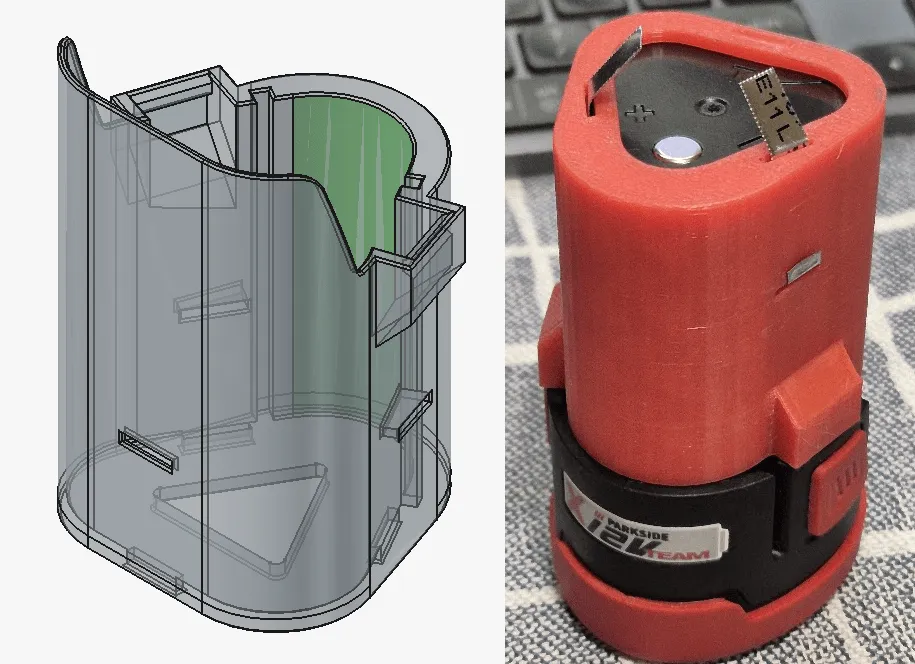

On a Friday, in a range of FreeCAD community platforms, you might see the hashtag #FreeCADFriday. The author of this post looks after this on the [FreeCAD Fosstodon account](https://fosstodon.org/@FreeCAD) but it also often [happens on X](https://x.com/FreeCADNews) and [Bluesky](https://bsky.app/profile/freecad.org). Indeed it may well happen on other social media platforms that we don't know about!

It's always fun, with around 9k followers on the Fediverse we get a wide range of people interacting showing a huge diversity of uses for FreeCAD. What's really great though is how people start asking questions and sharing tips and experiences. So if you are on any of these platforms, take a look, and if you are one some platform that doesn't use #FreeCADFriday... well why not be the first to try and establish it there?

Have a great #FreeCADFriday everyone!