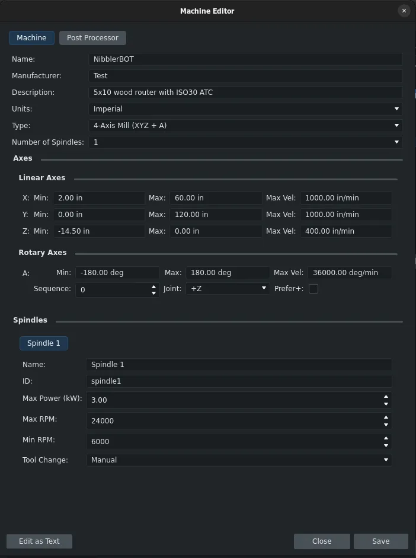

Maintainers have been backporting some of the fixes to the v1.1 branch where possible - 31 backports in the past 7 days. The list of changes in this recap applies to the main development branch (future v1.2).

This week in FreeCAD development:

**Draft**: Roy-043 fixed the setting of the AutoColor property of sketches to False before applying colors ([PR#25781](https://github.com/FreeCAD/FreeCAD/pull/25781)) and an error on constrained movement in the edit mode ([PR#26868](https://github.com/FreeCAD/FreeCAD/pull/26868)).

**Sketcher**:

- AjinkyaDahale fixed a minor regression introduced by recent refactoring ([PR#26886](https://github.com/FreeCAD/FreeCAD/pull/26886)).
- PaddleStroke fixed a bug where the equal constraint couldn't be applied to mirrored slot arcs ([PR#26604](https://github.com/FreeCAD/FreeCAD/pull/26604)).
- tetektoza fixed a crash when applying constraints during selection batching ([PR#26741](https://github.com/FreeCAD/FreeCAD/pull/26741)).
- saksham-malhotra-27 fixed a sketch redundancy warning ([PR#26064](https://github.com/FreeCAD/FreeCAD/pull/26064)).

**PartDesign:**

- tetektoza fixed a release blocker where the extrusion taper angle of internal faces was reversed ([PR#26781](https://github.com/FreeCAD/FreeCAD/pull/26781)). He also fixed Refine not working with Boolean operations ([PR#26745](https://github.com/FreeCAD/FreeCAD/pull/26745)).
- PaddleStroke fixed a release blocker where extruding up to shape would not recompute the document correctly ([PR#26696](https://github.com/FreeCAD/FreeCAD/pull/26696)).
- kadet1090 fixed recomputing the previews when recomputes are disabled ([PR#26805](https://github.com/FreeCAD/FreeCAD/pull/26805)), added the beginnings of scheduling the true recompute of the preview ([PR#26812](https://github.com/FreeCAD/FreeCAD/pull/26812)), and took another stab at fixing pattern transform previews ([PR#26697](https://github.com/FreeCAD/FreeCAD/pull/26697)).
- Lgt2x removed preview updates on property changes ([PR#26803](https://github.com/FreeCAD/FreeCAD/pull/26803)).
- wwmayer fixed a bug where Polar Pattern would not accept a datum line or a sketch line as a reference ([PR#26722](https://github.com/FreeCAD/FreeCAD/pull/26722), cherry-picked by maxwxyz).

**Assembly**:

- PaddleStroke fixed a release blocker where opening a document in the Insert tool would result in an error ([PR#26896](https://github.com/FreeCAD/FreeCAD/pull/26896)). He also fixed a bug in radial explosion ([PR#26724](https://github.com/FreeCAD/FreeCAD/pull/26724)) and updated the ground joint tooltip ([PR#25852](https://github.com/FreeCAD/FreeCAD/pull/25852)).
- wwmayer refactored a small part of the drag mode code ([PR#25678](https://github.com/FreeCAD/FreeCAD/pull/25678), cherry-picked by 3x380V).

**CAM**:

- davidgilkaufman added adaptive automatic picking of the helix entrance diameter ([PR#23980](https://github.com/FreeCAD/FreeCAD/pull/23980)).
- Sliptonic added retract annotation to drilling commands ([PR#26584](https://github.com/FreeCAD/FreeCAD/pull/26584)).
- Dimitris75 fixed the experimental waterline algorithm ([PR#26658](https://github.com/FreeCAD/FreeCAD/pull/26658)) and fixed the 3D surface rotational scan ([PR#26553](https://github.com/FreeCAD/FreeCAD/pull/26553)).
- tarman3 delivered the usual slew of changes:
  - Removed the duplicated movement to the clearance height at the end of the Slot operation ([PR#25842](https://github.com/FreeCAD/FreeCAD/pull/25842)).
  - Used the Job.GeometryTolerance property to set the precision of segmentation complex shapes while creating a path in the Tag, Engrave, and Deburr operations ([PR#26127](https://github.com/FreeCAD/FreeCAD/pull/26127)).
  - Fixed an error that showed up when changing the Radius property in DressupAxisMap ([PR#26321](https://github.com/FreeCAD/FreeCAD/pull/26321))

- Improved the Ramp Entry dressup ([PR#26695](https://github.com/FreeCAD/FreeCAD/pull/26695)).
- petterreinholdtsen patched the Fanuc post-processor ([PR#26617](https://github.com/FreeCAD/FreeCAD/pull/26617) and [PR#26436](https://github.com/FreeCAD/FreeCAD/pull/26436)).
- Connor added a threshold for treating large-radius arcs as linear in the simulator ([PR#26860](https://github.com/FreeCAD/FreeCAD/pull/26860)). He added a machine library and editor to the CAM preferences panel ([PR#26533](https://github.com/FreeCAD/FreeCAD/pull/26533)).

**BIM/Arch**:

- paullee0 patched the code to provide better information for users when Arch_Wall has 0 width or height ([PR#25878](https://github.com/FreeCAD/FreeCAD/pull/25878)).
- furgo16 did the same for when a face's horizontality or verticality cannot be determined ([PR#26231](https://github.com/FreeCAD/FreeCAD/pull/26231)), implemented baseless (without a base object) wall creation ([PR#24595](https://github.com/FreeCAD/FreeCAD/pull/24595)), and fixed ArchWallGui tests ([PR#26904](https://github.com/FreeCAD/FreeCAD/pull/26904)).
- YashSuthar983 fixed a bug in BIM Report where the column and line width and height are is reset every time the report result is recalculated ([PR#26736](https://github.com/FreeCAD/FreeCAD/pull/26736)).
- Roy-043 fixed an edge case where the area was calculated incorrectly ([PR#26779](https://github.com/FreeCAD/FreeCAD/pull/26779)), updated BIM example files ([PR#26820](https://github.com/FreeCAD/FreeCAD/pull/26820)), and removed unused ArchStairs Landings code ([PR#25357](https://github.com/FreeCAD/FreeCAD/pull/25357)).

**Other changes**:

- wwmayer fixed the orientation of internal shells of a solid in Part ([PR#26717](https://github.com/FreeCAD/FreeCAD/pull/26717), cherry-picked by maxwxyz).
- pieterhijma added a preselection of commonly used types to the Add Property dialog ([PR#26765](https://github.com/FreeCAD/FreeCAD/pull/26765)).
- ipatch fixed a bug where the workbench selector docked to the menubar would become unusable ([PR#26307](https://github.com/FreeCAD/FreeCAD/pull/26307)).
- tritao removed Boost-based signals and switched to FastSignals, which should make the same code faster ([PR#19132](https://github.com/FreeCAD/FreeCAD/pull/19132)).
- timpieces fixed shortcuts in the macro editor ([PR#26834](https://github.com/FreeCAD/FreeCAD/pull/26834)).
- Mr-Rahul-Paul added a "Copy" button to the Unit Test dialog, allowing users to copy the details of failing tests directly to the clipboard ([PR#25979](https://github.com/FreeCAD/FreeCAD/pull/25979)).
- galou patched the pixi builds to run natively under Wayland on Linux x86_64 by adding a qt6-wayland dependency ([PR#26753](https://github.com/FreeCAD/FreeCAD/pull/26753)).

Connor, Roy-043, PaddleStroke, efferre79, ipatch, furgo16, adrianinsaval, kadet1090, maxwxyz, and luzpaz contributed additional improvements and fixes.

If you are interested in testing the latest weekly build, you can grab it [here](https://github.com/FreeCAD/FreeCAD/releases/tag/weekly-2026.01.14).

**PR stats**: since the previous report, 95 pull requests have been merged (including backports to the v1.1 branch), and 38 new pull requests have been opened.

**Issue stats**: overall, there are 3164 open issues in the tracker, up by 18 from last week. There are 6 release blockers for v1.1 currently, up by 2 from last week.