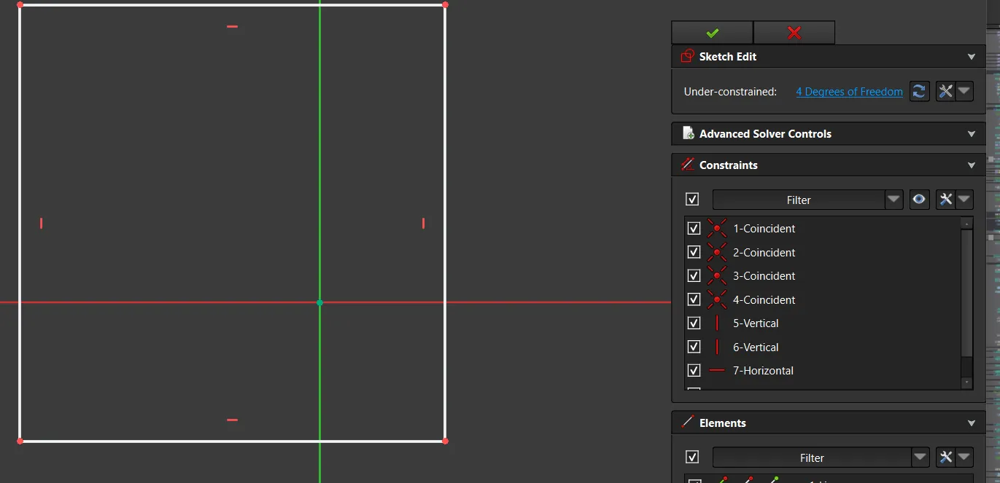
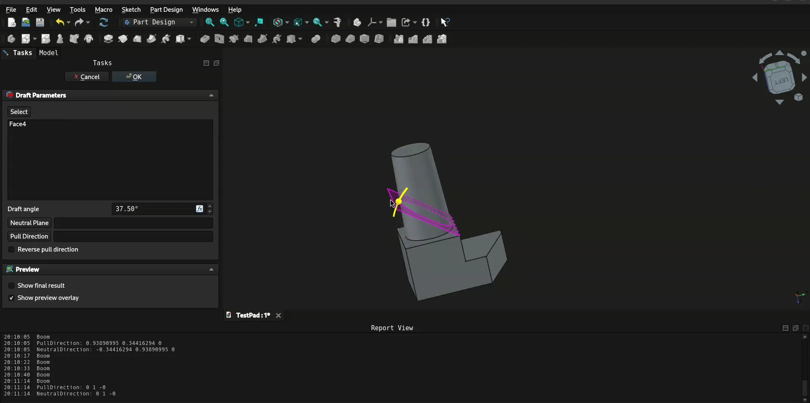
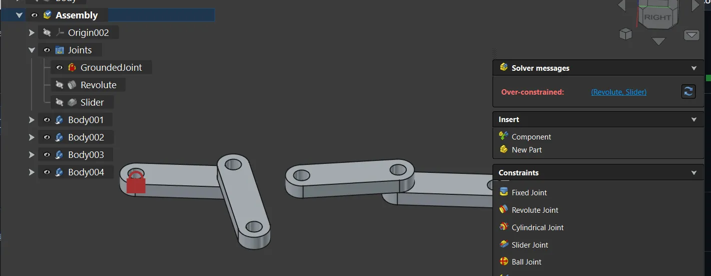
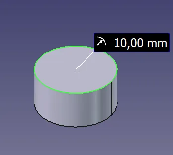

Maintainers have been backporting some of the fixes to the v1.1 branch where possible - 14 backports in the past 7 days. The list of changes in this recap applies to the main development branch (future v1.2).

This week in FreeCAD development:

**Sketcher**:

- amon-sha fixed a segfault that was happening during autoscaling ([PR#27077](https://github.com/FreeCAD/FreeCAD/pull/27077)).
- PaddleStroke implemented displaying the type of constraints in the constraints list ([PR#26797](https://github.com/FreeCAD/FreeCAD/pull/26797)), added a switch between diameter and radius in the Insert Diameter dialog ([PR#26794](https://github.com/FreeCAD/FreeCAD/pull/26794)), and fixed a regression where an angle constraint applied to arc was not correctly attached to the cursor ([PR#27177](https://github.com/FreeCAD/FreeCAD/pull/27177)).

**Part and PartDesign**: captain0xff added an interactive gizmo for the Draft operation ([PR#27111](https://github.com/FreeCAD/FreeCAD/pull/27111)).

**Assembly**: PaddleStroke fixed a handful of bugs and made several quality-of-life improvements:

- Fixed a bug where subassembly flexible joints on parts would be ignored ([PR#27172](https://github.com/FreeCAD/FreeCAD/pull/27172)).
- Fixed assembly activation ([PR#27107](https://github.com/FreeCAD/FreeCAD/pull/27107)), which resolved three issues.
- Changed joint references to remove cyclic dependency ([PR#25513](https://github.com/FreeCAD/FreeCAD/pull/25513)). This fixed six issues in a row, including one release blocker.
- Fixed the code to prevent assemblies from collapsing when you edit a sketch ([PR#26956](https://github.com/FreeCAD/FreeCAD/pull/26956)).
- Improved joints visualization: selecting a joint in the tree now highlights the joined elements in the viewport ([PR#24951](https://github.com/FreeCAD/FreeCAD/pull/24951)).
- Added the ability to report overconstraints ([PR#24623](https://github.com/FreeCAD/FreeCAD/pull/24623)).

**CAM**:

- tarman3 restored G0 movements in DressupBoundary ([PR#23242](https://github.com/FreeCAD/FreeCAD/pull/23242)).
- davidgilkaufman fixed the Adaptive algorithm producing tiny, random loops ([PR#26426](https://github.com/FreeCAD/FreeCAD/pull/26426)), and dbtayl fixed bspline processing in the same algorithm ([PR#21220](https://github.com/FreeCAD/FreeCAD/pull/21220)).
- petterreinholdtsen ensured the pre-/postamble help text matches active values by avoiding duplication ([PR#24617](https://github.com/FreeCAD/FreeCAD/pull/24617)).
- Ipatch fixed a release blocker where the recalculation button would stay active when the tool bit diameter was set to an expression without a unit ([PR#26884](https://github.com/FreeCAD/FreeCAD/pull/26884)).

**BIM/Arch**:

- Roy-043 fixed a variable name error in ArchWall ([PR#26991](https://github.com/FreeCAD/FreeCAD/pull/26991)) and a user-visible message ([PR#27213](https://github.com/FreeCAD/FreeCAD/pull/27213)).
- furgo16 added regression and functional test for ArchWall's MakeBlock feature ([PR#27002](https://github.com/FreeCAD/FreeCAD/pull/27002)).

**Other changes**:

- alfrix fixed an issue with mouse-grabbing on Wayland ([PR#26534](https://github.com/FreeCAD/FreeCAD/pull/26534)).
- Lgt2x improved the speed of expression completion ([PR#27137](https://github.com/FreeCAD/FreeCAD/pull/27137)).
- captain0xff patched the clipping plane code to prevent interactive gizmos, transform dragger, link dragger, and the sketch constraints from getting clipped ([PR#27126](https://github.com/FreeCAD/FreeCAD/pull/27126)).
- PaddleStroke improved the AutoTask mode in overlays ([PR#26768](https://github.com/FreeCAD/FreeCAD/pull/26768)). When it's enabled, the panel will now show if there is a taskbox visible.
- MortenVajhoj added support for picking cylindrical surfaces when measuring radius or diameter and changed the placement of annotations ([PR#27044](https://github.com/FreeCAD/FreeCAD/pull/27044)).

Chennes contributed additional improvements and fixes.

If you are interested in testing the latest weekly build, you can grab it [here](https://github.com/FreeCAD/FreeCAD/releases/tag/weekly-2026.01.28).

**PR stats**: since the previous report, 41 pull requests have been merged (including backports to the v1.1 branch), and 42 new pull requests have been opened.

**Issue stats**: overall, there are 3195 open issues in the tracker, up by 17 from last week. There are 7 release blockers for v1.1 currently, down by 3 from last week.