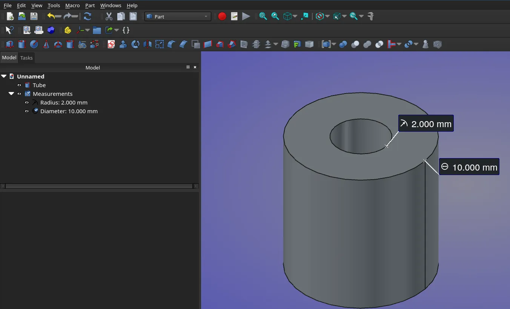

Maintainers have been backporting some of the fixes to the v1.1 branch where possible - 27 backports in the past 7 days. The list of changes in this recap applies to the main development branch (future v1.2).

This week in FreeCAD development:

**Sketcher**:

- PaddleStroke fixed the sluggishness of dragging complex constraint systems (think 500+ constraints, [PR#26598](https://github.com/FreeCAD/FreeCAD/pull/26598)). He also fixed **Snap to object** not working on axis ([PR#26558](https://github.com/FreeCAD/FreeCAD/pull/26558)), the handling of autoconstraints in slot geometry ([PR#26559](https://github.com/FreeCAD/FreeCAD/pull/26559)), selection and zoom lag in large sketches ([PR#26671](https://github.com/FreeCAD/FreeCAD/pull/26671)), sped up large bulk selection ([PR#26663](https://github.com/FreeCAD/FreeCAD/pull/26663)), and fixed dimensional constraint text rendered backwards ([PR#26554](https://github.com/FreeCAD/FreeCAD/pull/26554)).
- AjinkyaDahale contributed part 5 of his code refactoring work ([PR#22951](https://github.com/FreeCAD/FreeCAD/pull/22951)).
- wwmayer added support for Bezier and Offset curves as external geometry (cherry-picked by leoheck, [PR#25144](https://github.com/FreeCAD/FreeCAD/pull/25144)).
- tetektoza changed the rendering of constraint text, arrowheads, and constraint icons to be above geometry lines ([PR#26703](https://github.com/FreeCAD/FreeCAD/pull/26703)).

**PartDesign:**

- PaddleStroke fixed the issue where it was impossible to select multiple points on two sketches ([PR#26596](https://github.com/FreeCAD/FreeCAD/pull/26596)) and enabled the dragging and dropping of shapebinders ([PR#25264](https://github.com/FreeCAD/FreeCAD/pull/25264)).
- kadet1090 fixed the incorrect preview for polar patterns ([PR#26563](https://github.com/FreeCAD/FreeCAD/pull/26563)).
- ipatch fixed invalid edge links ([PR#26425](https://github.com/FreeCAD/FreeCAD/pull/26425)).
- Krrish777 fixed the Boolean's operation type drop-down list not updating after recomputation ([PR#26582](https://github.com/FreeCAD/FreeCAD/pull/26582)).
- captain0xff fixed the gizmo direction when the calculated point lies outside the face ([PR#26616](https://github.com/FreeCAD/FreeCAD/pull/26616)).

**TechDraw**:

- WandererFan fixed crashes in scripts on CosmeticEdge delete ([PR#26646](https://github.com/FreeCAD/FreeCAD/pull/26646)), restored manual control of view frames ([PR#26125](https://github.com/FreeCAD/FreeCAD/pull/26125)), and fixed two issues with axonometric length dimensions ([PR#26445](https://github.com/FreeCAD/FreeCAD/pull/26445)).
- Lgt2x improved drawing performance; the issue was especially noticeable when TD needed to scale hundreds of items on a page ([PR#25898](https://github.com/FreeCAD/FreeCAD/pull/25898)).

**CAM**:

- Connor added 0.05 um to V-bit tip diameter to prevent invalid sketch constraints ([PR#26535](https://github.com/FreeCAD/FreeCAD/pull/26535)) and fixed duplicate label issues with toolbits ([PR#26647](https://github.com/FreeCAD/FreeCAD/pull/26647)).
- jffmichi fixed the Radius Mill Tip Diameter always resetting to 5.0mm when opening a file ([PR#26707](https://github.com/FreeCAD/FreeCAD/pull/26707)).

**FEM**:

- marioalexis84 added support for 2D geometries to SectionPrint ([PR#25081](https://github.com/FreeCAD/FreeCAD/pull/25081)). He also added the magnetic flux density boundary condition ([PR#25897](https://github.com/FreeCAD/FreeCAD/pull/25897)).
- mac-the-bike added half-cycle animation ([PR#24129](https://github.com/FreeCAD/FreeCAD/pull/24129)).
- xtemp09 modernized a function in the FEM code ([PR#23743](https://github.com/FreeCAD/FreeCAD/pull/23743)).

**GUI**:

- Krrish777 reordered the Add Property dialog fields to Name-Value-Group-Type ([PR#26567](https://github.com/FreeCAD/FreeCAD/pull/26567)).
- tetektoza fixed broken image plane transparency ([PR#26590](https://github.com/FreeCAD/FreeCAD/pull/26590)) and fixed an issue where Selection View - Picked object list would add the whole object to face highlights ([PR#26589](https://github.com/FreeCAD/FreeCAD/pull/26589)).
- Krrish777 improved error feedback when a user creates a Mirrored, LinearPattern, or PolarPattern feature (or other Transformed features) without selecting any base features to transform ([PR#26565](https://github.com/FreeCAD/FreeCAD/pull/26565)).

**Other changes**:

- Roy-043 fixed a regression in Draft where an object would be displayed incorrectly when the Draft Object Pattern property is used. He also removed v1.1 Sill Height code in BIM; this was one of release blockers ([PR#26641](https://github.com/FreeCAD/FreeCAD/pull/26641)).
- tetektoza fixed an issue where the Selectable property would not work on a Body in a Part ([PR#25009](https://github.com/FreeCAD/FreeCAD/pull/25009)).
- WandererFan applied a patch that allows the Measure module to retrieve geometry information for Surface module objects ([PR#26479](https://github.com/FreeCAD/FreeCAD/pull/26479)).
- drwho495 fixed another toponaming issue ([PR#26691](https://github.com/FreeCAD/FreeCAD/pull/26691)).
- kevinsmia1939 added diameter measurement ([PR#24853](https://github.com/FreeCAD/FreeCAD/pull/24853)).

Roy-043, wwmayer, 3x380V, kadet1090, PaddleStroke, TONY8779, YashSuthar983, adrianinsaval, and luzpaz contributed additional improvements and fixes.

If you are interested in testing the latest weekly build, you can grab it [here](https://github.com/FreeCAD/FreeCAD/releases/tag/weekly-2026.01.07).

**PR stats**: since the previous report, 78 pull requests have been merged (including backports to the v1.1 branch), and 40 new pull requests have been opened.

**Issue stats**: overall, there are 3146 open issues in the tracker, same as last week. There are 4 release blockers for v1.1 currently, same as last week too.