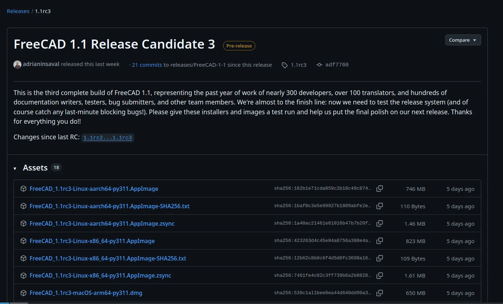

Earlier this week, we published the third release candidate of FreeCAD 1.1. With just two outstanding release blockers (fingers crossed), this should be the last release candidate before we call it a day and release the final v1.1.

If you are interested in helping us test the release candidate, please [download a build](https://github.com/FreeCAD/FreeCAD/releases/tag/1.1rc3) for your operating system, take it for a spin, and [tell us](https://github.com/FreeCAD/FreeCAD/issues) if it breaks horribly in one way or another. At this point, we are most interested in severe issues only.