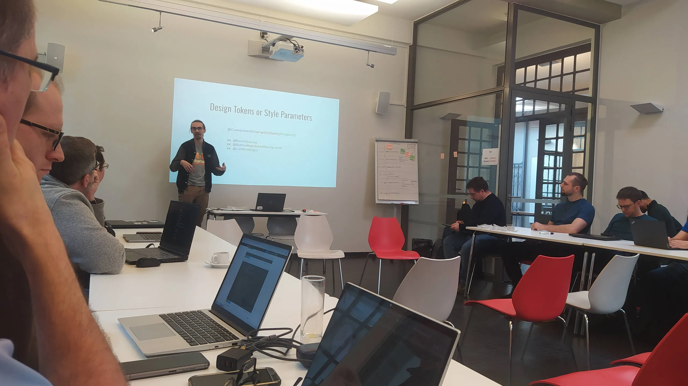
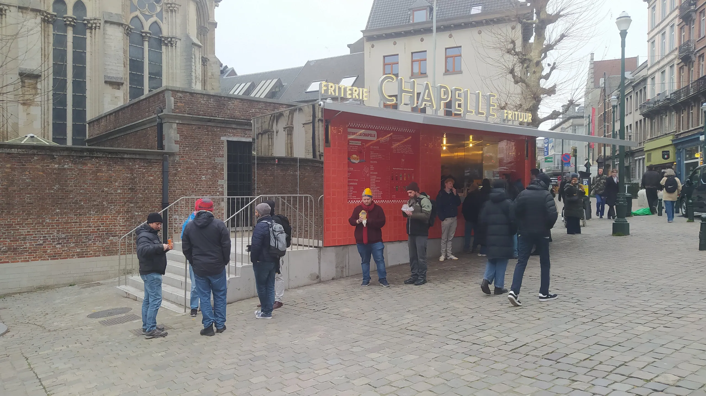
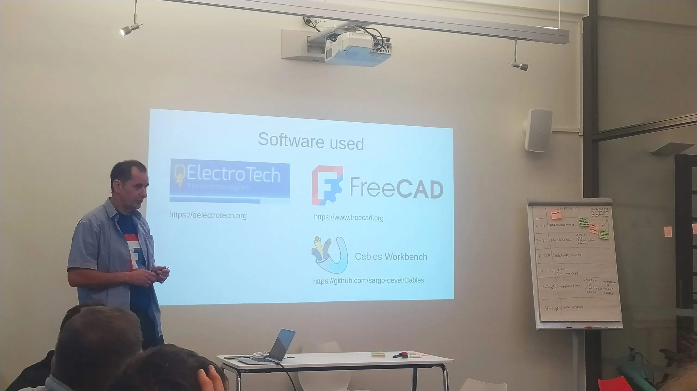
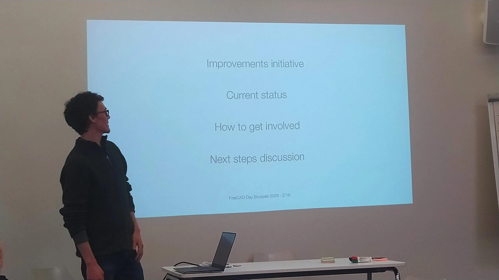

On the 30^th^ January 2026 we once again held our pre FOSDEM fringe meet up event FreeCAD Day. Once again we met at the fabulous Les Ateliers des Tanneurs venue, where, fuelled with plenty of coffee and tea, we had an excellent day of talks and discussions.

We kicked of the morning with talks from kadet1090 on the FPA grant funded activity to create a design system for FreeCAD, more details of the work can be found here [https://github.com/FreeCAD/FPA-grant-proposals/issues/58](https://github.com/FreeCAD/FPA-grant-proposals/issues/58). Moving forward we had an informal talk and discussion around approaches around promoting and developing the use of FreeCAD in academic environments led by pamintended.

Sadly travel problems stopped reqrefusion from attending the day but the fearless and mighty chennes stepped up to blast through reqrefusion slide deck which looked at the structure of FreeCAD/FPA finances looking at last year, 2025, as a case example.

An ever perennial favourite is the, magnificently facilitated, FreeCAD Complaints Session. If you don't know this is a session where anyone can raise any complaint about any aspect of FreeCAD. Kliment facilitates and has an amazing ability to turn any complex multi paragraph complaint discussion into a single concise bullet point. This session is audio recorded, transcribed (by a human) and the resulting complaints are fed into the issue system. It's simultaneously great fun as well as incredibly useful! This year we were all impressed that the session was only just over 32 minutes in length... either FreeCAD has improved, or we were all ready for lunch.

Lunch was a short walk to a friets stand that we tend to head for every year and, whilst pretty cold, it was great carry on the conversations over friets.

Back in the room we continued with talks. This included SargoDevel updating on the amazing Cables workbench, mwestphal speaking about F3D which has recently been integrated into FreeCAD and generates project thumbnails. The author of this post (concretedog) gave a talk on some of the tangles and trips that can occur when teaching or writing tutorial content for FreeCAD and we had a tantalising update on the new website work by marcuspollio. Marcel also gave a fascinating thought provoking talk on where, in both his work and hobbies, FreeCAD is useful, but also highlighting where FreeCAD is not quite ready for commercial engineering use.

Of course we were over running by this point and so the last two talks of the day were extremely concise. pieterhijma gave a very quick look at his software research project [OSH Autodoc](https://osh-autodoc.org/). This emergent FreeCAD workbench allows for the automated creation of project assembly instructions. Interestingly the example Pieter had worked on was a set of build instructions for a FreeCAD and KiCad designed project we featured on the FOSDEM booth, the sub micron capable [Micro Manipulators we have previously highlighted on the blog](https://blog.freecad.org/2025/09/25/forged-in-freecad-xyz-micro-manipulator-for-sub-micron-motion-control/).

Finally a super quick look at the current state of the Telemetry addon from chennes rounded out an extremely busy and productive day. Massive thanks to everyone who came and gave up their time making for a great day.
