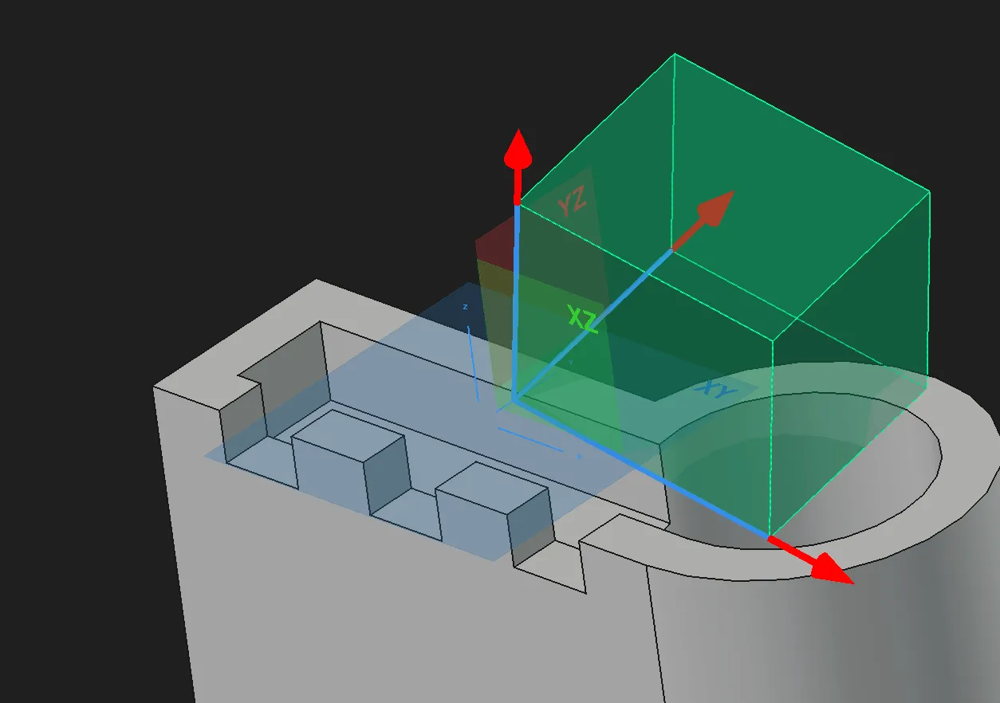
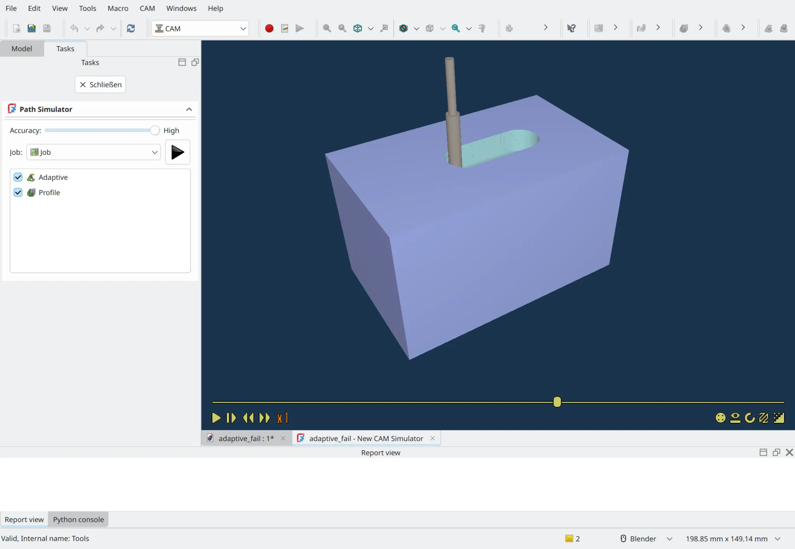

Maintainers have been backporting some of the fixes to the v1.1 branch where possible - 12 backports in the past 7 days. The list of changes in this recap applies to the main development branch (future v1.2).

This week in FreeCAD development:

**Draft**:

- Roy-043 fixed incorrect labels preview when moving or rotating the object ([PR#27480](https://github.com/FreeCAD/FreeCAD/pull/27480)).
- caio-venancio fixed the availability of Relative and Global modes in the Dimension's task panel when Alt is pressed ([PR#27422](https://github.com/FreeCAD/FreeCAD/pull/27422)).
- YashSuthar983 fixed the MaxChars property in Label ([PR#27478](https://github.com/FreeCAD/FreeCAD/pull/27478)).

**Sketcher**:

- skelliam added tooltips for Symmetry parameters ([PR#27131](https://github.com/FreeCAD/FreeCAD/pull/27131)).
- ipatch fixed a crash when using "Remove Axes Alignment" on partially constrained sketches ([PR#27344](https://github.com/FreeCAD/FreeCAD/pull/27344)).
- YashSuthar983 fixed the broken dragging of non-circular conics and arc of conics ([PR#27085](https://github.com/FreeCAD/FreeCAD/pull/27085)).
- TomPcz fixed dimension label alignment and inactive strikethrough ([PR#27346](https://github.com/FreeCAD/FreeCAD/pull/27346)).
- chennes fixed two minor issues ([PR#27439](https://github.com/FreeCAD/FreeCAD/pull/27439) and [PR#27438](https://github.com/FreeCAD/FreeCAD/pull/27438)).

**Part and PartDesign**:

- kadet1090 refactored the TopoShape::splitWires method to make it easier to follow and use variable names that better describe the intent ([PR#23096](https://github.com/FreeCAD/FreeCAD/pull/23096)).
- captain0xff added interactive gizmos for the Box, Cylinder, and Sphere operations ([PR#23700](https://github.com/FreeCAD/FreeCAD/pull/23700)).

**Assembly**:

- PaddleStroke fixed the BOM tool to separate mirrored links ([PR#26113](https://github.com/FreeCAD/FreeCAD/pull/26113)).
- TomPcz fixed the help text height in the BOM tool ([PR#27387](https://github.com/FreeCAD/FreeCAD/pull/27387)).

**CAM**:

- petterreinholdtsen reintroduced matching pre-/postamble and help text for the dynapath_4060 post-processor ([PR#27331](https://github.com/FreeCAD/FreeCAD/pull/27331)). He also added the M8x1.25 (aka M8 coarse) thread tapping bit ([PR#27114](https://github.com/FreeCAD/FreeCAD/pull/27114)).
- Daniel-Khodabakhsh fixed the case when the Start Depth of an operation equals the Final Depth and the Step Down is zero ([PR#27247](https://github.com/FreeCAD/FreeCAD/pull/27247)).
- Connor updated SVG annotation IDs for tool shapes ([PR#27325](https://github.com/FreeCAD/FreeCAD/pull/27325)).
- tarman3 fixed an issue where `_getCutAreaCrossSection()` would sometimes return False because it would incorrectly define the bounding box for the cut area ([PR#27295](https://github.com/FreeCAD/FreeCAD/pull/27295)).
- jffmichi integrated the new simulator into the main window ([PR#22204](https://github.com/FreeCAD/FreeCAD/pull/22204)).

**BIM/Arch**:

- Roy-043 fixed a regression caused by Link Hosts handling ([PR#27406](https://github.com/FreeCAD/FreeCAD/pull/27406)) and the case of some titles ([PR#27474](https://github.com/FreeCAD/FreeCAD/pull/27474)).
- paullee0 fixed a regression in baseless walls creation ([PR#27324](https://github.com/FreeCAD/FreeCAD/pull/27324)).

**Other changes**:

- wwmayer fixed several issues, including two release blockers, all patches cherry-picked by 3x380V ([PR#27355](https://github.com/FreeCAD/FreeCAD/pull/27355)).
- WandererFan patched TechDraw to make it possible to create a local section with a sketch made up of a line in 'no parallel' or 'aligned' mode ([PR#27361](https://github.com/FreeCAD/FreeCAD/pull/27361)).
- krissrex added code documentation for the Web module ([PR#27369](https://github.com/FreeCAD/FreeCAD/pull/27369)).
- PhoneDroid improved the overview of 3rd-party libraries in the About window ([PR#27219](https://github.com/FreeCAD/FreeCAD/pull/27219)).
- ScholliYT patched Mesh to export original object names to 3MF ([PR#27064](https://github.com/FreeCAD/FreeCAD/pull/27064)).
- JoesCat added 15 copper alloy materials to Material-Metals ([PR#25832](https://github.com/FreeCAD/FreeCAD/pull/25832)). The definitions include appearance, hardness, Young's and Shear modulus, tensile and yield strengths, elongation, area reduction, and ultimate strain.
- sw1nn improved spacenav integration for 3DConnexion devices support by setting the client name to FreeCAD ([PR#27264](https://github.com/FreeCAD/FreeCAD/pull/27264)). This allows the daemon to do things like provide application-level default settings.
- drwho495 removed unneeded migration dialog pop-up from toponaming code ([PR#27352](https://github.com/FreeCAD/FreeCAD/pull/27352)). This fixes a release blocker and a regression.

Krrish777, kkocdko, skelliam, PhoneDroid, mosfet80, cniethammer, ipatch, chennes, and jijinbei contributed additional improvements and fixes.

If you are interested in testing the latest weekly build, you can grab it [here](https://github.com/FreeCAD/FreeCAD/releases/tag/weekly-2026.02.11).

**PR stats**: since the previous report, 59 pull requests have been merged (including backports to the v1.1 branch), and 59 new pull requests have been opened.

**Issue stats**: overall, there are 3236 open issues in the tracker, up by 37 from last week. There are 5 release blockers for v1.1 currently, up by 1 from last week.