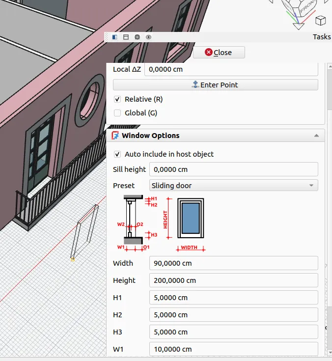

Maintainers have been backporting some of the fixes to the v1.1 branch where possible - 14 backports in the past 7 days. The list of changes in this recap applies to the main development branch (future v1.2).

This week in FreeCAD development:

**Sketcher**:

- Lgt2x sped up the solving for the Move/Array operation ([PR#26977](https://github.com/FreeCAD/FreeCAD/pull/26977)).
- theo-vt changed the way driven constraints are handled in the PlaneGCS module so that dragging geometry would look less odd when the sketch is under-constrained ([PR#26632](https://github.com/FreeCAD/FreeCAD/pull/26632)).

**Part and PartDesign**:

- paragforwork added missing tooltips to the Location task panel ([PR#27748](https://github.com/FreeCAD/FreeCAD/pull/27748)), and ipatch added tooltips for Part primitives ([PR#27732](https://github.com/FreeCAD/FreeCAD/pull/27732)).
- PaddleStroke fixed a bug where a plane from an LCS could not be picked as a limit for an "Up to face" Extrude operation ([PR#27637](https://github.com/FreeCAD/FreeCAD/pull/27637)).
- alfrix fixed a bug where a tapered hole wouldn't always fully cut faces ([PR#27127](https://github.com/FreeCAD/FreeCAD/pull/27127)).

**BIM/Arch**:

- Roy-043 fixed a crash that occurred when switching working planes ([PR#27373](https://github.com/FreeCAD/FreeCAD/pull/27373)).
- furgo16 renamed the obsolete Mesh property to HiRes ([PR#27783](https://github.com/FreeCAD/FreeCAD/pull/27783)), set the default value of 'MoveWithHost' property to True ([PR#27685](https://github.com/FreeCAD/FreeCAD/pull/27685)), and added an initial implementation of the sliding door preset ([PR#27375](https://github.com/FreeCAD/FreeCAD/pull/27375)).

**FEM**:

- marioalexis84 added a new DisplaceMesh option to the CalculiX solver to deform the mesh by the displacement field ([PR#27786](https://github.com/FreeCAD/FreeCAD/pull/27786)), fixed a regression where the refactored Elmer solver wouldn't provide text output ([PR#27775](https://github.com/FreeCAD/FreeCAD/pull/27775)), fixed various issues in Elmer examples ([PR#27749](https://github.com/FreeCAD/FreeCAD/pull/27749)), and switched to using vtkmodules rather than importing from VTK directly ([PR#27810)](https://github.com/FreeCAD/FreeCAD/pull/27810)/).
- pieterhijma reenabled visibility icons for Analysis and Solver ([PR#27577](https://github.com/FreeCAD/FreeCAD/pull/27577)).

**TechDraw**:

- WandererFan fixed the incorrect display of the "SCALE" automatic field ([PR#27616](https://github.com/FreeCAD/FreeCAD/pull/27616)).
- PaddleStroke reworked annotation tools ([PR#24624](https://github.com/FreeCAD/FreeCAD/pull/24624)). This was an FPA grant:



**CAM**:

- The usual batch of changes from tarman3:
  - Fixed errors when opening a wire with two equal edges ([PR#26109](https://github.com/FreeCAD/FreeCAD/pull/26109)).
  - Rotary axis inversion in the Axis Map dressup ([PR#26131](https://github.com/FreeCAD/FreeCAD/pull/26131)).
  - Fixed a regression in the task panel of Engrave ([PR#26818](https://github.com/FreeCAD/FreeCAD/pull/26818)).
  - Fixed the calculation of arc length and time milling ([PR#27389](https://github.com/FreeCAD/FreeCAD/pull/27389)).
  - Replaced G00 and G01 by G0 and G1 in LeadInOut ([PR#27704](https://github.com/FreeCAD/FreeCAD/pull/27704)).
  - Patched the Profile operation to allow setting the starting point when processing multiple shapes ([PR#24958](https://github.com/FreeCAD/FreeCAD/pull/24958)).
- captain0xff fixed the transform tool for CAM objects ([PR#27757](https://github.com/FreeCAD/FreeCAD/pull/27757)).
- petterreinholdtsen adjusted the Fanuc post-processor to always use required drill parameters ([PR#27788](https://github.com/FreeCAD/FreeCAD/pull/27788)).
- sliptonic added a more accessible CONSTANTS file to the root of the CAM workbench ([PR#27861](https://github.com/FreeCAD/FreeCAD/pull/27861)).

**Measurement**:

- Lokestrom added radius, diameter, and area measurements for discs / circular faces ([PR#27415](https://github.com/FreeCAD/FreeCAD/pull/27415)).
- YashSuthar983 fixed a bug where measurements would be saved if you exited the tool by initiating another task, such as opening a sketch ([PR#27805](https://github.com/FreeCAD/FreeCAD/pull/27805)). They also fixed a crash that would occur when you drag the label of an unsaved measurement ([PR#27707](https://github.com/FreeCAD/FreeCAD/pull/27707)).
- MortenVajhoj moved the Reset / Close / Save buttons to the top of the task panel ([PR#27774](https://github.com/FreeCAD/FreeCAD/pull/27774)).

**Other changes**:

- Roy-043 fixed a regression in Draft where it was impossible to assign an annotation style to objects such as Draft Dimension or Draft Label when the style was the second one created in the file ([PR#27831](https://github.com/FreeCAD/FreeCAD/pull/27831)).
- PaddleStroke fixed a bug in Assembly where mirrored links would snap back to their original positions when you tried to move them ([PR#26090](https://github.com/FreeCAD/FreeCAD/pull/26090)).
- marcuspollio added entire line selection in the text editor by clicking on the line number ([PR#27677](https://github.com/FreeCAD/FreeCAD/pull/27677)).
- APEbbers patched the search function in Preferences to ask the user if they want to start from the beginning when they reach the end ([PR#24772](https://github.com/FreeCAD/FreeCAD/pull/24772)).

PhoneDroid, 3x380V, wwmayer, ipatch, chennes, xtemp09, nmschulte, and kadet1090 contributed additional improvements and fixes.

If you are interested in testing the latest weekly build, you can grab it [here](https://github.com/FreeCAD/FreeCAD/releases/tag/weekly-2026.02.25).

**PR stats**: since the previous report, 66 pull requests have been merged (including backports to the v1.1 branch), and 46 new pull requests have been opened.

**Issue stats**: overall, there are 3285 open issues in the tracker, up by 19 from last week. There are [3 release blockers](https://github.com/FreeCAD/FreeCAD/issues?q=state%3Aopen%20label%3ABlocker%20milestone%3A1.1) for v1.1 currently, up by 1 from last week.