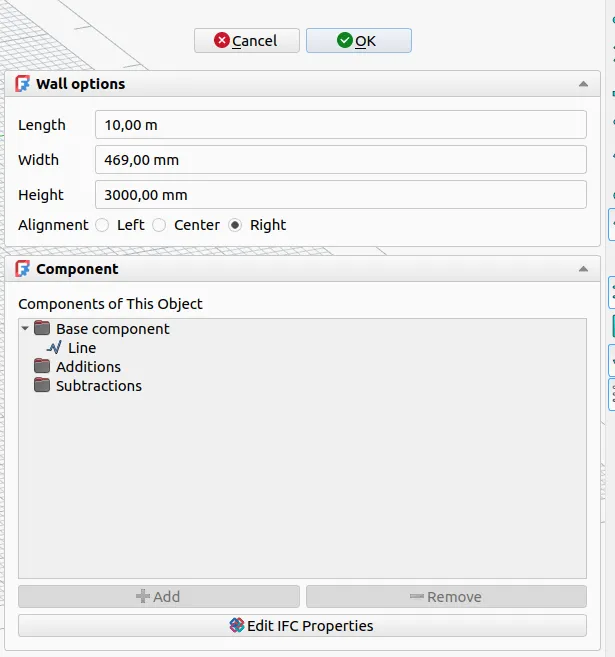

Maintainers have been backporting some of the fixes to the v1.1 branch where possible - 19 backports in the past 7 days. The list of changes in this recap applies to the main development branch (future v1.2).

This week in FreeCAD development:

**Draft**:

- YashSuthar983 added snapping to knots of BSplines ([PR#26571](https://github.com/FreeCAD/FreeCAD/pull/26571)).
- Roy-043 fixed the autogroup behavior when the active group is a layer ([PR#27102](https://github.com/FreeCAD/FreeCAD/pull/27102)).

**Sketcher**:

- PaddleStroke fixed the issue where dimensional constraints would visually match the lines when using on-view parameters ([PR#25848](https://github.com/FreeCAD/FreeCAD/pull/25848)). He also added a tooltip that displays the entire expression for constraints with an expression ([PR#25954](https://github.com/FreeCAD/FreeCAD/pull/25954)) and fixed disappearing construction lines during drawing ([PR#27195](https://github.com/FreeCAD/FreeCAD/pull/27195)).
- vcheckin fixed an intermittent crash on sketch exit ([PR#27129](https://github.com/FreeCAD/FreeCAD/pull/27129)).

**Part and PartDesign**:

- kadet1090 fixed two regressions in the MultiCommon boolean operation ([PR#27012](https://github.com/FreeCAD/FreeCAD/pull/27012)).
- theosib fixed mirror() regression with non-identity Placement ([PR#26963](https://github.com/FreeCAD/FreeCAD/pull/26963)).

**Assembly**: PaddleStroke contributed multiple fixes and improvements:

- Fixed the slider joint of the sub-assembly not working when inserted as a grounded part ([PR#27206](https://github.com/FreeCAD/FreeCAD/pull/27206)).
- Fixed isolate not working on sub-assembly components ([PR#27173](https://github.com/FreeCAD/FreeCAD/pull/27173)).
- Fixed assembly activation issues ([PR#27194](https://github.com/FreeCAD/FreeCAD/pull/27194)).
- Removed an extra solver message when the file is closed ([PR#27210](https://github.com/FreeCAD/FreeCAD/pull/27210)).
- Added support for single click to open exploded views in read-only mode, without entering the edit mode ([PR#25456](https://github.com/FreeCAD/FreeCAD/pull/25456)).

**TechDraw**:

- Lgt2x fixed Qt5 compatibility ([PR#27253](https://github.com/FreeCAD/FreeCAD/pull/27253)).
- WandererFan fixed the default circle centerline line style ([PR#27134](https://github.com/FreeCAD/FreeCAD/pull/27134)) and fixed a release blocker where the projection group jumps to the origin ([PR#27094](https://github.com/FreeCAD/FreeCAD/pull/27094)).

**CAM**:

- Daniel-Khodabakhsh fixed an error that would occur when Start depth equals to Final depth and Safe height ([PR#27258](https://github.com/FreeCAD/FreeCAD/pull/27258)).
- Luvtofish fixed and updated the Dyna_4060 postprocessor ([PR#27202](https://github.com/FreeCAD/FreeCAD/pull/27202)).

**BIM/Arch**:

- Roy-043 had eight of his pull requests merged, including these: fix for BuildingPart area calculation for indirect children ([PR#24848](https://github.com/FreeCAD/FreeCAD/pull/24848)), support for relative paths in hybrid IFC files ([PR#24190](https://github.com/FreeCAD/FreeCAD/pull/24190)), fix for subtractions not working with spaces ([PR#27239](https://github.com/FreeCAD/FreeCAD/pull/27239)), a test for horizontal area of tilted cylinders ([PR#27108](https://github.com/FreeCAD/FreeCAD/pull/27108)).
- Arusekk fixed a bug where an ArchBuildingPart would not move the child object base and only move the child itself ([PR#27237](https://github.com/FreeCAD/FreeCAD/pull/27237)).
- furgo16 added a task panel for wall options so that you can edit, e.g., alignment and width in one go ([PR#26758](https://github.com/FreeCAD/FreeCAD/pull/26758)). He also fixed a bug where a baseless wall with additions would have a different icon in the Tree View ([PR#27277](https://github.com/FreeCAD/FreeCAD/pull/27277)).

**Other changes**:

- pieterhijma contributed numerous improvements to the documentation of C++ API, expressions, and element mapping ([PR#25194](https://github.com/FreeCAD/FreeCAD/pull/25194), [PR#25195](https://github.com/FreeCAD/FreeCAD/pull/25195), [PR#25196](https://github.com/FreeCAD/FreeCAD/pull/25196), [PR#25197](https://github.com/FreeCAD/FreeCAD/pull/25197), [PR#25198](https://github.com/FreeCAD/FreeCAD/pull/25198), [PR#25199](https://github.com/FreeCAD/FreeCAD/pull/25199)).
- kadet1090 added a TimeTracker utility that can be used to orchestrate code with time measurements in an easy way and detect performance issues ([PR#26305](https://github.com/FreeCAD/FreeCAD/pull/26305)).
- nishendra3 fixed angle measurement in the Measure tool ([PR#27254](https://github.com/FreeCAD/FreeCAD/pull/27254)).

Roy-043, graelo, oursland, chennes, phaseloop, Krrish777, timpieces, YashSuthar983, cnaples79, leoheck, kkocdko, greg19, mosfet80, furgo16, xtemp09, PaddleStroke, captain0xff, 3x380V, pyro9, and Lgt2x contributed additional improvements and fixes.

If you are interested in testing the latest weekly build, you can grab it [here](https://github.com/FreeCAD/FreeCAD/releases/tag/weekly-2026.02.04).

**PR stats**: since the previous report, 88 pull requests have been merged (including backports to the v1.1 branch), and 29 new pull requests have been opened.

**Issue stats**: overall, there are 3199 open issues in the tracker, up by 4 from last week. There are 4 release blockers for v1.1 currently, down by 3 from last week.