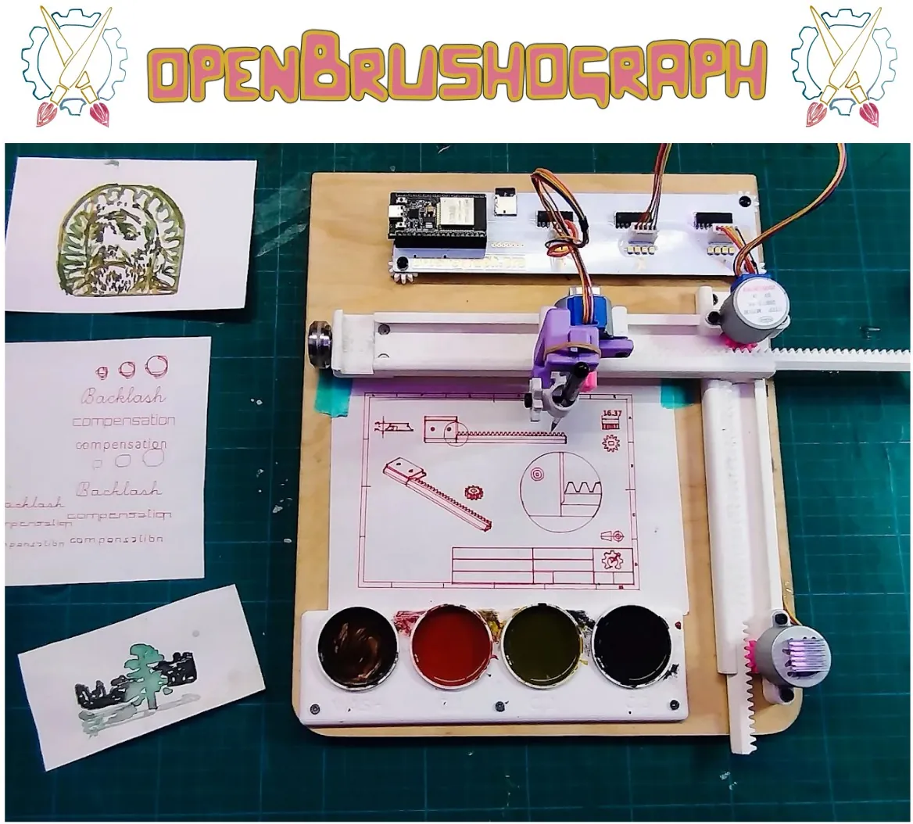
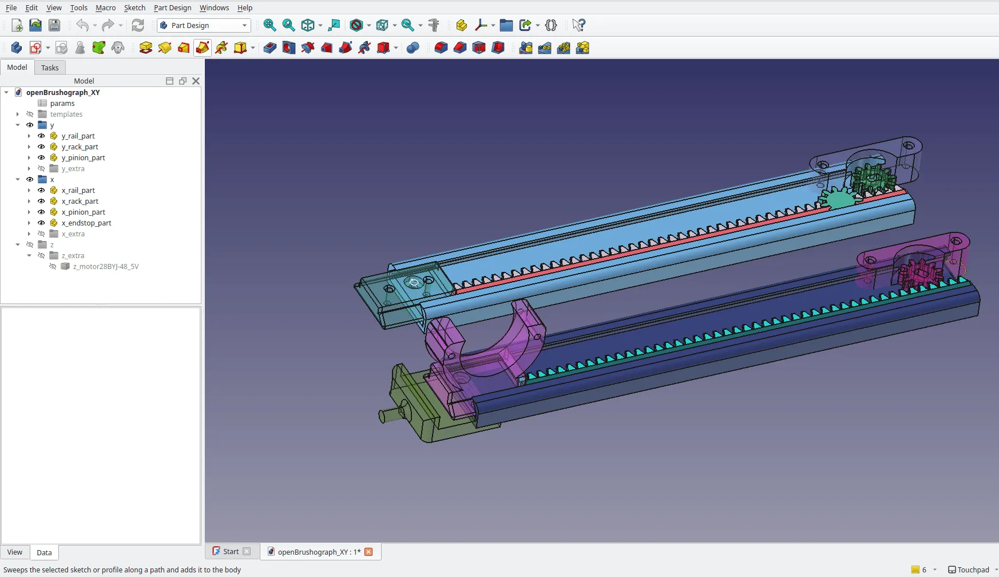

Pen plotters are cool and there are plenty of open designs to choose from. What if we want to experiment beyond pens? Well then perhaps brushes and paint are fun to play with! The [openBrushograph](https://github.com/openBrushograph/openBrushograph_hardware) is exactly this, an XYZ style pen plotter with additional paint dishes and some pretty cool design and control systems to allow for multi colour painting.

The hardware design is built around 3D printing and the very affordable 28BYJ48 style stepper motors. Interestingly the CAD design is [FreeCAD](https://www.freecad.org/) for the XY assembly components and [OpenSCAD](https://openscad.org/)for the Z axis assembly. It's possibly due to the Z axis being based on an earlier design, but, whatever the reason, it's great that FreeCAD and OpenSCAD offer the solutions needed for projects like this.

What's really impressive about openBrushograph is the amount of documentation not only for the build process, including setting up [GRBL](https://github.com/grbl/grbl) or [Fluid NC](https://github.com/bdring/FluidNC) parts of the build, but also lot's of guides about how to create multi coloured layered designs using [Inkscape](https://inkscape.org/). There's also lots of information on how to generate g-codes which have some added complexity due to the "travel to paint dish" aspects of the process. There's even a web based G-Code generator that can receive multiple SVG layer files and combine them into a G-Code document to run via Universal G-Code Sender ([UGS](https://winder.github.io/ugs_website/)).

Over on this [fabulous wiki](https://wiki.sgmk-ssam.ch/wiki/Brushograph) you'll find not only all this information, but also lot's of details of events and workshops that openBrushograph have run. It looks like they are creating a vibrant community. Excellent work.