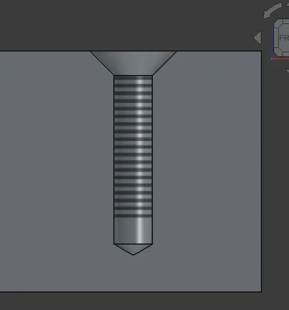

We don't always write individual blog posts about single new features that have been merged into the weekly development versions of FreeCAD, but this one, deserves a special mention.

Lots of people have been eagerly and patiently waiting the arrival of [cosmetic threads](https://github.com/FreeCAD/FreeCAD/pull/22573) in fact the arrival of this closes an issue that was raised in July 2013! Alfrix has worked hard to bring this feature to fruition and we look forward to people testing the cosmetic thread options when using the hole tooling in Part Design. We are delighted that Alfrix can claim a bounty payment which they plan to use to update their laptop to make code compiling a little more streamlined, a perfect win win!

You can explore the pull request on the above link or you can discuss this feature over on the [forum here](https://forum.freecad.org/viewtopic.php?t=103941).