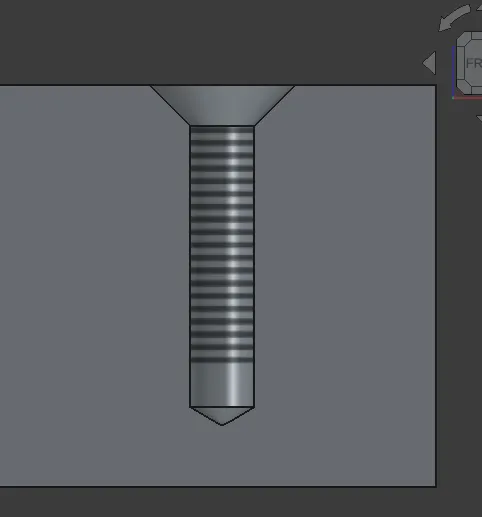

Maintainers have been backporting some of the fixes to the v1.1 branch where possible - 6 backports in the past 7 days. The list of changes in this recap applies to the main development branch (future v1.2).

This week in FreeCAD development:

**Draft**:

- Reqrefusion patched polar and circular arrays to become aware of the active working plane ([PR#28324](https://github.com/FreeCAD/FreeCAD/pull/28324)).
- YashSuthar983 fixed the creation of angular mode extension lines ([PR#27987](https://github.com/FreeCAD/FreeCAD/pull/27987)).

**Sketcher**:

- chennes added a backwards-compatible path for external geometry ([PR#28374](https://github.com/FreeCAD/FreeCAD/pull/28374)).
- hyarion fixed a couple of minor issues in the recently added Text tool ([PR#28247](https://github.com/FreeCAD/FreeCAD/pull/28247)).
- PaddleStroke fixed the Text position on-view parameters ([PR#28365](https://github.com/FreeCAD/FreeCAD/pull/28365)).
- alfrix improved the quantity spinbox in Sketcher's on-view parameters, specifically for the Text tool ([PR#25978](https://github.com/FreeCAD/FreeCAD/pull/25978)).
- Lokestrom fixed the hyperbola flipping issue in hyperbolic arcs ([PR#27656](https://github.com/FreeCAD/FreeCAD/pull/27656)).
- pjcreath split the monolithic SketchObject.cpp source code file that used to be ~12,000 lines long ([PR#26031](https://github.com/FreeCAD/FreeCAD/pull/26031)).

**Part and PartDesign**:

- theosib fixed conflicts between AttacherType and AttacherEngine properties ([PR#27069](https://github.com/FreeCAD/FreeCAD/pull/27069)).
- alfrix fixed the range of the custom clearance of threads ([PR#26296](https://github.com/FreeCAD/FreeCAD/pull/26296)) and added support for cosmetic threads ([PR#22573](https://github.com/FreeCAD/FreeCAD/pull/22573)).

**Assembly**: PaddleStroke added the ability to view joints attached to a selected part ([PR#27530](https://github.com/FreeCAD/FreeCAD/pull/27530)) and fixed a typo in code ([PR#28415](https://github.com/FreeCAD/FreeCAD/pull/28415)).

**BIM/Arch**:

- Bojan9597 fixed a bug where Project Setup would create no Level if the height was set to zero ([PR#28065](https://github.com/FreeCAD/FreeCAD/pull/28065)).
- furgo16 refactored link processing ([PR#28104](https://github.com/FreeCAD/FreeCAD/pull/28104)).
- Roy-043 updated tooltips in BIM Setup ([PR#28262](https://github.com/FreeCAD/FreeCAD/pull/28262)) and fixed BuildingPart color issues, including v1.0 regressions ([PR#28001](https://github.com/FreeCAD/FreeCAD/pull/28001)).

**CAM**:

- sliptonic added machine-based postprocessing ([PR#27507](https://github.com/FreeCAD/FreeCAD/pull/27507)). This is the next stage of revamping the way the CAM workbench stores information about CAM devices and their specifics.
- Connor fixed the saving of `shape_type` for toolbits ([PR#28274](https://github.com/FreeCAD/FreeCAD/pull/28274)) and added a new TSP solver with Python bindings to improve the hole sorting performance ([PR#23093](https://github.com/FreeCAD/FreeCAD/pull/23093)).
- awgrover added several new features to the opensbp post-processor ([PR#27184](https://github.com/FreeCAD/FreeCAD/pull/27184)): support for arcs (G2, G3), probe (G38.2), and drill (G73, etc.)
- Several PRs from tarman3:
  - Fix for an overcrowded dropdown list in Job Setub ([PR#27427](https://github.com/FreeCAD/FreeCAD/pull/27427)).
  - Default RampFeed in ToolController after migration ([PR#27191](https://github.com/FreeCAD/FreeCAD/pull/27191)).
  - Replaced the KeepToolDown property with RetractThreshold in DressupBoundary ([PR#25667](https://github.com/FreeCAD/FreeCAD/pull/25667)).
  - Fixed holeDiameter() for faces ([PR#27514](https://github.com/FreeCAD/FreeCAD/pull/27514)).
  - Minor optimization for simple solids in Linking ([PR#28173](https://github.com/FreeCAD/FreeCAD/pull/28173)).
  - MachineState can now process a list of commands instead of one command ([PR#28167](https://github.com/FreeCAD/FreeCAD/pull/28167)).

**TechDraw**:

- WandererFan fixed the thickness of smooth edges ([PR#27747](https://github.com/FreeCAD/FreeCAD/pull/27747)) and an issue where the selection order would block dimension creation ([PR#28356](https://github.com/FreeCAD/FreeCAD/pull/28356)).
- nishendra3 added supplementary angle support ([PR#27055](https://github.com/FreeCAD/FreeCAD/pull/27055)).
- alopes0905 fixed a confusing tooltip in the views scale property ([PR#28293](https://github.com/FreeCAD/FreeCAD/pull/28293)).

**Other changes**:

- PaddleStroke fixed a regression where external linked bodies or meshes would be rendered incorrectly ([PR#28287](https://github.com/FreeCAD/FreeCAD/pull/28287)).
- Bojan9597 enhanced the materials code so that material changes can be undone and cancelled (PR#27910).
- theo-vt implemented multi-file editing ([PR#21978](https://github.com/FreeCAD/FreeCAD/pull/21978)). This means you can now switch between documents without submitting changes in the task box first. This was her GSoc2025 project.

Rexbas, marioalexis84, davidgilkaufman, filippor, tarman3, chennes, petterreinholdtsen, 3x380V, hyarion, and PaddleStroke contributed additional improvements and fixes.

If you are interested in testing the latest weekly build, you can grab it [here](https://github.com/FreeCAD/FreeCAD/releases/tag/weekly-2026.03.18).

**PR stats**: since the previous report, 61 pull requests have been merged (including backports to the v1.1 branch), and 44 new pull requests have been opened.

**Issue stats**: overall, there are 3332 open issues in the tracker, up by 6 from last week. There are [2 release blockers](https://github.com/FreeCAD/FreeCAD/issues?q=state%3Aopen%20label%3ABlocker%20milestone%3A1.1) for v1.1 currently, down by 2 from last week.