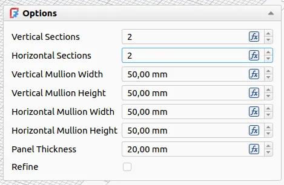

Maintainers have been backporting some of the fixes to the v1.1 branch where possible - 3 backports in the past 7 days. The list of changes in this recap applies to the main development branch (future v1.2).

This week in FreeCAD development:

**Sketcher**:

- FlachyJoe fixed a regression to make symmetry work on arcs with constrained centers again ([PR#24466](https://github.com/FreeCAD/FreeCAD/pull/24466)).
- wiljam144 renamed "Attachment Editor" to "Edit Attachment" in the context menu ([PR#27932](https://github.com/FreeCAD/FreeCAD/pull/27932)).
- wwmayer fixed an offset geometry issue (cherry-picked by 3x380V, [PR#27930](https://github.com/FreeCAD/FreeCAD/pull/27930)).
- Krrish777 improved the error message displayed when links in Sketcher objects go out of their allowed scope ([PR#26776](https://github.com/FreeCAD/FreeCAD/pull/26776)).

**Part and PartDesign**:

- kadet1090 fixed the 3D View button in the Location sections of the Part GUI to stay pressed when it is active ([PR#27879](https://github.com/FreeCAD/FreeCAD/pull/27879)).
- wwmayer fixed a crash in Revolution (cherry-picked by 3x380V, [PR#27929](https://github.com/FreeCAD/FreeCAD/pull/27929)).
- paragforwork renamed the 3D View button to Pick Position to better describe what it does ([PR#27844](https://github.com/FreeCAD/FreeCAD/pull/27844)).

**Assembly**:

- spontarelliam changed the parts listing in Insert Component to be collapsed by default ([PR#27658](https://github.com/FreeCAD/FreeCAD/pull/27658)).
- PaddleStroke changed the solver task messages to appear only when the Assembly workbench is activated, as they were bleeding into the Draft workbench ([PR#27502](https://github.com/FreeCAD/FreeCAD/pull/27502)).

**BIM/Arch**:

- paragforwork changed the Nudge shortcuts from Ctrl to Alt to avoid conflict ([PR#28036](https://github.com/FreeCAD/FreeCAD/pull/28036)).
- paullee0 fixed a bug where walls with assigned multi-material would report incorrect width ([PR#27972](https://github.com/FreeCAD/FreeCAD/pull/27972)).
- Roy-043 provided several patches:
  - Patched BIM_DrawingView to always create the Cut Lines view ([PR#27853](https://github.com/FreeCAD/FreeCAD/pull/27853)).
  - Fixed window hinge direction if edge has no delta Z ([PR#27476](https://github.com/FreeCAD/FreeCAD/pull/27476)).
  - Changed TD BIMView linecaps to square ([PR#27682](https://github.com/FreeCAD/FreeCAD/pull/27682)).
  - Removed superfluous transaction handling when editing IFC properties ([PR#27313](https://github.com/FreeCAD/FreeCAD/pull/27313)).
- furgo16 ixed the placement jump when uncloning objects ([PR#27597](https://github.com/FreeCAD/FreeCAD/pull/27597)) and added quick-access option taskboxes to all relevant objects ([PR#27746](https://github.com/FreeCAD/FreeCAD/pull/27746)).

**FEM**:

- marioalexis84 added initial support for reading materials from CalculiX's FRD files, so far without UI ([PR#27847](https://github.com/FreeCAD/FreeCAD/pull/27847)). He also removed the non-functional CalculiX solver implementation ([PR#27850](https://github.com/FreeCAD/FreeCAD/pull/27850)) and added a 'Nonlinear' property link to materials to reference nonlinear objects ([PR#27862](https://github.com/FreeCAD/FreeCAD/pull/27862)).
- 3x380V moved some minor improvements by wwmayer to upstream ([PR#27835](https://github.com/FreeCAD/FreeCAD/pull/27835)).

**CAM**:

- jffmichi fixed the new CAM simulator on macOS ([PR#27906](https://github.com/FreeCAD/FreeCAD/pull/27906)). He also removed the remaining reference to deprecated Dogbone dressup ([PR#27990](https://github.com/FreeCAD/FreeCAD/pull/27990)), and sliptonic provided another patch to the same effect ([PR#27927](https://github.com/FreeCAD/FreeCAD/pull/27927)).
- petterreinholdtsen implemented thread tapping in Fanuc and fixed a crash post-processor ([PR#27860](https://github.com/FreeCAD/FreeCAD/pull/27860)).
- tarman3 submitted multiple patches:
  - Implemented auto-select optimizations in Drillable ([PR#27585](https://github.com/FreeCAD/FreeCAD/pull/27585)).
  - Added ArcZ style following the profile in LeadInOut ([PR#24849](https://github.com/FreeCAD/FreeCAD/pull/24849)).
  - Fixed adding geometry in the Bast task panel ([PR#27686](https://github.com/FreeCAD/FreeCAD/pull/27686)).
  - Fixed holePosition() for face with several arcs in CircularHoleBase ([PR#27504](https://github.com/FreeCAD/FreeCAD/pull/27504)).
- Dimitris75 added an 'Optimize linear paths' option to the Waterline OCL Adaptive algo ([PR#27040](https://github.com/FreeCAD/FreeCAD/pull/27040)).
- Connor introduced a way to dynamically alias toolbits and added subtypes for toolbits ([PR#27091](https://github.com/FreeCAD/FreeCAD/pull/27091)).
- davidgilkaufman separated the tolerance variable used for arc fitting from the tolerance used for section height offsets ([PR#27178](https://github.com/FreeCAD/FreeCAD/pull/27178)).
- Doriangaensslen moved ThreadMilling and Tapping from experimental to standard ([PR#27859](https://github.com/FreeCAD/FreeCAD/pull/27859)).

**Other changes**:

- Roy-043 fixed a regression in Draft where clones wouldn't receive the correct diffuse color ([PR#27961](https://github.com/FreeCAD/FreeCAD/pull/27961)).
- nishendra3 added the ability to drag measurement labels when the labels are in front of models ([PR#27832](https://github.com/FreeCAD/FreeCAD/pull/27832)).
- NewJoker renamed Change Image to Edit Image Plane ([PR#27913](https://github.com/FreeCAD/FreeCAD/pull/27913)).
- timpieces improved the expression parser ([PR#27099](https://github.com/FreeCAD/FreeCAD/pull/27099)).
- 3x380V backported wwmayer's patch to not allow activating disabled workbenches ([PR#27928](https://github.com/FreeCAD/FreeCAD/pull/27928)).
- paragforwork added **Ctrl+Shift+Alt+S** as a shortcut for Save Copy ([PR#27966](https://github.com/FreeCAD/FreeCAD/pull/27966)).
- greg19 fixed transparent panels getting in the way in Spreadsheet ([PR#27771](https://github.com/FreeCAD/FreeCAD/pull/27771)).
- kadet1090 fixed the issue with shape representation not updating after changing the deviation or angular deflection ([PR#27933](https://github.com/FreeCAD/FreeCAD/pull/27933)).

3x380V, wwmayer, chennes, tarman3, Lgt2x, theo-vt, Syres916, filippor, and ipatch contributed additional improvements and fixes.

If you are interested in testing the latest weekly build, you can grab it [here](https://github.com/FreeCAD/FreeCAD/releases/tag/weekly-2026.03.04).

**PR stats**: since the previous report, 69 pull requests have been merged (including backports to the v1.1 branch), and 91 new pull requests have been opened.

**Issue stats**: overall, there are 3322 open issues in the tracker, up by 37 from last week. There are [2 release blockers](https://github.com/FreeCAD/FreeCAD/issues?q=state%3Aopen%20label%3ABlocker%20milestone%3A1.1) for v1.1 currently, down by 1 from last week.